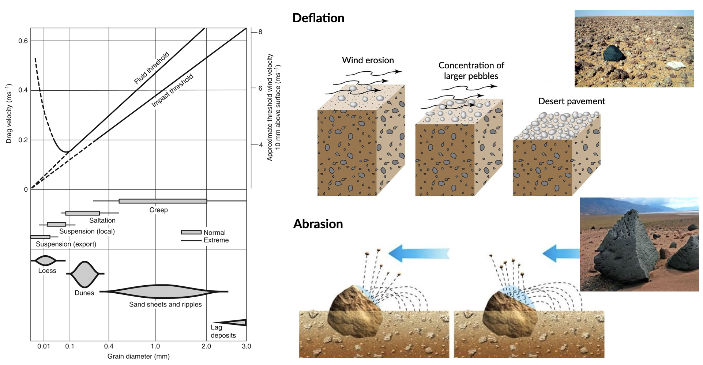
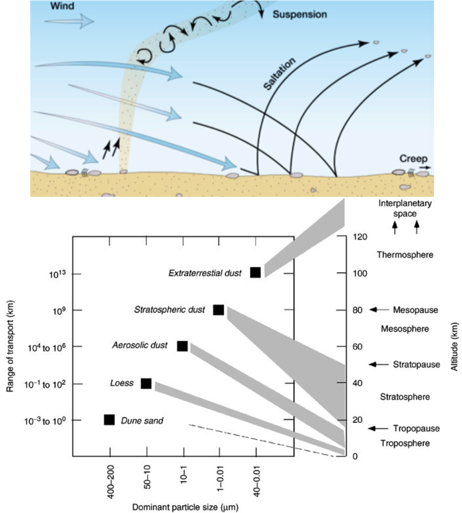
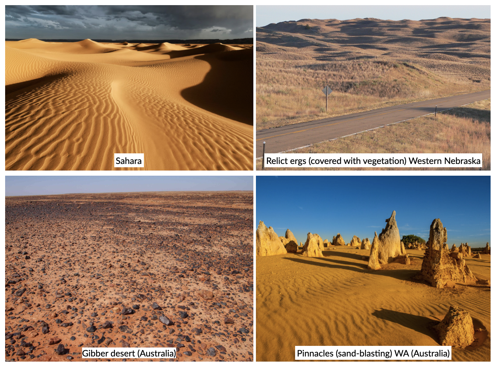
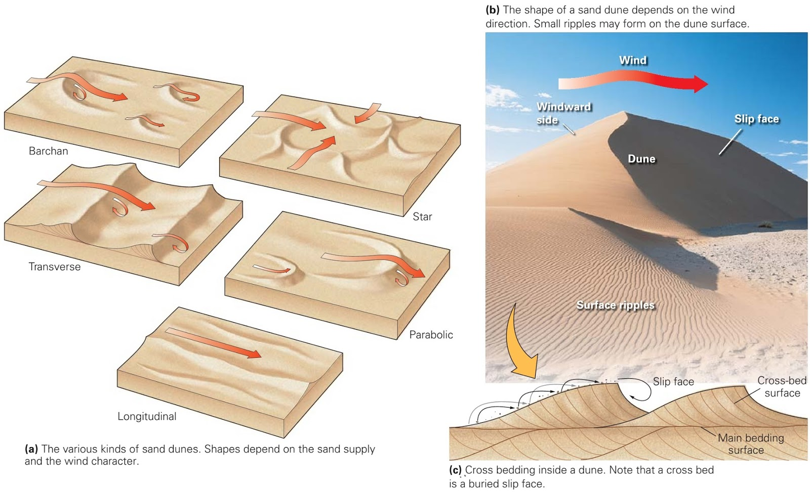
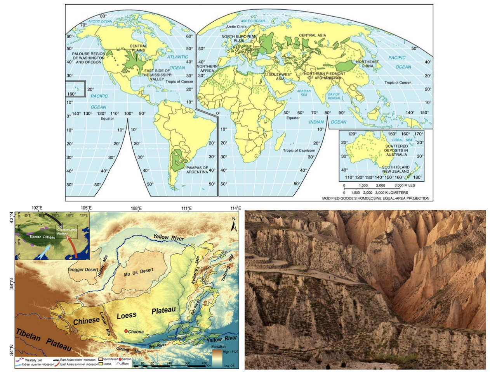

Aeolian environments
==========================================

.. note::
  This chapter is mainly based on Chapter 8 of G. Nichols book: Sedimentology and stratigraphy (2nd ed.), 2009 (`link <http://usuarios.geofisica.unam.mx/cecilia/CT-SeEs/LA-N_Sys.pdf>`_).

..  admonition:: Chapter structure
    :class: toggle

    - Erosion, transportation, deposition by wind
    - Drylands geomorphology
    - Loess and environmental reconstructions

Aeolian sedimentary processes involve transport and deposition of material by the wind. The whole of the surface of the globe is affected by the wind to varying degrees, but aeolian deposits are only dominant in a relatively restricted range of settings. The most obvious aeolian environments are the large sandy deserts in hot, dry areas of continents, but there are significant accumulations of wind-borne material associated with sandy beaches and periglacial sand flats.

..  admonition:: Learning outcomes
    :class: toggle

    - To understand the significance of aeolian sediment in the Earth System;
    - To overview the major processes that control the movement of aeolian sediment  through the sediment routing system;
    - To understand the basic properties, bed forms and landscape features  produced by aeolian processes

Aeolian transport
------------------------------

Global wind patterns
**************************

..  admonition:: Global wind distribution
    :class: toggle, toggle-shown, important

    .. figure:: images/1226px-Earth_Global_Circulation_-_en.svg_.png
        :width: 90 %
        :alt: Winds
        :align: center

        The distribution of high- and low-pressure belts at different latitudes creates wind patterns that are deflected by the Coriolis force.

    Air masses move from areas of high pressure towards areas of low pressure, and the speed at which the air moves will be determined by the **pressure difference**. The circulation of air in the atmosphere is ultimately driven by **temperature differences**. The main contrast in temperature is between the Equator, which receives the most energy from the Sun, and the poles, which receive the least. Heat is transferred between these regions by air movement. Hot air at the Equator rises, while cold air at the poles sinks, so the overall pattern is for a circulation cell to be set up with the warm air from the Equator travelling at high altitudes towards the poles and a complementary movement of cold air back to the Equator closer to ground level.

    This simple pattern is, however, complicated by two other factors:

    1. the **circulation pattern breaks up into smaller cells**, three in each hemisphere.
    2. the **Coriolis force** deflects the pathway of the air mass from simple north–south directions. The result is the pattern of winds shown in the above figure.

    .. figure:: images/Drylands_world_map1-orig.jpg
        :width: 100 %
        :alt: Drylands
        :align: center

        Arid and hyper-arid regions make up approximately 20% of Earth’s surface and are arranged in two latitudinal zones around 30°N and S of equator, as a result of dry air associated with the descending arm of a Hadley Cell.

Aeolian erosion
**************************

Wind erosion is based on two distinct mechanisms:

1. **Deflation** which is related to small particles eroded from the landscape by wind over time, leaving larger particles behind to form a desert pavement (ground surface lowers);
2. **Abrasion** where particles carried by the wind blast larger features in the landscape, abrading their surface and wearing away the rock.

The source of aeolian sediment transported by deflation is made of seasonally arid ephemeral stream or river beds, floodplains and alluvial fans in arid regions of the Earth (also glacial outwash in colder periods of Earth’s history). The process varies based on **bed adhesion**, which will increase the **fluid threshold velocity** (*i.e.* wind speed at which saltation is initiated) and which is dependent upon soil moisture, clay content, vegetation, armouring or cementation. However, once grains have become entrained, bombardment of the bed liberates smaller grains, effectively reducing the threshold velocity. The trajectory of individual grains, then, is  dependent upon their size, mineralogy (density), the wind speed and bed form characteristics. Once the speed of the wind decreases suspension and saltation will cease. The wind speed at which saltation is halted is defined as the **impact threshold** (see above figure - left panel).

Aeolian transport processes
****************************

A flow of air over a loose grain of sand exerts a lift force on the particle and with increasing velocity the force may increase to the point where the grain rolls or saltates. The strength of the lift force is proportional to both the velocity of the flow and the density of the medium. Air has a density of 1.3 kg/m3, which is three orders of magnitude less than that of water (1000 kg/m3) so, whereas water flows of only a few tens of centimetres a second can cause movement of sand grains, much higher velocities are
required for the wind to move the same grains.

Winds of 55 m/s or more are recorded during hurricanes, but strong winds over land areas are typically around 30 m/s, and at these velocities the upper limit on the size of quartz grains moved by the wind is around a half a millimetre in diameter. **This provides an important criterion for the recognition of aeolian deposits in the stratigraphic record: deposits consisting of grains coarser than coarse sand are unlikely to be aeolian deposits**.

At high wind velocities silt- and clay-sized particles are carried as **suspended load**. This aeolian dust can become entrained in the wind in large quantities in dry areas to create **dust storms** that can carry airborne sediment large distances away from its origin. The dust will remain in suspension until the wind speed drops and the fine sediment starts to fall to the ground or onto a water surface. Significant accumulations of aeolian dust are relatively uncommon, but airborne material can be literally carried around the world by winds and be deposited in all depositional environments.

..  admonition:: Clasts transport
    :class: toggle

    Smaller clasts (0.01-0.1 mm, depending on wind shear velocity) are kept aloft temporarily, and will rejoin the bed load, often at high velocity;

    The impact of these clasts on stationary grains further downwind imparts energy that mobilises stationary grains as ‘splashed up’. Particles moved into the suspended load temporarily (called saltation, representing about  20-25% of bedload transport);

    Larger clasts will move (roll or slide) incrementally along the bed as a result of the continual bombardment by smaller clasts and wind stress (called creep).

Aeolian terrains
------------------------------

Deserts and ergs
****************************

.. important::
  A **desert** is a continental area that receives little precipitation: they are arid areas that receive **less than 250 mm/yr precipitation**. Areas that receive average precipitation of between **250 and 500 mm/yr** are defined as **semi-arid** and are not usually considered to be true deserts.

This definition of a desert does consider temperature to be a factor, for, although the ‘classic’ deserts of the world today, such as the Sahara, are hot as well as dry places, there are also many dry areas that are also cold, including **polar deserts** of high latitudes.

The **shortage of water** limits the quantity and diversity of life in a desert. The **lack of vegetation** is an important influence on surface processes because without a plant cover detritus lies loose on the surface where it is subject to aeolian activity.

An **erg** (*Arabic for sand*) is an area where sand has accumulated as a result of aeolian processes. Ergs are prominent features of some deserts (deserts of Arabia, the Sahara and Namibia), but in fact most deserts are not sandy but are large barren areas known as *rocky deserts* (also called **Reg** – Arabic for stone).

Rocky deserts (such as the *Gibber plains* in Australia) are areas of deflation, that is, removal of material, and as such are not depositional environments. However, pebbles, cobbles and boulders that lie on the surface may subsequently be preserved if they are covered by other sediment, and these clasts may show evidence of their history in a rocky desert.

Mesa-and-scarp
****************************

.. figure:: images/mesa.png
    :width: 100 %
    :alt: Mesa-and-scarp
    :align: center

    Residual landforms resultant from the dissection of a plateau in semiarid climate, Monument Valley, USA.

**Mesas** are defined as flat-topped elevations, which are bounded from all sides by steep escarpments and hence they stand distinctly above the surrounding country, as a table stands above the floor upon which it rests. They are capped by more resistant layers, usually sandstones, basalts or duricrusts, beneath which more erodible rocks are present. Such a sequence sustains the general mesa form, with planar top surface, vertical cliffs in the upper part and less inclined slopes truncating weaker strata below, although the areal extent of the mesa becomes reduced over time due to complex processes involved in cliff retreat. The reduction in the width of the mesa by cliff retreat forms a **butte**.

..  admonition:: Differential weathering
    :class: toggle

    Differential weathering exploits various properties and characteristics of rock series exposed in escarpments. The most important are mineralogical composition, porosity and the presence of discontinuities.

    .. figure:: images/bm.jpg
        :width: 80 %
        :alt: Differential weathering
        :align: center

        Differential weathering of a sandstone cliff, with some parts of the rock wall being slightly recessed and the others dotted with well-developed tafoni and honeycomb structures, Blue Mountains, Australia.

..  admonition:: Bornhardt
    :class: toggle, important

    A German geologist described (1900) certain prominent hills on the East African shield as **inselberge** (island mounts). Subsequently, the term inselberg acquired a wider connotation and Bailey Willis (1936) suggested the term **bornhardt** to describe hills with *bare surfaces, domelike summits, precipitous sides becoming steeper toward the base, an absence of talus, alluvial cones or soil, a close adjustment of form to internal structure*.

    Bornhardts are usually made up of granites or gneisses, but can sometimes be found in other rock types like limestone, sandstone and conglomerate. They are therefore **weathering resistant** and lied below ground within layers of sediment that slowly become exposed by erosion (Uluru Australia). The ground level may drop over thousands of years as sediment surrounding the rock is washed away by flooding or blown away by the wind. They occur more often in the desert where there is little vegetation to protect the ground from erosion.

Aeolian bedforms
------------------------------

The processes of transport and deposition by wind produce bedforms that are in some ways similar to subaqueous bedforms, but with some important differences that can be used to help distinguish aeolian from subaqueous sands. Two groups are separated in this section on the basis of their size: **aeolian ripples and dunes**.

Aeolian ripples
****************************

As wind blows across a bed of sand, grains will move
by saltation forming a thin carpet of moving sand
grains. The grains are only in temporary suspension,
and as each grain lands, it has sufficient energy to
knock impacted grains up into the free stream of air,
continuing the process of saltation. Irregularities in
the surface of the sand and the turbulence of the air
flow will create patches where the grains are slightly
more piled up. Grains in these piles will be more
susceptible to being picked up by the flow and at a
constant wind velocity all medium sand grains will
move about the same distance each time they saltate.
The result is a series of piles of grains aligned perpendicular
to the wind and spaced equal distances apart.
These are the crests of aeolian ripples (Figs 8.4 &
8.5). The troughs in between are shadow zones where
grains will not be picked up by the air flow and where
few saltating grains land.

Aeolian ripples have extremely variable wavelengths
(crest to crest distance) ranging from a few
centimetres to several metres. Ripple heights (bottom
of the trough to the top of a crest) range from less than
a centimetre to more than ten centimetres. Coarser
grains tend to be concentrated at the crests, where
the finer grains are winnowed away by the wind, and
as aeolian ripples migrate they may form a layer of
inversely graded sand. Where a crest becomes well
developed grains may avalanche down into the adjacent
trough forming cross-lamination, but this is less
common in aeolian ripples than in their subaqueous
counterparts.

Aeolian dunes
****************************

    Main aeolian dune types, their forms determined by the direction of the prevailing wind(s) and the availability of sand.
    Cross-bedded facies could be used to infer the likely distribution of palaeo-wind directions (from this `blog <http://people.uwplatt.edu/~stradfot/PHYSICAL104/ReviewCD/15_page3.html>`_).

.. note::
  **Aeolian dunes** are bedforms that range from 3 m to 600 m in wavelength and are between 10 cm and 100 m high.

They migrate by the **saltation** of sand up the stoss (upwind) side of the dune to the crest (panel c in above figure). This saltation may result in the formation of aeolian ripples which are commonly seen on the stoss sides of dunes (panel b in above figure).

..  admonition:: Cross-bed formation
    :class: toggle, toggle-shown, important

    Sand accumulating at the crest of the dune is **unstable** and will **cascade down** the lee slope as an avalanche or grain flow to form an inclined layer of sand (which is at or near the angle of repose, 30-40 degrees). **Repeated avalanches build up a set of cross-beds** that may be preserved if there is a net accumulation of sand.

    At high wind speeds some sand grains are in temporary **suspension** and are blown directly over the crest of the dune and fall out onto the lee slope. These grain fall deposits accumulate on the lee slope, but *they will usually be reworked from the upper slope by avalanching*: some may be preserved at the toe bedded with grain flow deposits.

    The orientation and form (planar or trough) of the cross-bedding will depend on the type of dune (panel a in above figure).

    - Planar cross-beds will form by the migration of **transverse dunes**, straight-crested forms aligned **perpendicular to the prevailing wind direction**.
    - **Transverse dunes** form where there is an **abundant supply of sand**
    - as the **sand supply decreases** there is a transition to **barchan dunes**, which are lunate structures with arcuate slip faces forming trough crossbedding.
    - Under circumstances where there are two prominent wind directions at approximately 90 degrees to each other, **longitudinal** or **seif dunes** form. The deposits of these linear dunes are characterised by cross-bedding reflecting avalanching down both sides of the dune and hence oriented in different directions.
    - In areas of multiple wind directions **star dunes** have slip faces in many orientations and hence the cross-bedding directions display a similar variability.

Desert environments
****************************

Aeolian sands form one part of an arid zone facies
association that also includes ephemeral lake deposits
and alluvial fan and/or ephemeral river sediments
(Figs 8.12 & 8.13). In these dry areas, sediment is
brought into the basin by rivers that bring weathered
detritus from the surrounding catchment areas and
deposit poorly sorted mixtures of sediment on alluvial
fans (9.5) or associated with the channels of ephemeral
rivers (9.2.3). The sandy component of these
deposits is subsequently reworked by the wind and
redeposited in other parts of the basin in aeolian dune
complexes. Water from these rivers and fans ponds in
the basin to form ephemeral lakes and these temporary
lakes dry up to leave deposits of mud and evaporite
minerals (10.4). Through time the positions of the
ephemeral lakes, sand dunes and the alluvial fans will
change, and the deposits of these three sub-environments
will be preserved as intercalated beds in the
succession of strata (5.6.3).

The dominant factor in determining the distribution
and extent of sandy deserts is climate. Arid conditions
are necessary to inhibit the development of
plants and a soil that would stabilise loose sediment,
and an absence of abundant surface water prevents
sediment from being reworked and removed by fluvial
processes. Sand accumulates to form an erg where
there are local or regional depressions: these may
range from small build-ups of sand adjacent to topography
to broad areas of the continent covering many
thousands of square kilometres.

Palaeo-wind directions
****************************

.. note::
  The slip faces of aeolian dunes generally face downwind so by measuring the direction of dip of cross-beds formed by the migration of aeolian dunes it is possible to determine the direction of the prevailing wind at the time of deposition.

The variability of the readings obtained from cross-beds will depend upon the type of dune. Transverse dunes generate cross-beds with little variability in orientation, whereas the curved faces of barchan dunes produce cross-beds that may vary by as much as 45 degrees from the actual downwind direction. Multiple directions of cross-bedding result from the numerous slip faces of a star dune.

Aeolian deposits outside deserts
---------------------------------

Aeolian dust deposits
****************************

There are deposits of Quaternary age in eastern Europe, North America and China that are interpreted as accumulations of wind-blown dust. These deposits, known as **loess**, locally occur in beds several metres thick made up predominantly of well-sorted silt-sized material, with little clay or sand-sized material present.

    Loess forms as a ‘blanket’ over the existing topography (up to 300 m thick). Loess covers about 5% of the world’s terrestrial surface, the thickest and  most extensive deposits in China, central Asia, central and eastern Europe, Great Plains of north America and Argentina. The Loess Plateau (China Central and western China) covers around 500,000 km2. It is composed of a blanket of fine sediment between 100 and 300 m in thickness.

The particle size distribution of loess tends to be bi-modal, or strongly  positively skewed (indicating a tail of fine particles);
composed of particles 10-50 μm in size with a primary modal peak between 20-30 μm.

The origin of **loess** is related to episodes of retreat of ice sheets, as large amounts of loose detritus carried in the ice were released.

..  admonition:: Loess origin from periglacial environment
    :class: toggle, important

    In the cold periglacial environment in front of the receding ice colonisation by plants and stabilisation of the soil would have been slow, so the glacial debris was exposed on the outwash plains, where wind picked up and transported the silt-sized dust. This dust was probably transported over large parts of the globe but accumulated as loess deposits in some places. Similar processes probably occurred during other glacial episodes in Earth history, but pre-Quaternary loess deposits have not been recognised. The preservation potential of loess is likely to be quite low because it is soft, loose material that is easily reworked and mixed with other sediment.

..  admonition:: Loess origin from volcanism
    :class: toggle, important

    Volcanism is an important source of dust in the atmosphere. Explosive eruptions can send plumes of volcanic ash high up into the atmosphere where it is distributed by wind. Coarser ash tends to be deposited close to the volcano, while the silt-sized ash particles can be transported around the world. Large amounts of atmospheric dust from eruptions can darken the sky, and it will gradually fall as fine sediment.

..  admonition:: Loess origin from fires
    :class: toggle, important

    A further source of atmospheric dust is from fires that propel soot (fine carbon) up into the air, where it can be redistributed by the wind. Despite the fine grain size, soot, volcanic and terrigenous dust can all be distinguished by geochemical analysis.

.. raw:: html

    

    <iframe width="100%" height="380" src="https://www.youtube.com/embed/Esz6ne9x9yM?rel=0" frameborder="0" allow="accelerometer; autoplay; encrypted-media; gyroscope; picture-in-picture" allowfullscreen></iframe>
    

**Aeolian dust** is dispersed worldwide, but most of it ends up in other marine and continental depositional environments where it mixes with other sediment and its origin cannot easily be determined. In most places the proportion of aeolian dust is very low compared with other sediment being deposited, but there are some environments where terrigenous clastic deposition is very low, and the main source of silt and clay can be aeolian dust. The parts of the deep oceans that are distant from any continental margin receive very little sediment: **airborne dust that settles through the water column can therefore be an important component of deep ocean deposits**.

Aeolian sands in other environments
************************************************

Beach dunes
^^^^^^^^^^^^^^^^^^^^^

**Sand dunes built up by aeolian action can form adjacent to beaches in any climatic setting**. In the intertidal zone of a foreshore loose sediment is subaerially exposed at low tide, and as it dries out it is available to be picked up and redeposited by the wind. Beach dune ridges form where the foreshore sediments are mainly sandy, exposed at low tide and subject to removal by onshore winds. The sand then accumulates at the head of the beach, either as a simple narrow ridge or sometimes extending for hundreds of metres inland.

In humid climates the dunes become colonised by grasses, shrubs and trees that stabilise the sand and allow the ridges to build up metres to tens of metres thickness.

Periglacial deposits
^^^^^^^^^^^^^^^^^^^^^

Glacial outwash areas are places where loose detritus that has been released from melting ice remains exposed on the surface for long periods of time because plant growth and soil formation is slow in periglacial regions. Wind blowing over the outwash plain can pick up sand and redeposit it locally, usually against topographic features such as the side of a valley. These patches of aeolian sand may therefore occur intercalated with fluvio-glacial facies, but rarely form large deposits.

..  admonition:: So what did you learn?
   :class: toggle, important

   - Aeolian deposits occur mainly in arid environments where surface water is intermittent and there is little plant cover. Sands deposited in these desert areas are characteristically both compositionally and mineralogically mature with large-scale cross-bedding formed by the migration of dune bedforms.

   - Associated facies in arid regions are mud and evaporites deposited in ephemeral lakes and poorly sorted fluvial and alluvial fan deposits. Aeolian deposits are less common outside of desert environments, occurring as local sandy facies associated with beaches and glaciers, and as dust distributed over large distances into many different environments, but, apart from Quaternary loess, rarely in significant quantities.

   Characteristics of aeolian deposits

   - lithologies – sand and silt only
   - mineralogy – mainly quartz, with rare examples of carbonate or other grains
   - texture – well- to very well-sorted silt to medium sand
   - bed geometry – sheets or lenses of sand
   - sedimentary structures – large-scale dune crossbedding and parallel stratification in sands
   - palaeocurrents – dune orientations reconstructed from cross-bedding indicate wind direction
   - facies associations – occur with alluvial fans, ephemeral river and lake facies in deserts, also with beach deposits or glacial outwash facies
