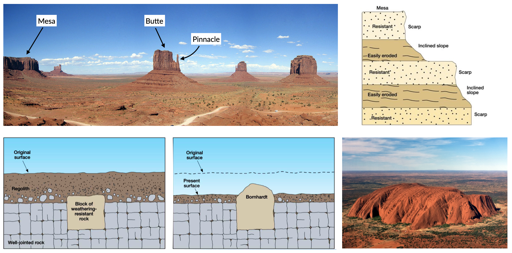

Aeolian environments
==========================================

.. note::
  This chapter is mainly based on Chapter 8 of G. Nichols book: Sedimentology and stratigraphy (2nd ed.), 2009 (`link <http://usuarios.geofisica.unam.mx/cecilia/CT-SeEs/LA-N_Sys.pdf>`_).

..  admonition:: Chapter structure
    :class: toggle

    - Erosion, transportation, deposition by wind
    - Drylands geomorphology
    - Loess and environmental reconstructions

Aeolian sedimentary processes involve transport and deposition of material by the wind. The whole of the surface of the globe is affected by the wind to varying degrees, but aeolian deposits are only dominant in a relatively restricted range of settings. The most obvious aeolian environments are the large sandy deserts in hot, dry areas of continents, but there are significant accumulations of wind-borne material associated with sandy beaches and periglacial sand flats.

..  admonition:: Learning outcomes
    :class: toggle

    - To understand the significance of aeolian sediment in the Earth System;
    - To overview the major processes that control the movement of aeolian sediment  through the sediment routing system;
    - To understand the basic properties, bed forms and landscape features  produced by aeolian processes

Aeolian transport
------------------------------

Global wind patterns
**************************

..  admonition:: Global wind distribution
    :class: toggle, toggle-shown, important

    .. figure:: images/1226px-Earth_Global_Circulation_-_en.svg_.png
        :width: 90 %
        :alt: Winds
        :align: center

        The distribution of high- and low-pressure belts at different latitudes creates wind patterns that are deflected by the Coriolis force.

    Air masses move from areas of high pressure towards areas of low pressure, and the speed at which the air moves will be determined by the **pressure difference**. The circulation of air in the atmosphere is ultimately driven by **temperature differences**. The main contrast in temperature is between the Equator, which receives the most energy from the Sun, and the poles, which receive the least. Heat is transferred between these regions by air movement. Hot air at the Equator rises, while cold air at the poles sinks, so the overall pattern is for a circulation cell to be set up with the warm air from the Equator travelling at high altitudes towards the poles and a complementary movement of cold air back to the Equator closer to ground level.

    This simple pattern is, however, complicated by two other factors:

    1. the **circulation pattern breaks up into smaller cells**, three in each hemisphere.
    2. the **Coriolis force** deflects the pathway of the air mass from simple north–south directions. The result is the pattern of winds shown in the above figure.

    .. figure:: images/Drylands_world_map1-orig.jpg
        :width: 100 %
        :alt: Drylands
        :align: center

        Arid and hyper-arid regions make up approximately 20% of Earth’s surface and are arranged in two latitudinal zones around 30°N and S of equator, as a result of dry air associated with the descending arm of a Hadley Cell.

Aeolian erosion
**************************

Wind erosion is based on two distinct mechanisms:

1. **Deflation** which is related to small particles eroded from the landscape by wind over time, leaving larger particles behind to form a desert pavement (ground surface lowers);
2. **Abrasion** where particles carried by the wind blast larger features in the landscape, abrading their surface and wearing away the rock.

.. figure:: images/wdist.png
    :width: 100 %
    :alt: erosion processes
    :align: center

The source of aeolian sediment transported by deflation is made of seasonally arid ephemeral stream or river beds, floodplains and alluvial fans in arid regions of the Earth (also glacial outwash in colder periods of Earth’s history). The process varies based on **bed adhesion**, which will increase the **fluid threshold velocity** (*i.e.* wind speed at which saltation is initiated) and which is dependent upon soil moisture, clay content, vegetation, armouring or cementation. However, once grains have become entrained, bombardment of the bed liberates smaller grains, effectively reducing the threshold velocity. The trajectory of individual grains, then, is  dependent upon their size, mineralogy (density), the wind speed and bed form characteristics. Once the speed of the wind decreases suspension and saltation will cease. The wind speed at which saltation is halted is defined as the **impact threshold** (see above figure - left panel).

Aeolian transport processes
****************************

A flow of air over a loose grain of sand exerts a lift force on the particle and with increasing velocity the force may increase to the point where the grain rolls or saltates. The strength of the lift force is proportional to both the velocity of the flow and the density of the medium. Air has a density of 1.3 kg/m3, which is three orders of magnitude less than that of water (1000 kg/m3) so, whereas water flows of only a few tens of centimetres a second can cause movement of sand grains, much higher velocities are
required for the wind to move the same grains.

.. figure:: images/defab.png
    :width: 80 %
    :alt: distance of transport
    :align: center

Winds of 55 m/s or more are recorded during hurricanes, but strong winds over land areas are typically around 30 m/s, and at these velocities the upper limit on the size of quartz grains moved by the wind is around a half a millimetre in diameter. **This provides an important criterion for the recognition of aeolian deposits in the stratigraphic record: deposits consisting of grains coarser than coarse sand are unlikely to be aeolian deposits**.

At high wind velocities silt- and clay-sized particles are carried as **suspended load**. This aeolian dust can become entrained in the wind in large quantities in dry areas to create **dust storms** that can carry airborne sediment large distances away from its origin. The dust will remain in suspension until the wind speed drops and the fine sediment starts to fall to the ground or onto a water surface. Significant accumulations of aeolian dust are relatively uncommon, but airborne material can be literally carried around the world by winds and be deposited in all depositional environments.

..  admonition:: Clasts transport
    :class: toggle

    Smaller clasts (0.01-0.1 mm, depending on wind shear velocity) are kept aloft temporarily, and will rejoin the bed load, often at high velocity;

    The impact of these clasts on stationary grains further downwind imparts energy that mobilises stationary grains as ‘splashed up’. Particles moved into the suspended load temporarily (called saltation, representing about  20-25% of bedload transport);

    Larger clasts will move (roll or slide) incrementally along the bed as a result of the continual bombardment by smaller clasts and wind stress (called creep).

Aeolian terrains
------------------------------

Deserts and ergs
****************************

.. important::
  A **desert** is a continental area that receives little precipitation: they are arid areas that receive **less than 250 mm/yr precipitation**. Areas that receive average precipitation of between **250 and 500 mm/yr** are defined as **semi-arid** and are not usually considered to be true deserts.

.. figure:: images/desert.png
    :width: 80 %
    :alt: distance of transport
    :align: center

This definition of a desert does consider temperature to be a factor, for, although the ‘classic’ deserts of the world today, such as the Sahara, are hot as well as dry places, there are also many dry areas that are also cold, including **polar deserts** of high latitudes.

The **shortage of water** limits the quantity and diversity of life in a desert. The **lack of vegetation** is an important influence on surface processes because without a plant cover detritus lies loose on the surface where it is subject to aeolian activity.

An **erg** (*Arabic for sand*) is an area where sand has accumulated as a result of aeolian processes. Ergs are prominent features of some deserts (deserts of Arabia, the Sahara and Namibia), but in fact most deserts are not sandy but are large barren areas known as *rocky deserts* (also called **Reg** – Arabic for stone).

Rocky deserts (such as the *Gibber plains* in Australia) are areas of deflation, that is, removal of material, and as such are not depositional environments. However, pebbles, cobbles and boulders that lie on the surface may subsequently be preserved if they are covered by other sediment, and these clasts may show evidence of their history in a rocky desert.

Mesa-and-scarp
****************************

    Residual landforms resultant from the dissection of a plateau in semiarid climate, Monument Valley, USA.

**Mesas** are defined as flat-topped elevations, which are bounded from all sides by steep escarpments and hence they stand distinctly above the surrounding country, as a table stands above the floor upon which it rests. They are capped by more resistant layers, usually sandstones, basalts or duricrusts, beneath which more erodible rocks are present. Such a sequence sustains the general mesa form, with planar top surface, vertical cliffs in the upper part and less inclined slopes truncating weaker strata below, although the areal extent of the mesa becomes reduced over time due to complex processes involved in cliff retreat. The reduction in the width of the mesa by cliff retreat forms a **butte**.

..  admonition:: Differential weathering
    :class: toggle

    Differential weathering exploits various properties and characteristics of rock series exposed in escarpments. The most important are mineralogical composition, porosity and the presence of discontinuities.

    .. figure:: images/bm.jpg
        :width: 80 %
        :alt: Differential weathering
        :align: center

        Differential weathering of a sandstone cliff, with some parts of the rock wall being slightly recessed and the others dotted with well-developed tafoni and honeycomb structures, Blue Mountains, Australia.

..  admonition:: Bornhardt
    :class: toggle, important

    A German geologist described (1900) certain prominent hills on the East African shield as **inselberge** (island mounts). Subsequently, the term inselberg acquired a wider connotation and Bailey Willis (1936) suggested the term **bornhardt** to describe hills with *bare surfaces, domelike summits, precipitous sides becoming steeper toward the base, an absence of talus, alluvial cones or soil, a close adjustment of form to internal structure*.

    Bornhardts are usually made up of granites or gneisses, but can sometimes be found in other rock types like limestone, sandstone and conglomerate. They are therefore **weathering resistant** and lied below ground within layers of sediment that slowly become exposed by erosion (Uluru Australia). The ground level may drop over thousands of years as sediment surrounding the rock is washed away by flooding or blown away by the wind. They occur more often in the desert where there is little vegetation to protect the ground from erosion.

Aeolian bedforms
------------------------------

The processes of transport and deposition by wind produce bedforms that are in some ways similar to subaqueous bedforms, but with some important differences that can be used to help distinguish aeolian from subaqueous sands. Two groups are separated in this section on the basis of their size: **aeolian ripples and dunes**.

Aeolian ripples
****************************

Aeolian dunes
****************************

Desert environments
****************************

Palaeowind directions
****************************

The slip faces of aeolian dunes generally face downwind
so by measuring the direction of dip of crossbeds
formed by the migration of aeolian dunes it is
possible to determine the direction of the prevailing
wind at the time of deposition (Fig. 8.9). Results can
be presented as a rose diagram (5.3.3). The variability
of the readings obtained from cross-beds will depend
upon the type of dune (McKee 1979). Transverse
dunes generate cross-beds with little variability in
orientation, whereas the curved faces of barchan
dunes produce cross-beds that may vary by as much
as 458 from the actual downwind direction. Multiple
directions of cross-bedding result from the numerous
slip faces of a star dune. In all cases the confidence
with which the palaeowind direction can be inferred
from cross-bedding orientations is improved with the
more readings that are taken.
Wind directions are normally expressed in terms of
the direction the wind blows from, that is, a southwesterly
wind is one that is blowing from the southwest
towards the northeast and will generate dune
cross-bedding which dips towards the northeast. Note
that this form of expression of direction is different from
that of water currents that are normally presented in
terms of the direction the flow is towards.

Aeolian deposits outside deserts
---------------------------------

Aeolian dust deposits
****************************

.. raw:: html

    

    <iframe width="100%" height="380" src="https://www.youtube.com/embed/Esz6ne9x9yM?rel=0" frameborder="0" allow="accelerometer; autoplay; encrypted-media; gyroscope; picture-in-picture" allowfullscreen></iframe>
    

There are deposits of Quaternary age in eastern Europe,
North America and China that are interpreted as
accumulations of wind-blown dust (Pye 1987). These
deposits, known as loess, locally occur in beds several
metres thick made up predominantly of well-sorted
silt-sized material, with little clay or sand-sized material
present. The origin of loess is related to episodes of
retreat of ice sheets, as large amounts of loose detritus
carried in the ice were released. In the cold periglacial
environment in front of the receding ice colonisation
by plants and stabilisation of the soil would have been
slow, so the glacial debris was exposed on the outwash
plains, where wind picked up and transported
the silt-sized dust. This dust was probably transported
over large parts of the globe but accumulated as loess
deposits in some places. Similar processes probably
occurred during other glacial episodes in Earth history,
but pre-Quaternary loess deposits have not been
recognised. The preservation potential of loess is likely
to be quite low because it is soft, loose material that is
easily reworked and mixed with other sediment.
Volcanism is an important source of dust in the
atmosphere. Explosive eruptions can send plumes of
volcanic ash high up into the atmosphere where it is
distributed by wind. Coarser ash tends to be deposited
close to the volcano (although in very large eruptions
this can be hundreds of kilometres away – 17.6.2),
while the silt-sized ash particles can be transported
around the world. Large amounts of atmospheric dust
from eruptions can darken the sky, and it will gradually
fall as fine sediment. A further source of atmospheric
dust is from fires that propel soot (fine carbon)
up into the air, where it can be redistributed by the
wind. Despite the fine grain size, soot, volcanic and
terrigenous dust can all be distinguished by geochemical
analysis.
Aeolian dust is dispersed worldwide, but most of it
ends up in other marine and continental depositional
environments where it mixes with other sediment and
its origin cannot easily be determined. In most places
the proportion of aeolian dust is very low compared
with other sediment being deposited, but there are
some environments where terrigenous clastic deposition
is very low, and the main source of silt and clay
can be aeolian dust. Limestones formed in carbonateforming
environments can usually be shown to contain
a residue of dust if the calcium carbonate is dissolved,
and dust settled on ice sheets and glaciers may
be seen as layers within the ice. The parts of the deep
oceans that are distant from any continental margin
receive very little sediment (16.5): airborne dust that
settles through the water column can therefore be an
important component of deep ocean deposits.

Aeolian sands in other environments
************************************************

Beach dunes
^^^^^^^^^^^^^^^^^^^^^

Sand dunes built up by aeolian action can form adjacent
to beaches in any climatic setting. In the intertidal
zone of a foreshore loose sediment is subaerially
exposed at low tide, and as it dries out it is available to
be picked up and redeposited by the wind. Beach dune
ridges form where the foreshore sediments are mainly
sandy, exposed at low tide and subject to removal by
onshore winds. The sand then accumulates at the
head of the beach, either as a simple narrow ridge or
sometimes extending for hundreds of metres inland.
In humid climates the dunes become colonised by
grasses, shrubs and trees that stabilise the sand and
allow the ridges to build up metres to tens of metres
thickness. The roots of these plants and burrowing
animals disrupt any depositional stratification, so the
cross-bedding characteristic of desert dunes may not
be preserved in beach dune ridges.

Periglacial deposits
^^^^^^^^^^^^^^^^^^^^^

Glacial outwash areas (7.4.3) are places where loose
detritus that has been released from melting ice
remains exposed on the surface for long periods of
time because plant growth and soil formation is slow
in periglacial regions. Wind blowing over the outwash
plain can pick up sand and redeposit it locally,
usually against topographic features such as the side
of a valley. These patches of aeolian sand may therefore
occur intercalated with fluvio-glacial facies
(7.4.3), but rarely form large deposits.

..  admonition:: So what did you learn?
   :class: toggle, important

   - Aeolian deposits occur mainly in arid environments where surface water is intermittent and there is little plant cover. Sands deposited in these desert areas are characteristically both compositionally and mineralogically mature with large-scale cross-bedding formed by the migration of dune bedforms.

   - Associated facies in arid regions are mud and evaporites deposited in ephemeral lakes and poorly sorted fluvial and alluvial fan deposits. Aeolian deposits are less common outside of desert environments, occurring as local sandy facies associated with beaches and glaciers, and as dust distributed over large distances into many different environments, but, apart from Quaternary loess, rarely in significant quantities.

   Characteristics of aeolian deposits

   - lithologies – sand and silt only
   - mineralogy – mainly quartz, with rare examples of carbonate or other grains
   - texture – well- to very well-sorted silt to medium sand
   - bed geometry – sheets or lenses of sand
   - sedimentary structures – large-scale dune crossbedding and parallel stratification in sands
   - palaeocurrents – dune orientations reconstructed from cross-bedding indicate wind direction
   - facies associations – occur with alluvial fans, ephemeral river and lake facies in deserts, also with beach deposits or glacial outwash facies
