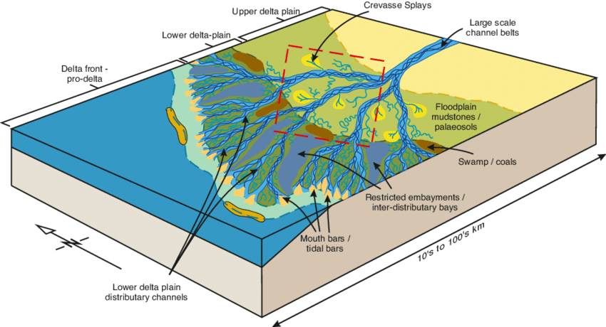

Source-to-sink & deltaic systems
==========================================

Source-to-sink system
----------------------

When landscapes are eroded, the resulting sediment and dissolved constituents pass through a connected suite of geomorphic environments, ultimately to be deposited or precipitated on an adjacent flood plain, marine shelf or abyssal plain.

This journey from *source* to *sink* represents the return limb of a mass flux loop that begins when rock is first exposed to subaerial erosion by tectonic processes such as crustal thickening or volcanic processes. The suite of connected environments through which the journey takes place is the **source-to-sink** system.

.. figure:: images/s2s.png
   :scale: 37 %
   :alt: s2s
   :align: center

   A simple schematic showing the dispersal system. The color of the lettering is coded: sources are indicated by black text, sinks are yellow, processes are shown in white (from MARGINS Source-to-Sink initiative NSF - 2009).

.. important::
  The connected environments of the source to sink system are separated by dynamic boundaries that shift in response to changes in sediment fluxes and accommodation.

Each environmental unit, which is inter-linked with other units by the flux of sediment through the boundaries, may produce sediment through erosion or act as a sediment sink through deposition, either temporarily or permanently (*figure below*). The erosion and deposition occur at spatial and temporal scales that vary over at least four orders of magnitude, making system behaviour especially difficult to predict.

   Hypsometric configuration of the various environmental units and boundaries in the source-to-sink concept. Table: connected environment units and their dynamic boundaries in the source to sink system (from MARGINS Source-to-Sink initiative NSF - 2009).

The source to sink system is a particularly important historical archive of past and present global change. Yet, whether we look at landscape morphology or the stratigraphy that records its erosion, we see the integral effect of many events over time.

An ability to predict the *quantitative behaviour* of the source to sink system is important for a variety of societal reasons. As an example:

1. The source to sink system contains most of our energy resources and potable water, and as a result most of Earth’s human population lives along the source to sink path.

2. Sediment eroded in uplands represents a significant loss of agricultural productivity even as it replenishes eroding coastlines. Yet we are presently unable to anticipate how perturbations in one part of the system will affect another.

To better understand and predict this system behaviour over an intimidating range of time and space scales, we rely on quantitative methods that help us analyse bed characteristics and architecture existing in the subsurface. Stratal patterns arising from the interplay of changing sea level, sediment supply, and accommodation can be predicted from physically based conceptual and numerical models that couple landscape-seascape experiments that reconstruct stratal geometries from ancient landscapes and climates.

Deltaic systems
---------------

In this part of the course we will focus on delta. Deltas are amongst the most environmentally and economically important coastal sedimentary environments. Significant resources (oil, gas, groundwater) have been exploited from deltaic formations.

.. note::
  The term **delta** comes from the Greek capital letter Δ and was first used for these deposits by *Herodotus* in the fifth century BC for the triangular-shaped alluvial deposits at the mouth of the Nile River.

Preamble
*********

Historically, modern deltas have been prized by human civilisations for their high natural and agricultural productivity, rich biodiversity, and for the abundance of waterways that provide easy means of transportation. Deltas are ubiquitous: 21 of the world’s 25 largest rivers, which deliver 31% of total fluvial sediment reaching the ocean, have formed well-expressed deltas at the coast (Meade, 1996). As a result, ~25% of the world’s population lives within deltaic and wetland coastal systems (Syvitski et al., 2005)

.. raw:: html

    

    <iframe width="100%" height="380" src="https://www.youtube.com/embed/W6OzezihmUw?rel=0" frameborder="0" allow="accelerometer; autoplay; encrypted-media; gyroscope; picture-in-picture" allowfullscreen></iframe>
    

.. important::
  Deltas are *constructional coastal landforms* with both subaerial and subaqueous components that are genetically associated with rivers discharging into a standing body of water, such as a lake, estuary, lagoon, sea, or the open-ocean shelf (*Top video*: Landsat satellites images of the Wax Lake Outlet and Atchafalaya deltas from 1984 to 2014 EarthObservatory (Louisiana US, USGS-NASA).

A delta is usually built by a single river. Reworking of sediments accumulated at the river mouth by marine processes (e.g., waves, tides, currents) should be slow enough to allow delta building to proceed. Take a look @ the video below from MinuteEarth that explains how deltas are formed.

.. raw:: html

    

    <iframe width="100%" height="400" src="https://www.youtube.com/embed/A47ythEcz74?rel=0" frameborder="0" allow="accelerometer; autoplay; encrypted-media; gyroscope; picture-in-picture" allowfullscreen></iframe>
    

.. note::
  The river is the main source for sediment delivered to the delta, although in some wave-dominated settings, a significant portion may be transported by wave-driven currents from remote sources

Features description
*********************

The deltaic environment breaks down into three regions:

1. The **delta plain**: The terrestrial environment where river meets ocean. It differs from fluvial floodplains and channels because it develops on top of previous deltaic deposits. In it, we see: *distributary channels* / *flood plains* / *inter-distributary marshes and swamps* / *beach complexes*. The delta plain is really a coastal extension of the river system. It comprises river and overbank sedimentary deposits in a flat, meandering stream type of setting.  These environments are at or near sea level, and it is essential that the overbank regions receive repeated deposits of muds and silts during flood stages to build up the land surface continuously as the entire delta subsides below sea level by tectonic processes.

2. The **delta front**: The steeply sloping portion of the delta where deltaic deposits slope downward from sea level to the level of the sea floor. Characterised by: *thinly bedded turbidites* / *slumps, slides and convolute bedding* / *grain size grades from sand and silt near sea level to fine clay farther out*. During floods, however, sand may extend farther down slope. The delta front environment is an extremely sensitive environment. It is strongly affected by waves, tides, changing sea level, and changes in the flux or amount of sediment delivered to the delta front. Many delta fronts have an offshore sandbar, called a distributary mouth bar, or barrier island system, parallel to the coast along the delta front.

3. **prodelta**: is located in the subtidal to deep continental shelf environment. It contains mainly fine grained distal mudstones usually *finely laminated*.

   Example of depositional model of the Mungaroo Formation (North West Shelf, WA, Australia) from Heldreich et al. (2017) highlighting the different geometries and definitions.

Because the delta progrades, these environments are superimposed on top of one another.

Classification
***************

As mentioned above, deltaic depositional facies result from interacting dynamics processes (*wave energy*, *tidal regime*, *currents*, *climate*, *tectonic*), which modify and disperse fluvial clastic deposits. The complexity of environmental settings under which deltas exist results in a variety of vertical sequences that can form within the delta facies.

The morphology and sedimentary sequences of a delta depend on the discharge regime, the sediment load of the river, and the relative magnitudes of tides, waves, and currents. Also, the sediment grain size and the water depth at the depositional site are important for the shape of the deltaic deposition patterns. This complex interaction of different processes and conditions results in a large variety of different patterns according to the local situations. Wright and Coleman (1973) described depositional facies in deltaic sediments and concluded that they result from a large variety of interacting dynamic processes (climate, hydrologic characteristics, wave energy, tidal action, etc.) that modify and disperse the sediment transported by the river. By comparing 16 deltas, they found that the Mississippi River delta is dominated by the sediment supply of the river, whereas the Senegal River delta or the São Francisco River delta are mainly dominated by the reworking wave activities. High tides and strong tidal currents are the dominant forces at the Fly River delta.

Following these observations and based on the general morphology of the subaerial delta plain, deltas have typically been classified as **fluvial**-, **wave**-, or **tide**-dominated according to the dominant processes affecting sediment delivery, deposition, and dispersal (Galloway, 1975; Orton and Reading, 1993). This simple classification scheme was later extended to include grain size and other effects.

   The classification scheme after Galloway & Broussard (1975), where wave-, tide-, and river-dominated deltas are distinguished in the extremes of the triangle. By comparing 16 major river deltas, Wright and Coelman (1973) concluded that, in the extremes, the Mississippi River delta is the most river-dominated delta and the São Francisco River delta is the most wave-dominated one. The delta of the Fly River in Papua New Guinea is mainly dominated by the tides.

At the **river-dominated** end of the spectrum, deltas are indented and have more distributaries with marshes, bays, or tidal flats in the interdistributary regions. They occur when the stream of the river and the resulting sediment transport is strong and other effects, such as reworking by waves or tides, are minor. These deltas tend to form big delta lobes into the sea, which may have little more than the distributary channel, and have a levee exposed above the sea level. Due to their similarity with a bird's foot, they are often referred to in the literature as a *bird-foot delta*, like in the case of the Mississippi River delta. When more of the flood plain between the individual distributary channels is exposed above the sea level, the delta displays lobate shape.

**Wave-dominated** delta shorelines are more regular, assuming the form of gentle, arcuate protrusions, and beach ridges are more common (e.g., the Nile River delta or Niger River delta). Here, the breaking waves cause an immediate mixing of fresh and salt water. Thus, the stream immediately loses its energy and deposits all its load along the cost.

.. figure:: images/delta.png
   :scale: 70 %
   :alt: classification
   :align: center

   Range of common shallow-water depositional systems in a coastal classification based on ratio of wave power to tidal power (from Steel & Milliken 2013)

**Tide-dominated** deltas occur in locations of large tidal ranges or high tidal current speeds. Such a delta often looks like a estuarine bay filled with many stretched islands parallel to the main tidal flow and perpendicular to the shore line (e.g., the Brahmaputra River delta or the Fly River delta).

Delta stratigraphy
---------------------

Over time, research on deltas moved from the development of depositional models based on modern highstand deltas, which are ultimately controlled by variations in sediment supply by the delta-building rivers, to sequence stratigraphic interpretations of deltaic evolution through multiple sea-level cycles.

In 1890, American geologist G. K. Gilbert recognised that the deposition of finer-grained material farther away from the shoreline also created a distinctive vertical sequence in delta deposits. Based on these observations, he was the first to subdivide a deltaic deposit into three parts —the **topset**, the **foreset**, and the **bottomset**— where sedimentary processes are controlled by different physical processes.

   Top: sketch of stratification of a Gilbert‐type delta (from Chavarrías et al. 2018 after Gilbert, 1890). Bottom: view of a Gilbert‐type delta in the field (Arizona, US).

The topset deposit is formed out of layers gently inclined in the streamwise direction and deposited over the foreset by fluvial transport processes. The downstream limit of the topset is denoted as the brinkpoint. The delta foreset, or front, is dominated by avalanching processes and is formed out of steeply inclined layers that are placed over a fine‐grained bottomset deposit. In general foreset layers are nearly parallel to the relatively steep delta front, and the bottomset deposit is nearly parallel to the substrate (i.e., the lake or sea bottom).

a. the foreset layer is thus graded from coarse nearshore to fine offshore,
b. the bottomset layer consists of the finest material, deposited far out,
c. as this material continues to build outward, the stream must extend its length and forms new deposits, known as topset layers.

    **Foresets** are characterised by a depositional angle ranging between 25° and 30°, but they can reach 40° if the sediment is sufficiently coarse. Under these conditions, delta front is unstable and commonly affected by collapses, which can generate slumps, debris flow or even turbidity currents. **Toeset** deposits represent the transition between the steeply inclined foreset and the sub-horizontal bottomset. Because of the significant change in depositional angle, the larger rolling clasts along with several debris flow are trapped in the toeset zone, where also turbulent flows can drop part of their sedimentary load. **Bottomsets** are the finest deposits of the Gilbertian system. They are characterised by deposition of turbidity currents (HDTC and LDTC), although, being located (such as toeset) below the wave base, they are commonly interested also by mud settling (photo: Ghinassi).

Sediment transfer
**********************

The mode of sediment transfer from the subaerial delta plain to the subaqueous delta slope depends on the type and amount of sediment delivered by the fluvial system and the density contrast between the sediment-laden river outflow and the basin water.

  Classification of deltas according to Bates (1953), considering the relationship between the density of the incoming flow (river discharge or Dr) respect to that of the receiving water body (lake or sea, or Dw). A) Hypopycnal flow（Dr<Dw) .B) Homopycnal flow (Dr=Dw). C) Hyperpycnal flow (Dr>Dw).

1. **Hypopycnal** outflow results in a buoyant plume of fine-grained sediment suspension that spreads away from the delta and gradually settles in its distal realm.
2. **Homopycnal** outflow involves rapid mixing of river and basin water, which causes sediment deposition close to the river mouth.
3. **Hyperpycnal** outflows plunge down on the steep delta slope, depositing there their sediment load.

The latter two types of river outflow conditions thus favour delta build-out, with most of the sediment deposited beneath the wave base and transported by gravitational processes.

    Mouth bar progradation will form coarsening-upward units, from mud and fine sand (distal lobe) to coarse sand and gravels, if the feeder channel is preserved at the top (photo: Ghinassi).

    Top: **Down-current depositional patterns** - sections parallel to flow will show gently inclined beds (3°-10°) pinching out down-current. Middle: **feeder channel** - in the proximal part of the bar, sections transverse to the main flow will show the geometry of the feeder channel. Bottom: combination of these typical deposits in the field (photo: Ghinassi).

.. important::
  Gilbert-type deltas are sensitive coastal recorders of relative base-level changes. In zones of active tectonics in particular, the combined effect of eustasy and tectonic uplift/subsidence gives rise to diverse delta architecture.

  Schematic longitudinal cross‐section of a Gilbert‐type delta, depicting its characteristic tripartite architecture and other common features (Gobo et al., 2015). The formation of such deltas reflects a high basin/river depth ratio; no scale is given, as the delta thickness depends on the basin accommodation and may range from a few metres to a few hundred metres. Bottom pannels: schematic cartoon portraying the growth of a Gilbert‐type delta subject to short‐term base‐level changes, with a sigmoidal toplap formed during base‐level rise (cases 1 and 3) and an oblique toplap formed base‐level stillstand or fall (cases 2 and 4). Note that the sigmoidal brink‐zone architectural record of base‐level rise tends to be erased by fluvial incision during a subsequent base‐level fall (see case 4).

Large changes in relative base level may lead to axial dissection of delta by an incised valley and its subsequent drowning with the progradation of a younger bayhead delta, or result in vertical stacking of successive deltas.
Low-magnitude short-term changes are recorded in the delta brink-zone, with the relative base-level rise reflected in a sigmoidal geometry and the relative base-level fall or stillstand in an oblique geometry.
As the brink zone tends to be eroded by fluvial system and waves, the foreset and toeset/bottomset deposits are the most valuable archives of allogenic and autogenic changes affecting the delta front and its fluvial feeder system.
