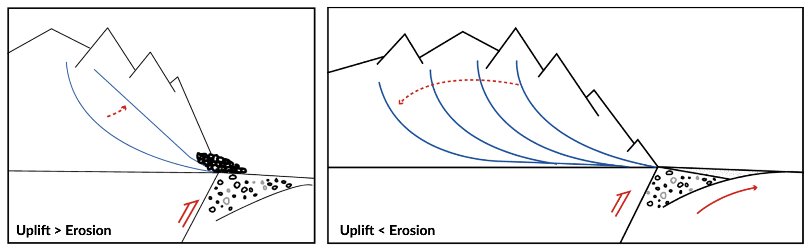
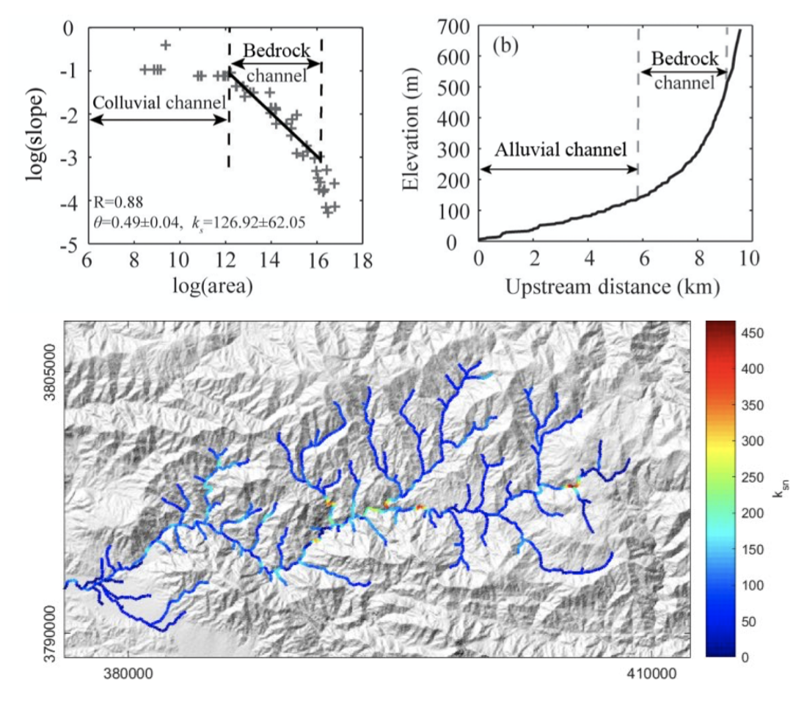
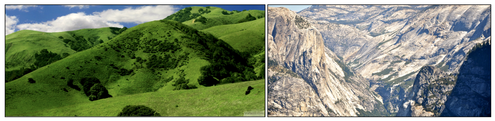
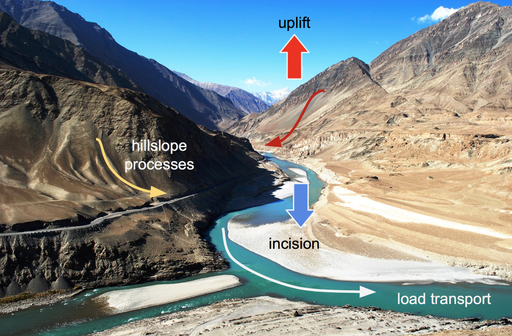
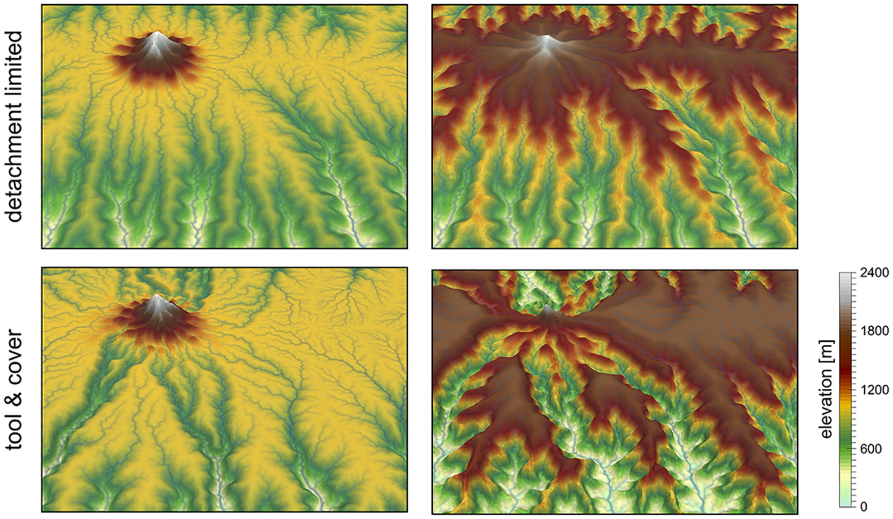
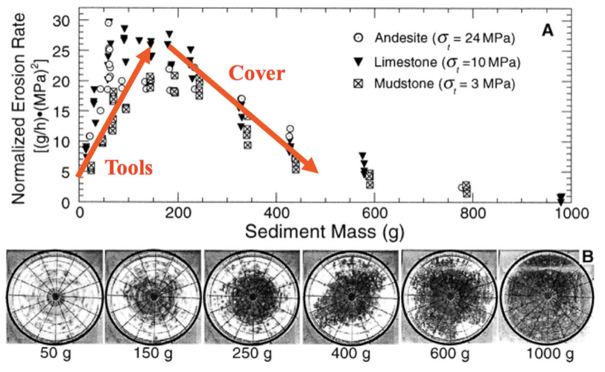

Fluvial processes
==========================================

.. note::
  Water is one of the primary agents driving the constant erosion of the surface of the earth. Water aids in the degradation of rocks and then transports the resulting sediment downstream to some sedimentary basin, usually the ocean.

Even though the process of erosion is constantly occurring, sediments move down a river much more slowly. Sediments, particularly gravel, can only be moved when the river is flowing with high energy, like during a flood. As a result, sediments can be temporarily stored in fluvial deposits until the next storm comes along and washes some of the sediment downstream a little further. The sediment that gets washed away will probably be replaced by more sediment from upstream. In this manner, sediments inch their way downstream, getter ever smaller in the process.

Longitudinal profiles of bedrock rivers
----------------------------------------

Graded rivers
****************

Longitudinal profiles of alluvial and bedrock rivers are typically concave up, and the precise shape of their concavity is known to integrate tectonic, climatic, and channel grain size distribution factors.

   In a river, the long profile is in equilibrium when it forms a smooth, concave shaped profile without major irregularities.

A river at **equilibrium** or **steady state**, **a graded stream**, is referred to as having a **graded profile**. Rivers can be kicked into in a state of disequilibrium because of changes in the environment such as: discharge, storm activity and intensity, sediment supply, temperature, vegetation, tectonic uplift and damming.

The graded river has just the right combination of gradient and discharge a river needs to flow and carry sediment delivered by its tributaries. If a river is pushed out of disequilibrium by one or more of the environmental variables listed above, **the rivers respond to these changes in a variety of ways so as to attain a graded profile again**.

This is not to imply that a river will return to the same graded profile as before the disturbance occurred. Rather, the river attains a new equilibrium which is in balance with the new environmental conditions. The deposition of sediments, erosion, changing sinuosity (the amount of stream meandering that occurs over a length of stream channel), channel widening, channel deepening or a combination of all the above may happen as the river tries to attain equilibrium. Because the environment is always changing, the equilibrium a river seeks is, in essence, always changing too. This variability makes it hard for a river to reach equilibrium.

Responses to tectonic & climate
^^^^^^^^^^^^^^^^^^^^^^^^^^^^^^^^

The sketches below illustrate the long-term response of longitudinal river profile subjects to change in either tectonic conditions or climatic forcing.

In the left panel, the uplift regime increases and the overall slope increases as well leading to higher erosion until a new equilibrium (steady-state) is reached. At steady-state the rate of rock uplift relative to some datum (or base-level), such as mean sea level, equals the erosion rate at every point in the landscape and consequently the overall topography does not change. Under these circumstances, the high velocity of the flow is able to transport coarse sediments on short distance.

In the right panel, the uplift remains constant but the precipitation is increased. As a result, the erosion increases and the slope decreases. A new steady-state is reached when the erosion equates the uplift regime. Under these circumstances, as the slope decreases, the velocity of the flow also decreases and finer sediments are transported and deposited in foreland basins.

Knickpoints
****************

As we saw, rivers in equilibrium with the environment have smooth, concave long profiles, however a dynamic knickpoint, which is a sharp break in slope in the long profile of a river (*e.g.* a waterfall) can be formed when the system is perturbed by external factors such as changes in tectonic or climatic conditions.

Knickpoints migrate upstream, separating a downstream reach, broadly in equilibrium with the new conditions (red in diagram above), and an upstream reach which is yet to adjust (green in diagram). Understanding the development and migration of knickpoints through landscapes is therefore fundamental for inferring historic landscape forcings and predicting possible future landscape responses to change.

.. figure:: images/knickpoint.png
   :scale: 48 %
   :alt: knickpoint
   :align: center

   Knickpoints (often waterfalls) are often located at dynamic boundaries within landscapes, separating a downstream reach characterised by steep channels and long steep hillslopes (highlighted in red) from a low relief landscape upstream (shown in green) (source: Waterfall3d model adapted from Hurst et al. (2012))

Knickpoints generally retreat very slowly through landscapes which makes the erosion processes very difficult to monitor in real time. Experimental flume tanks can allow these processes to be simulated in a controlled environment, as the timescale of knickpoint migration is reduced and the controls on formation and retreat processes can be isolated and quantified.

Relationship between river slope and drainage area
****************************************************************

As emphasised above, bedrock rivers play a important role in setting the boundary conditions for the relief production and its evolution. Of particular importance is the analysis of river profiles to detect those zones where rock uplift is high because rivers respond to tectonic forcing by steepening their gradient and enhancing their incision into bedrock.

   Relationship between river slope and drainage area and plot of :math:`k_{sn}` along river streams using the Topotoolbox package.

The use of the normalised channel steepness index (:math:`k_{sn}`) which is derived from the slope–area regression, has widely been applied to detect zones subject to different rock uplift rates. This slope–area regression has the following form:

.. math::
  S = k_s A^\theta

where :math:`S` is the channel slope, :math:`k_s` is referred as the steepness index, :math:`A` is the drainage area (surrogate of stream discharge) and :math:`\theta` is the concavity of the longitudinal profile. :math:`k_{sn}` is estimated from the equation above by normalising the drainage area of a given reach and using a reference concavity (:math:`\theta_{ref}`) which corresponds to the regional concavity observed in reaches unperturbed by tectonic signals.

Controls on the width of bedrock rivers
****************************************************************

Channel width and its variation with water discharge importantly influence bed shear-stress patterns, and thus play a first-order role in controlling the pattern and tempo of bedrock channel incision. Given challenges to measuring channel width in mountainous terrain, classical hydraulic geometry relationships among width, discharge, and drainage area developed for lowland alluvial rivers.

There is some indication that this approach is appropriate – the widths of bedrock and alluvial channels both appear to scale similarly with drainage area across many orders of magnitude and, in fact, appear to have physically similar widths at comparable drainage areas as illustrated in the figure below.

.. figure:: images/width.png
   :scale: 58 %
   :alt: Controls on the width
   :align: center

   Bedrock channel width as a function of upstream drainage area in graded bedrock rivers. Power-law scaling relations for alluvial gravel-bedded rivers (e.g., Parker et al., 2007) and mixed bedrock–alluvial rivers (Hack, 1957) are shown for comparison (from Whipple et al., 2013).

This scaling suggests that the factors governing bedrock and alluvial channel width are similar. Although it is convenient to model bedrock channel width as a simple power-law function of drainage area, it has been hypothesised that width also depends on uplift rate and serves as an important mode of channel adjustment to base-level change.

Transient adjustments identification
****************************************************************

Evaluating whether river profiles reflect steady-state or transient conditions has been performed using plots of slope versus drainage area (discussed above), but noisy topographic data can complicate interpretations of these plots. In particular, step-like changes in channel elevation over distance associated with digital elevation models introduce imprecision into determinations of channel slopes. An alternative approach involves integrating the slope-area equation under the assumption of spatially invariant uplift and erodibility (Perron and Royden, 2013).

Performing the integration in the upstream direction from a base level :math:`x_b` to an observation point :math:`x`  yields to:

.. math::
  \chi = \int_{x_b}^x \left( \frac{A_0}{A(x)} \right)^{\frac{m}{n}} dx

where :math:`A_0` is a reference drainage area, :math:`m`, :math:`n` coefficients from the stream power law.  Values of :math:`\chi` are determined using assumed values of :math:`m/n` between 0 and 1. A plot of bed elevations versus :math:`\chi` (a chi plot) is produced. If a profile is in steady state, the plot should be linear.

.. note::
  For :math:`A_0` = 1 km2, the slope of a linear chi-plot profile represents the steepness index :math:`k_{s}`

An advantage of the chi-plot approach is that it removes the effect of drainage area, so that locations within a drainage network with similar elevations have similar values of χ, even if the drainage areas of those locations differ. Thus, all rivers in steady state within an area of spatially uniform uplift and resistance should exhibit collinear chi plots.

.. figure:: images/chi.png
   :scale: 80 %
   :alt: chi-plot
   :align: center

   River network and longitudinal profile before and after river capture. a χ map for the river network before river capture. b :math:`\chi` map for the present river network. c :math:`\chi`-elevation plot for the Paleo Chaiwen and Yihe Rivers before capture. d :math:`\chi`-elevation plot for the present Chaiwen, Yihe, and Reversed Rivers (Fan et al., 2018).

Transient adjustments of longitudinal profiles, characterised by knickpoints and knickzones, are depicted on chi plots as local increases in change of elevation per unit change in :math:`\chi`, which produce positive deviations from a linear profile. Differences in slopes of transformed profiles upstream and downstream of knickpoints also define differences between adjusted sections of profiles below knickpoints and unadjusted sections of profiles above knickpoints.

   River basins and river profiles in equilibrium and disequilibrium (from Willett et al., 2014).

The figure above shows change in size and shape of two drainage basins that share a common divide as they evolve from (A) a state of disequilibrium to (B) a steady state. The parameter :math:`\chi` provides a prediction of the steady-state elevation for a given point on a channel. The basin on the left (aggressor) has lower steady-state elevation at channel heads and therefore drives the drainage divide toward the basin on the right (victim). The lower panels show the evolution of the elevation of two channels that meet at the shared divide with respect to (C) :math:`\chi` and (D) distance along the channel. The slopes above the channel head attain a symmetric form at steady state, but do not differ strongly from this form under disequilibrium conditions. The disequilibrium channel profiles in (C) show that :math:`\chi` is discontinuous across the drainage divide, with larger :math:`\chi` values in the “victim” basin. At steady state, all channel points in both basins lie on a single linear trend, subject to the assumptions described in the text. Note that changes in elevation are subtle, whereas changes in χ are marked.

Limited conditions for landscape evolution
****************************************************************

   Transport-limited (left) vs weathering-limited (right) landscapes.

1. **Transport-limited** landscapes: delivery of sediment to streams is limited by the rate at which soil and rock can be transported (supply >> capacity). The forces that cause erosion and transport of sediment are not sufficient to remove all landscape materials. Transport-limited slopes occur where weathering processes are efficient at producing debris but where transport processes are inefficient at removing it from the slope. Such slopes lack free faces and faceted appearances, and they are generally covered with a soil mantle.
2. **Weathering-limited (detachment-limited)** landscapes: delivery of sediment to streams is limited by the rate of sediment production (supply << capacity) by the various mechanisms of chemical weathering, physical weathering, and erosional detachment (overland flow; mass movement). The forces that cause erosion and transport of sediment are sufficient to remove all landscape materials. On weathering-limited slopes, transport processes are so efficient that debris is removed more quickly than it can be generated by further weathering. Such landscapes develop a faceted or angular morphology in which an upper free face, or cliff, contributes debris to a lower slope of accumulation.

Surface processes models
---------------------------------------------

The whole landscape evolution can basically be represented in a single equation:

.. math::
  \frac{\partial z}{\partial t} = U - E - \nabla \cdot q_s

All landscape must obey this fundamental statement about sediment transport. In this equation :math:`\frac{\partial z}{\partial t}` is the change in surface elevation,  :math:`U` is the uplift rate, :math:`E` is the erosion rate and :math:` \nabla \cdot  q_s` is the sediment flux divergence.

The erosion rate :math:`E` corresponds to sediment production from weathering and bedrock erosion by glacier, wind, water. The sediment fluxes is transported by hillslope
and fluvial transport processes.

   Surface processes are acting everywhere we have relief, but more obviously in mountain regions. In response to tectonic uplift, rivers incise into bedrock and insure the progressive lowering of the base level for hillslope processes to take place. Rivers also transport the eroded materials to the sedimentary basin.

Many geomorphological applications have demonstrated the usefulness of these models, whose predictions help researchers test simple to complex hypotheses on the nature of landscape evolution. Surface processes models (SPMs) also provide connection between small scale, measurable processes and their long-term geomorphic implications.

History
*********

The roots of landscape evolution theory can be found in the pioneering work of Gilbert (1877), who proposed a set of hypotheses to relate various landforms to the mechanisms of weathering, erosion and sediment transport. The first quantitative models appeared later in the 1960s (e.g., Culling, 1960; Scheidegger, 1961; Ahnert, 1970; Kirkby, 1971). These models formalise the concepts of Gilbert (1877) to the development of hillslope profiles. A few years later, these models were extended to two dimensions, although still focused on hillslope morphology.

.. figure:: images/lem.png
   :scale: 50 %
   :align: center

   Partial list of existing landscape evolution models.

During the last two decades, as computers continued to get faster, a number of sophisticated numerical SPMs have been developed, mainly focusing on watershed and mountain belt evolution. Both hillslope and fluvial processes are involved in these models, which differ from each other by the parameterisation of these processes and their numerical resolution.

Continuity of mass
*******************

In the simplest case where there is no distinction between a regolith layer and the bedrock underneath, the mass continuity equations for a column of soil or rock is expressed as:

.. math::
  \frac{\partial z}{\partial t} = U - \nabla \cdot q_s

where the elevation  :math:`z` (m) is measured vertically,  :math:`q_s` is the total downhill soil flux, :math:`\nabla \cdot` is the spatial divergence operator and :math:`U` (m/yr) is a source term that can either represent the rate of incision of channel streams at the hillslope boundaries or uniform uplift.

Sediment transport
***************************

To describe the rates of sediment erosion/transport/deposition, several approaches have been proposed. In its simplest formalism a detachment-limited equation is often used.

Detachment-limited model
^^^^^^^^^^^^^^^^^^^^^^^^^^

The soil transport rate per unit width by flowing water, :math:`q_r`, is modelled as a power function of topographic gradient :math:`\nabla z` and surface water discharge per unit width :math:`q_w` (m2 /yr):

.. math::
  q_r = − \kappa_r q_w^m \nabla z^n

This detachment-limited incision rate, which is calculated as a power law function of fluvial discharge only applies where channel slope is positive. This brings the following relatioship:

.. math::
  \frac{\partial z}{\partial t} = − \kappa_r q_w^m \nabla z^n

This expression corresponds to a simplified form of the usual expression of sediment transport by water flow, in which the transport rate is assumed to be equal to the local carrying capacity, which is itself a function of boundary shear stress or stream power per unit width. We consider additionally no threshold for particle entrainment. Generally, the exponents m and n have values between 1 and 2.

.. raw:: html

    

    <iframe width="100%" height="350" src="https://www.youtube.com/embed/TVRH4dJabO8?rel=0" frameborder="0" allow="accelerometer; autoplay; encrypted-media; gyroscope; picture-in-picture" allowfullscreen></iframe>
    

Hillslope processes
^^^^^^^^^^^^^^^^^^^

In its most simple form, the parameterisation of hillslope transport is based on a linear dependence to the topographic gradient. This linear law has in fact been used to represent a variety of transport processes such as creep, biogenic activity or rain splash.

Downslope simple creep is commonly regarded as operating in a shallow superficial layer and is defined as:

.. math::
  q_d = − \kappa_d \nabla z

Note that because of the multi-process parameterisation of soil transport, the coefficient :math:`\kappa_d` is also scale-dependent, like the :math:`\kappa`-scale parameters of the other stream power law defined above.

Incision laws overview
***************************

Several formulations of river incision have been proposed to account for long term evolution of fluvial system. These formulations describe different erosional behaviours ranging from detachment-limited incision, governed by bed resistance to erosion, to transport-limited incision, governed by flow capacity to transport sediment available on the bed.

As we already discussed, mathematical representation of erosion processes in these formulations is often assumed to follow a stream power law. These relatively simple approaches have two main advantages. First, they have been shown to approximate the first order kinematics of landscape evolution across geologically relevant timescales (>104 years). Second, neither the details of long term catchment hydrology nor the complexity of sediment mobilisation dynamics are required. However, other formulations are sometimes necessary when addressing specific aspects of landscape evolution.

.. figure:: images/fig3.jpg
   :scale: 12 %
   :alt: laws
   :align: center

   Model space for stream power-based incision laws. It shows the dependence of river incision rate on sediment flux (adapted from Hobley et al., 2011).

Detachment-limited
^^^^^^^^^^^^^^^^^^^^^^

The simplest law to simulate fluvial incision is based on the detachment-limited stream power law (option 1, in the above figure), in which erosion rate  depends on drainage area :math:`A`, net precipitation :math:`P` and local slope :math:`S` and takes the form:

.. math::
  I = − \kappa_d P^l (PA)^m S^n

:math:`\kappa_d` is a dimensional coefficient describing the erodibility of the channel bed as a function of rock strength, bed roughness and climate, :math:`l`, :math:`m` and :math:`n` are dimensionless positive constants.

Default formulation assumes :math:`l = 0`, :math:`m = 0.5` and :math:`n = 1`. The precipitation exponent :math:`l` allows for representation of climate-dependent chemical weathering of river bed across non-uniform rainfall. In this model sediment deposition occurs solely in topographically closed depression and offshore.

Transport-limited
^^^^^^^^^^^^^^^^^^^^^^

   Illustration of the impact of detachment versus transport limited (tool & cover option 3) formulations on landscape dynamics. Evolution of dissection of an uplifting landscape composed of a flat surfaces dotted with an isolated peak, after 5 and 9 Ma of dissection. The modeling shows how the abundant bedload shed by the isolated peak boosts incision along the receiving streams (tool effect).

Here, volumetric sediment transport capacity (:math:`Q_t`) is defined using a power law function of unit stream power:

.. math::
  Q_t = − \kappa_t (PA)^m_t S^n_t

where :math:`\kappa_t` is a dimensional coefficient describing the transportability of channel sediment and :math:`m_t` and :math:`n_t` are dimensionless positive constants. In this equation, the threshold of motion (the critical shear stress) is assumed to be negligible.

An additional term is now introduced in the stream power model:

.. math::
  I = − \kappa f(Q_s) (PA)^m S^n

with :math:`f(Q_s)` representing a variety of plausible models for the dependence of river incision rate on sediment flux :math:`Q_s`. In the standard detachment-limited, :math:`f(Q_s)` is equal to unity, which corresponds to cases where :math:`Qs << Qt`. All sediment is dispersed downstream and the incision limiting factor is bedrock erodibility.

Addition of the transport-limited function results in the fact that, where sediment flux equals or exceeds transport capacity (:math:`Q_s/Q_t \ge 1`) the system becomes transport-limited and depositional if :math:`Qs/Qt > 1`. In this model the time-evolving distribution of erosion and sedimentation, is affected by the distribution of detachment-limited and transport-limited reaches, which is controlled by the respective values of :math:`\kappa_d` and :math:`\kappa_t`.

   Experimental study of bedrock abrasion by saltating particles (Sklar & Dietrich, 2001).
   The tool effect corresponds to impacting particles that remove rock, the more particles in the flow the higher the erosion rate. The cover effect corresponds to the effect of bed protection related to the amount of particles within the flow. The more particles the smaller the erosion rates.

The transition from one behaviour to the other can be treated either abruptly, progressively, through the use of one of the following formulations:

#. **Linear decline**: This model belongs to the undercapacity family of models: it assumes that stream incision represents the expenditure of the energy in excess of that needed to transport the bypassing sediment load. Stream incision potential decreases linearly from a maximum where sediment flux is negligible, to zero where sediment flux equals transport capacity (option 2).

#. **Almost parabolic**: Both qualitative and experimental observations have shown that sediment flux has a dual role in the river bed incision. First, when sediment flux is low relative to carrying capacity, erosion potential increases with sediment flux (tool effect: bedrock abrasion and plucking). Then, with increased sediment flux, erosion is inhibited (cover effect: sediments protect the bed from impacts by saltating particles) (option 3).

#. **Dynamic cover**: Typically gravel-river beds have an armoured layer of coarse grains on the surface, which acts to protect finer particles underneath from erosion. To account for sediment and spatial heterogeneity in the armouring of the river bed, Turowski et al. proposed a modified form of the ‘almost parabolic’ model that better estimates the original Sklar and Dietrich experiments (option 4).

.. figure:: images/lowrelief.png
   :scale: 80 %
   :alt: Preferential erosion
   :align: center

   Preferential erosion and low relief preservation.
