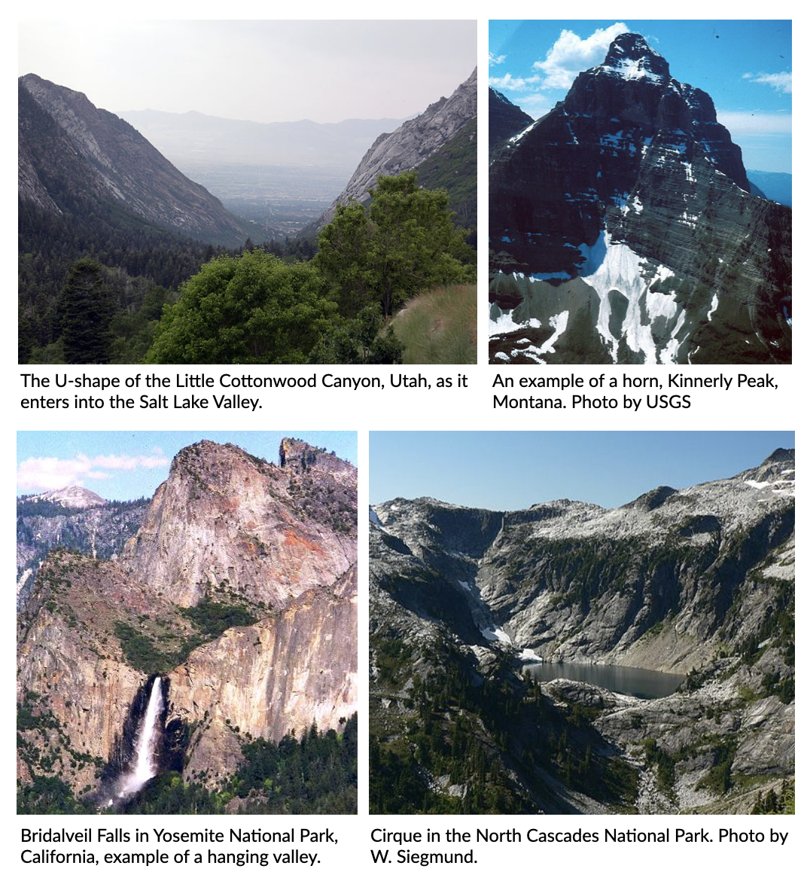

Glacial geomorphology
==========================================

..  admonition:: Chapter structure
    :class: toggle

    - Continental glacial processes
    - Erosion, transportation and deposition induced by ice flow
    - Marine glacial sediment delivery and deposition  processes

Glacial geomorphology is the scientific study of the processes, landscapes, and landforms produced by ice sheets, valley glaciers, and other ice masses on the surface of the Earth.

These processes include understanding how ice masses move, and how glacial ice erodes, transports, and deposits sediment.

..  admonition:: Learning outcomes
    :class: toggle

    - To understand the mechanisms by which ice masses entrain, move and deposit sediment;
    - To understand how *glacial* sedimentary bodies articulate with other components of sediment routing systems;
    - To consider the importance of the *cryosphere* in shaping the Earth’s surface and the pivotal role it plays in influencing many of its core functions

Distribution and significance
------------------------------

.. note::
  This part of the notes is based on the IPCC Special Report on the Ocean and Cryosphere in a Changing Climate (2019) (`link <https://www.ipcc.ch/site/assets/uploads/sites/3/2019/11/06_SROCC_Ch02_FINAL.pdf>`_).

.. raw:: html

    

    <iframe width="100%" height="380" src="https://www.youtube.com/embed/hC3VTgIPoGU?rel=0" frameborder="0" allow="accelerometer; autoplay; encrypted-media; gyroscope; picture-in-picture" allowfullscreen></iframe>
    

..  admonition:: The cryosphere
    :class: toggle

    The cryosphere is an all-encompassing term for those portions of Earth's surface where water is in solid form, including sea ice, lake ice, river ice, snow cover, glaciers, ice caps, ice sheets, and frozen ground. Thus, there is a wide overlap with the hydrosphere.

..  admonition:: Ice sheet
    :class: toggle

    An ice sheet is a chunk of glacier ice that covers the land surrounding it and is greater than 50,000 kilometers wide. An ice sheet is also known as a continental glacier (*e.g.* Antartic Ice Sheet or Greenland Ice Sheet).

..  admonition:: Ice shelf
    :class: toggle

    An ice shelf is a thick, floating slab of ice that forms where a glacier or ice flows down a coastline. Ice shelves are found only in Antarctica, Greenland, and Canada. Thicknesses of floating ice shelves range from 100 to 1000 meters.

..  admonition:: Permafrost
    :class: toggle

    Permafrost is ground that continuously remains frozen for two or more years, located on land or under the ocean.

Cryosphere in high mountain regions
*******************************************************************

The cryosphere (including, snow, glaciers, permafrost, lake and river ice) is an integral element of high mountain regions. Ice presently covers about 10% of Earth’s surface (Most of it is in the polar ice caps, particularly Antarctica). Widespread cryosphere changes affect physical, biological and human systems in the mountains and surrounding lowlands, with impacts evident even in the ocean. Almost 10% (671 million people) of the global population lived in high mountain regions in 2010, based on gridded population data (Jones and O’Neill, 2016) and a distance of less than 100 km from glaciers or permafrost located in mountains areas as defined in the following figure.

Distribution of mountain areas (orange shading) and glaciers (blue) as well as regional summary statistics for glaciers and permafrost in mountains are presented in the above figure. Mountains are distinguished based on a ruggedness index (>3.5), a logarithmically scaled measure of relative relief. Eleven distinct regions with glaciers. Diamonds represent regional glacier area and circles the permafrost area in all mountains within each region boundary. Histograms for each region show glacier and permafrost area in 200 m elevation bins as a percentage of total regional glacier and permafrost area, respectively. Also shown in grey is the median elevation of the annual mean 0 degree Celsius isotherm calculated. The annual 0 degree Celsius isotherm elevation roughly separates the areas where precipitation predominantly falls as snow and rain.

Ice sheets interaction with Climate
*******************************************************************

Ice sheets play a central role in the climate system. They store significant amounts of fresh water and are the conveyor belts for transporting snow that accumulates on land back into the oceans. The figure below illustrates several of the processes taking place between ice sheets, solid earth and the climate system. These interactions have an internal variability but also affect the coupled ice sheet–climate response to external forcings on time scales of months to millions of years. The inlay figure represents a typical height profile of atmospheric temperature and moisture in the troposphere.

.. figure:: images/FigBox5.2-1_interaction_ice_sheet_rest.jpg
    :width: 100 %
    :alt: Ice sheets interaction with the Climate
    :align: center

    The interaction of ice sheets with the climate system. Credit: Figure 1 in Box 5.2, IPCC AR5.

If the current warming of the climate continues, the ice sheets will respond at a yet unknown rate, with unknown consequences for the rest of the climate system.

..  admonition:: Hydrological cycles, climate and landscape evolution
    :class: toggle, important

    - Ice masses (glaciers and ice sheets) are important sinks in the hydrological cycle,
    - More than 82% of Earth’s freshwater is stored in the Antarctic and Greenland ice-sheets alone;
    - Ice masses are important ‘drivers’ of environmental processes, including  climate, deep-water formation in the Southern Ocean driving carbon sequestration, planetary albedo as a feedback mechanism for glacial advance, and changes in atmospheric circulation.

    .. figure:: images/Albedo.jpg
        :width: 90 %
        :alt: Albedo
        :align: center

        Sea ice reflects as much as 85% of solar radiation hitting the surface,  hence absorbing only 15%.  Ocean water,  by contrast,  reflects only about 7% of  solar radiation,  absorbing 93%. (from Don Perovich, CRREL)

How has the distribution of glaciers and ice sheets changed?
*******************************************************************

The current distribution of glaciers and ice sheets is very different to how these areas used to look in the past. Over the last 100 years land covered with ice has decreased considerably as the global climate has warmed.

The majority of glaciers receded in the last 200 years, although noticeably some gained in length in the late 1970s and early 1980s. There were very few glaciers increasing in length from 2010 to 2014 as these were among the warmest in recorded history. There is much concern that Africa will soon join Australia as a continent with no glaciers.

.. figure:: images/Cascade.png
    :width: 80 %
    :alt: South Cascade Glacier
    :align: center

    Change in the amount of ice on South Cascade Glacier between 1928 and 2010.

The figure above shows clear evidence of the decline in the volume of ice from the South Cascade Glacier in the Cascade Ranges in Washington State, USA. This glacier is estimated to have lost half its volume of ice between 1959 and 2010.

In recent geologic time the trend in ice coverage was not one of recession. After closely examining glacial deposits in many locations, scientists have identified a number of ice ages in the last 200,000 years where ice levels were much higher than today. The most recent of these ice ages occurred between 21,000 and 18,000 years ago and it has been estimated that about 30% of the Earth was covered by ice. The average temperature of the Earth was at least seven degrees cooler and sea levels were considerably lower (as much as 100 metres) as water was frozen.

The figure below shows the estimated extent of global ice cover around 18,000 years ago. It is important to notice that the amount of ice in the Northern Hemisphere is double that of the Southern Hemisphere, and that only relatively small areas of the Australian Alps and Tasmania were covered by ice. At the peak of this ice age it is thought that ice covered 6000 square kilometres of the central plateau of Tasmania to a depth of 700 metres.

.. figure:: images/prevglace.png
    :width: 100 %
    :alt: Global glaciation about 18 000 years ago
    :align: center

    Global glaciation about 18 000 years ago.

It is uncertain as to why these ice ages, as symptoms of significant climatic change, may have occurred at regular intervals in the Earth’s history. Scientists have speculated that this climate change could have been influenced by a number of natural causes including celestial cycle changes, volcanic activity, changes in atmospheric gas levels, ocean current changes and sun spot activity.

Glacial processes
------------------------------

.. note::
  This section is based on the `open geology book <https://opengeology.org/textbook/14-glaciers/>`_, Prof. Nelson from Tulane University `Glaciers and Glaciation lecture notes <https://www.tulane.edu/~sanelson/eens1110/glaciers.htm>`_ and the `antarcticglaciers.org <http://www.antarcticglaciers.org>`_ website from Dr Davies from Royal Holloway, University of London.

Glacier formation
************************************************

Three conditions are necessary to form a glacier:

1. Cold local climate (polar latitudes or high elevation);
2. Snow must be abundant; more snow must fall than melts, and
3. Snow must not be removed by avalanches or wind.

Glaciers can only form at latitudes or elevations above the **snowline**, which is the elevation above which snow can form and remain present year round. The snowline, at present, lies at sea level in polar latitudes and rises up to 6000 m in tropical areas.

Glaciers form in these areas if the snow becomes compacted, forcing out the air between the snowflakes. As compaction occurs, the weight of the overlying snow causes the snow to recrystallise and increase its grain-size, until it increases its density and becomes a solid block of ice. The density of the ice increases from 50-100 kg/m3 for fresh snow up to 900 kg/m3 for fully compacted glacial ice. In some cases, small air pockets remain trapped in the ice and form a record of the past atmosphere

The above animated figure from `OGGM-Edu <https://edu.oggm.org/en/latest/index.html>`_ shows how a glacier can change its size by:

- **accumulation**, which occurs by addition of snowfall, compaction and recrystallisation, and
- **ablation**, the loss of mass resulting from melting, usually at lower altitude, where temperatures may rise above freezing point in summer.

.. important::
  Depending on the balance between accumulation and ablation during a full season, the glacier can advance or retreat. The zone where there is net accumulation (where there is more mass gained than lost) is the **accumulation zone**. The part of the glacier that has more ablation than accumulation is the **ablation zone**. Where ablation is equal to accumulation is the **Equilibrium line altitude ELA**.

Glacier movement
************************************************

As the ice accumulates, it begins to flow downward under its own weight. Pressure-Temperature diagram of ice shows that ice actually melts under pressure (one of the unique properties of water) so **ice at the base of a typical glacier is actually melting** (right hand side figure above). **About half of the overall glacial movement is from sliding on a film of meltwater along the bedrock surface and half from internal flow**. The ice near the surface (about the upper 50 meters depending on location, temperature, and flow rate) is rigid and brittle. This upper zone is the **brittle zone**, the portion of the ice in which ice breaks when it moves forming large cracks along the top of a glacier called **crevasses**.

Below the **brittle zone**, there is so much weight of the overlying ice (typically exceeding 100 kilopascals-approximately 100,000 times atmospheric pressure) that it no longer breaks when force is applied to it but rather it bends or flows. **This is the plastic zone and within this zone the ice flows**.  The plastic zone represents the great majority of the ice of a glacier and often contains a fair amount of sediment from as large as boulders and as small as silt and clay which act as grinding agents. The bottom of the plastic zone slides across the bedrock surface and represents the zone of erosion.

Valley glaciers move (on average) at 10-200 m per year. In comparison, ice sheets (or ‘ice streams’ within the ice sheets) can move at 200-1400 m per year. The video below shows the glacial ice velocity ranges from a few m/year near divides to a few km/year on fast-moving glaciers and floating ice shelves on the Antarctic ice sheets.

.. raw:: html

    

    <iframe width="100%" height="380" src="https://www.youtube.com/embed/KlDO0C8r_ws?rel=0" frameborder="0" allow="accelerometer; autoplay; encrypted-media; gyroscope; picture-in-picture" allowfullscreen></iframe>
    

Glaciers landforms
************************************************

Glacial landforms are of two kinds, **erosional** and **depositional** landforms.

Erosional glacial landforms
^^^^^^^^^^^^^^^^^^^^^^^^^^^^^^^^^

Erosional landforms are formed by removing material from the bedrock. The internal pressure and movement within glacial ice causes some melting and glaciers slide over bedrock on a thin film of water. Glacial ice also contains a large amount of sediment such as sand, gravel, and boulders. Together, the movement plucks off bedrock and grinds the bedrock producing a polished surface and fine sediment called rock flour as well as other poorly-sorted sediments.

..  admonition:: Abrasion
    :class: toggle, important

    **Abrasion** occurs at the contact between the bedrock boundary (*e.g.* the base in the case of ice sheets, the base and sides in the case of mountain glaciers) and rock clasts embedded in the basal ice.

    The effectiveness of abrasion (in terms of yield of sediment) is dependent upon a range of factors:

    - the relative hardness of the bedrock material and the debris in the basal ice (they need to be different materials);
    - the normal pressure at the base of the ice mass;
    - the rate of basal sliding.

    Elongated grooves are created by fragments of rock embedded in the ice at the base of a glacier scraping along the bedrock surface called **glacial striations**.

..  admonition:: Plucking
    :class: toggle, important

    **Plucking** (or glacial quarrying) is the second dominant mode of erosion by ice masses. Blocks cracked from bedrock by ice melting/freezing and are picked up and transported by the overlying ice. This process depends upon joints or other weaknesses in bedrock that predate the ice mass. It often occurs on the lee side of an irregularity in the bed  (with the stoss side smoothly abraded and the lee side quarried following jointing in the rock).

Since glaciers are typically much wider than rivers of similar length, and since they tend to erode more at their bases than their sides, they transform former **V-shaped stream valleys** into broad valleys that have relatively flat bottoms and steep sides with a **distinctive “U” shape**. The animated figure below illustrates the formation of a glacial valley - Glaciers change the shape of the valley from a “V” shape to a “U” (bBy Cecilia Bernal [CC BY-SA 4.0], via Wikimedia Commons).

When two U-shaped valleys are adjacent to each other, the ridge between them can be carved into a sharp ridge called an **arête**.

   Examples of erosional glacier landscapes.

Since glaciers erode a broad valley, the arêtes are left behind with steep walls separating them. At the head of a glacially carved valley is a a bowl-shaped feature called a **cirque** representing where the head of the glacier is eroding against the mountain by plucking rock away from it and the weight of the thick ice is eroding out a bowl.

Headward cirque erosion by three or more mountain glaciers produce **horns**, which are steep-sided, spire-shaped mountains with pronounced cirques on three or more sides. Low points along arêtes or between horns (also mountain passes) are termed **cols**.

When a smaller tributary glacier intersects a larger trunk glacier, the smaller glacier erodes down less. Therefore, once the ice has been removed, the tributary valley is left as a hanging valley, sometimes with a waterfall.

.. raw:: html

  <iframe src="https://opengeology.org/textbook/wp-admin/admin-ajax.php?action=h5p_embed&id=7" width="838" height="820" frameborder="0" allowfullscreen="allowfullscreen"></iframe>

Depositional glacial landforms
^^^^^^^^^^^^^^^^^^^^^^^^^^^^^^^^^

Characteristic depositional landscapes are produced when the ice melts and retreats and leaves behind sediments with distinct shapes and compositions.

Sediment is deposited by glaciers in both alpine and continental environments. Since ice is responsible for a large amount of erosion, there is a lot of sediment in glacial ice. When sediment is left behind by a melting glacier, it is called **till** and is characteristically poorly sorted with grain sizes ranging from clay and silt to subrounded pebbles and boulders, possibly striated. Lithified rocks of this type are described as **diamictite**, meaning a rock with a wide range of clast sizes.

..  admonition:: Types of debris transport
    :class: toggle, important

    Ice masses transport mineral clasts as **supraglacial** debris (valley glaciers only), **englacial** debris, or **subglacial** debris.

    .. figure:: images/esp4879-fig-0014-m.jpg
       :width: 90 %
       :alt: Processes of debris supply, transport and removal
       :align: center

       Processes of debris supply, transport and removal from `Fyffe et al. (2020) <https://onlinelibrary.wiley.com/doi/10.1002/esp.4879>`_.

    **Supraglacial debris** deposited on the glacier in the  accumulation zone may become part of the englacial or  subglacial load through interment by new snow, deformation of the glacier surface (crevasse, folding), or carried by meltwater into the glacier.
    These debris are largely derived from mechanical weathering (freeze-thaw) of bounding valley slopes. They form lateral **moraines** at the margins of valley glaciers, or **medial moraines** where two or more glaciers merge. They tend to be poorly sorted, relatively  large, angular, slabby or elongate clasts.

    **Subglacial debris** is a mixture of materials abraded or plucked/quarried from the bedrock, supraglacial and englacial clasts. Grinding of large clasts produces fine-grained (< silt-sized) quartz and feldspar (‘rock flour’). When waters freeze they can entrain large volumes of sediment from the bed, creating debris-rich strata within the ice mass, which can in some cases dominate sediment yield. Subglacial tills can be deposited in subglacial channels forming **eskers**, or as traction till (**ground moraine**). These debris are laterally extensive, massively bedded and poorly sorted. Clasts are rounded, striated and faceted.

Material carried by the glacier is called **moraine**, which is an accumulation of glacial till produced by the grinding and erosive effects of a glacier. In valley glaciers, moraine also includes material falling on the sides of the glacier by mass wasting from the valley walls. The glacier acts like a conveyor belt, carrying sediment inside and on the ice and depositing it at the end and sides of the glacier. The type of moraine depends on its location. A **terminal moraine** is a ridge of unsorted till at the maximum extent of a glacier or the farthest extent of a glacier. When glaciers retreat in episodes, they may leave behind deposits called **recessional moraines**. Moraines located along the side of a glacier are called **lateral moraines** and mostly represent material that fell on the sides of the glacier from mass wasting of the valley walls. When two tributary glaciers join together, the two lateral moraines combine to form a **medial moraine**. Behind the terminal and recessional moraines is a veneer (or thin sheet) of till on top of bedrock called the **till sheet** (or **ground moraine**).

In addition to moraines, as glaciers melt they leave behind other depositional landforms. The intense grinding process creates a lot of silt. Streams of water melting from the glacier carry this silt (along with sand and gravel) and deposit it in front of the glacier in an area called an **outwash plain**. In the plain, discharge of meltwater carries bedload, suspended load and solutes from the terminus of the glacier which are typically *milky* in appearance due to high concentrations of rock flour from basal abrasion. The outwash streams tend to be high energy and  seasonally variable. The high sediment loads result in braided and anastomosing (diverging/branching) channel morphology, forming extensive plains of reworked till. As water is now involved, sorting of sediment by turbulent flows means that coarse clasts are deposited close to the ice margin, with fining  apparent with distance.

In addition, when glaciers retreat large blocks of ice can be left behind to melt within the impermeable till and can create a depression called a **kettle** that can be later filled with surface water as a kettle lake. As glaciers melt, the meltwater flows over the ice surface until it descends into crevasses, perhaps finding channels within the ice or continuing to the base of the glacier into channels along the bottom. Such streams located under continental glaciers carry sediment in a sinuous channel within or under the ice, similar to a river. When the ice recedes, the sediment remains as a long sinuous ridge known as an **esker**.

Also common in continental glacial areas are **drumlins**. A drumlin is an elongated asymmetrical drop-shaped hill with its steepest side pointing upstream to the flow of ice and streamlined side (low angle side) pointing in the direction the ice is flowing. The origin of drumlins is still debated and some leading ideas are incremental accumulation of till under the glacier, large catastrophic meltwater floods located under the glacier, and surface deformation by the weight of the overlying glacial ice.

.. raw:: html

  <iframe src="https://opengeology.org/textbook/wp-admin/admin-ajax.php?action=h5p_embed&id=9" width="838" height="417" frameborder="0" allowfullscreen="allowfullscreen"></iframe>

..  admonition:: What have we seen so far...
    :class: toggle

    - Ice is an important part of the Earth system, drives landscape evolution at the mid to high latitudes and plays a central role in Earth’s climate.
    - Ice masses transport mineral clasts passively as supraglacial debris, and act to denude bedrock through abrasion, plucking/quarrying and freezing;
    - The capacity of an ice mass to erode is constrained by the production of water at the base of the ice mass, which facilitates bed sliding and  abrasion, and by the speed of the ice flow.
    - Large volumes of sediment are deposited as tills, often as unique landscape features, or in outwash plains;
    - Ice masses, therefore, play a pivotal role in transporting and generating  large volumes of material which are then transferred to other parts of the sediment routing system.

Glaciomarine processes
------------------------------
