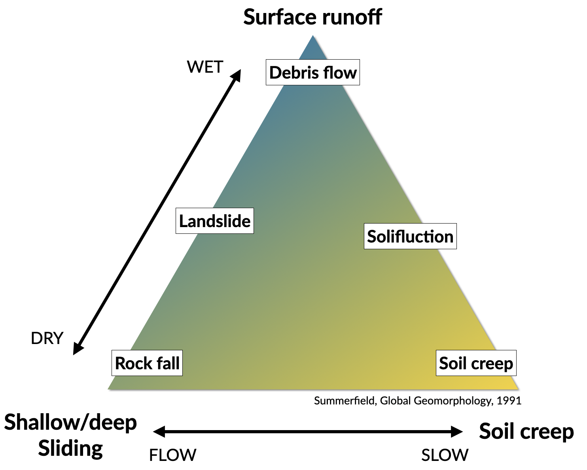
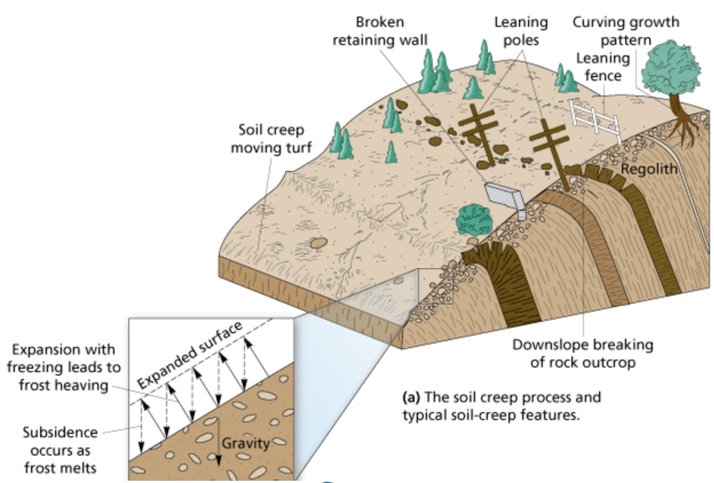
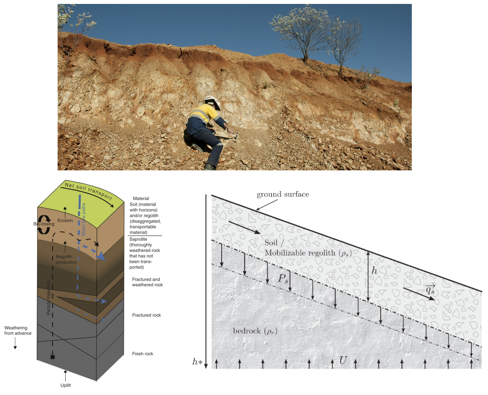
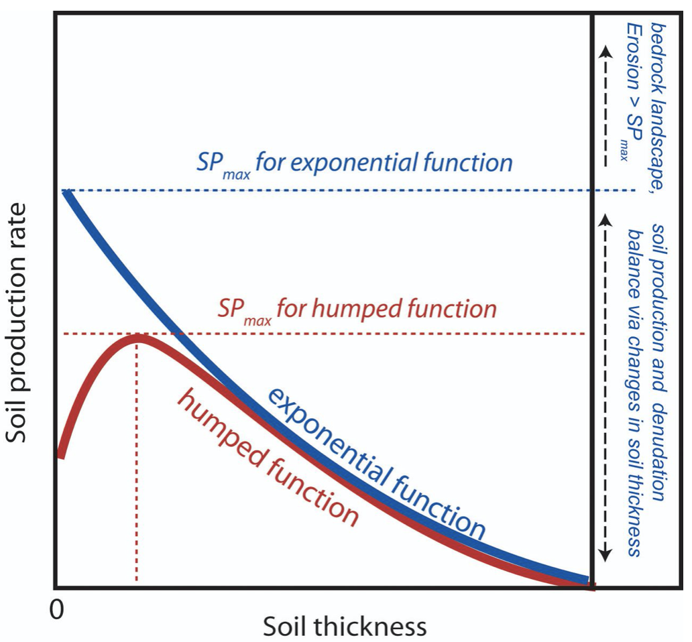
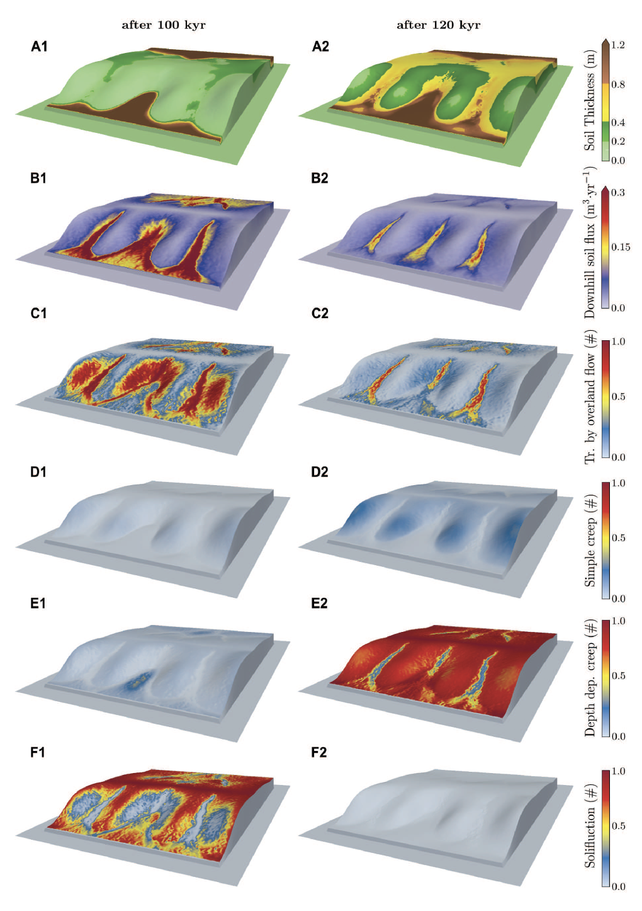

Hillslope processes
==========================================

In hilly and mountainous regions, long-term downslope movement of soil on hillslopes can play a crucial role governing the rate at which landscape evolves through time. Indeed, hillslopes represent the most important part (over 90 %) of landscapes that are not currently glaciated, the remainder part of these landscapes consisting of river channels and their floodplains. Although river incision is often considered to mainly drive landscape response to tectonic or climatic change, hillslope erosion processes produce and deliver sediments to channels, which are known to influence river incision rates either as tools for erosion or as a cover protecting the underlying bedrock from erosion. Considering weathering and hillslope transport processes is therefore vital to understand how landscape evolves in response to climatic variations.

This section describes the processes involved in the transport of material over hillslopes. Hillslopes provide the gradients enabling material to be transported from the slopes themselves towards the valley bottoms, directly by gravity alone, or by water flowing down over the surface. Gravity has the potential to transfer material downslope if the material resistance to counteact it is insufficient. Similarly, water flowing along the surface exert a drag on soil particles and have the potential to entrain material. After the gradient has fallen below a critical threshold to keep the material in transport, deposition occurs. Flowing water is an important transporting agent on which the emphasis is placed here.

In the following, a brief overview is given of some of the main characteristics, morphologies of mass movements and erosion.

Terminology
*******************************

.. note::
  Conventionally, slope processes in which gravity alone is the dominant transporting agent are called **mass movements**. Processes in which other agents dominate are called erosion, *e.g.* wind or water erosion.

The terminology depends on **what is moving** and **how it moves** and is defined as: *slide*, *fall*, *flow*, and *heave* (note: not mutually exclusive categories):

1. Slide is when the material maintains continuous contact with the surface.
2. Fall  refers to the free fall of material (looses contact with the surface).
3. Flow involves continuous movement with the material behaving in a plastic to liquid manner.
4. Heave is a slow movement where the particles are pushed up perpendicular to the sloping surface then "let down" in the direction of gravity.

Speed & type of movements
*******************************

Slow movements
^^^^^^^^^^^^^^^

   Soil creep process and associated typical features.

Generally used for processes having speed ranging from 1mm/yr to 1mm/day. The most common of these movements is the downward motion of surface material called **soil creep**. This is the slowest type of mass wasting, requiring years of gradual movement to have a pronounced effect on a slope. Slopes creep due to the expansion and contraction of surface sediment, and the pull of gravity. The pull of gravity is a constant, but the forces causing **expansion and contraction** of sediment are not. The presence of water is generally required, but in a desert lacking
vegetative ground cover even dry sediment will creep due to daily
heating and cooling of surface sediment grains.

Two other types of slow movements are:

**Frost heaving** that occurs when water gets behind or underneath an object and freezes.

**Solifluction** that refers to the downslope movement of debris under saturated conditions. Solifluction is the mass movement of soil and regolith affected by alternate freezing and thawing. This process is characteristic of saturated soils in high latitudes, both within and beyond the permafrost zone. A number of features contribute to active solifluction:

1. frequent freeze-thaw cycles
2. saturated soils and regolith, after snow melt and heavy rainfall
3. frost-susceptible materials, with significant contents of silt and clay, at least at depth
4. extensive regolith across a range of slope angles

Moderate movements
^^^^^^^^^^^^^^^^^^^^

It corresponds to speed ranging from 1 cm/day to 1 cm/sec. The main hillslope processes in this category are:

1. **Slump**: the downward and outward movement of earth traveling as a unit or as a series of units.
2. **Earthflows** are slow but perceptible movements.
3. **Debris slide** that involves the movement of comparatively dry unconsolidated material.

.. raw:: html

    

    <iframe width="100%" height="400" src="https://www.youtube.com/embed/AYHradcVYyQ?rel=0" frameborder="0" allow="accelerometer; autoplay; encrypted-media; gyroscope; picture-in-picture" allowfullscreen></iframe>
    

These types of movements like for example **rock slide** or **landslide** occur where there is a tilted, **pre-existing plane of weakness** within a slope which serves as a slide surface for overlying sediment/rock to move downward. Such planes of weakness are either flat sedimentary surfaces (usually where one layer of sediment or sedimentary rock is in contact with another layer), planes of cleavage (determined by mineral foliation) within metamorphic rocks, or a fracture (fault or joint) within a body of rock. Rock slides can be massive, occasionally involving an entire mountainside, making them a real hazard in areas where a surface of weakness tilts in the same direction as the surface of the slope (the video above illustrates the evolution of a coastal landslide at Mud Creek in California (Warrick et al., 2020)). Rock slides can be triggered by **earthquakes** or by the **saturation of a slope with water**.

.. raw:: html

    

    <iframe width="100%" height="400" src="https://www.youtube.com/embed/Etm6c94eX-Y?rel=0" frameborder="0" allow="accelerometer; autoplay; encrypted-media; gyroscope; picture-in-picture" allowfullscreen></iframe>
    

At the top corner of the Summerfield's triangle, the **debris flows** as the name implies, contains a **variety of particles or fragments**, mainly small to large rock fragments but also trees, animal carcasses, cars and buildings.
Debris flows usually contain a **high water content** which enables them to travel at fairly high velocity for some distance from where they originated. Debris flows tend to follow the paths of pre-existing stream channels and valleys, but debris flows are **much denser than water**, so they can destroy anything in their paths such as houses, bridges, or highways.

Rapid movements
^^^^^^^^^^^^^^^^^^^^

Fastest type of movements that can go quite fast (*e.g.*, free fall).

A rock fall consists of one or maybe a few rocks that detach from the high part of a steep slope, dropping and perhaps bouncing a few times as they move **very rapidly down slope**.

.. raw:: html

    

    <iframe width="100%" height="400" src="https://www.youtube.com/embed/uOJfcTZME0U?rel=0" frameborder="0" allow="accelerometer; autoplay; encrypted-media; gyroscope; picture-in-picture" allowfullscreen></iframe>
    

Rock falls are very dangerous because they can occur without warning, and because the rocks are **traveling at high velocity**.

.. tip::
  You can usually tell where rock falls are common by identifying **talus at the base** of steep slopes.

Soil production
*******************************

**Weathering** is the breakdown of rocks at the Earth’s surface, by the action of rainwater, extremes of temperature, and biological activity. It does not involve the removal of rock material. There are three types of weathering, physical, chemical and biological.

.. note::
  Erosion is the process by which soil and rock particles are worn away and moved elsewhere by wind, water or ice. Weathering involves no moving agent of transport.

   Top: Example of regolith in the field (WA - Australia). Left: Regolith and weathering (rock decay) in the Critical Zone (Pope, 2015). Right: :math:`q_s` is the downhill mass transport resulting from the action of multiple processes.
   :math:`P_s` is rate of conversion of rock into soil. :math:`U` is the apparent rate of uniform mass uplift (from Bovy 2012, modified from Dietrich et al. (1995)). Soil thickness :math:`h` and depth below the ground surface :math:`h_\star` are both measured vertically.

As mentioned above, soil production, or rock weathering, is the result of a variety of chemical and mechanical processes. It is, however, difficult for geomorphologists to consider each of these processes separately while studying the form of the landscape. Bedrock weathering rates are thus usually estimated using empirical soil production functions, *i.e.*, relationships between weathering rates and soil depth.

Soil production function
^^^^^^^^^^^^^^^^^^^^^^^^^

A minimum soil cover is needed for bedrock weathering, as soil acts as a reservoir of water essential to weathering processes such as freeze-thaw or solutional processes. At depths beyond which soil production is maximised, soil production is self limiting as thicker soil progressively buffers the underlying bedrock from weathering.

This behaviour can be represented by a **humped** function. This relationship has been assumed for 100 years, but has not been quantitatively tested until recently. Heimsath et al. (1997, 1999) have first applied field methods and cosmogenic dating to hillslopes in northern California to determine soil production rates as a function of soil depth. These observations suggest an exponential decrease in soil production with increasing soil depth, as proposed earlier by Dietrich et al. (1995).

   Schematic representation of the exponential soil production function proposed by Dietrich et al. (1995) and Heimsath et al. (1997, 1999), and the humped soil production function initially proposed by Gilbert (1877) (redrawn from (Humphreys and Wilkinson, 2007).

Soil production equation
^^^^^^^^^^^^^^^^^^^^^^^^^

Bedrock weathering is modelled using the exponential soil production function used by Heimsath et al. (1997, 1999). The rate of weathering :math:`P_s` (m/yr) is given by:

.. math::
 P_s = P_0 exp(− \frac{h}{h_0})

where :math:`P_0` is expressed in (m/yr) and :math:`h_0` (m) is a characteristic soil depth (soil production ‘damping’ depth) at which :math:`Ps = (1/e)P_0`.

This soil production law has been calibrated at different sites (in northern California and southern Australia) using both soil thickness and cosmogenic radionucleides (CRN) measurements (Heimsath et al., 1999, 2000). For these sites, the authors reported values of :math:`P_0` between :math:`5 \cdot 10^{−5}` and :math:`8 \cdot 10^{−5}` m/yr and a value of :math:`h_0 \simeq 0.5` m.

Hillslope: the diffusion equation
*********************************

Formulations for hillslope erosion are mainly derived considering hillslope form (*e.g.*, convex, convex-concave, planar). In many models, sediment transport rate on hillslopes is assumed to be equal to a linear function of topographic gradient. Such an expression has its origin in the pioneering studies of convex hillslopes by Davis (1892) and Gilbert (1909). Combined with the application of mass conservation, this leads to the diffusion equation that describes the rate of elevation change :math:`\delta h/ \delta t`:

.. math::
  \frac{\delta h}{ \delta t} = - \nabla \cdot q_s

.. math::
  q_s = - \kappa \nabla z

.. math::
  \frac{\delta h}{ \delta t} = \kappa \nabla^2 z

where :math:`z` is elevation, :math:`\nabla \cdot` is the spatial divergence operator, :math:`\nabla z` is the topographic gradient (*i.e.*, the local slope), :math:`q_s` is the soil flux in the positive direction of :math:`\nabla z`, and :math:`\kappa` is the hillslope diffusivity.

Modelling soil transport
^^^^^^^^^^^^^^^^^^^^^^^^^^

Although the linear dependence of soil transport on local slope has been widely assumed, only a few observations support this relationship. Morevover, it is well admitted that sediment transport on hillslopes result from a variety of processes, such as landsliding, rain-splash, depth-dependent creep, or overland flow. Other transport laws have therefore been proposed. These laws, still based on the process/form principle, state that transport rates depend non-linearly on local slope, on depth of soil movement and/or on drainage area or overland flow discharge. Some authors have proposed new parameterisation of soil transport which involves several processes, *i.e.*, in which soil transport on slopes results from the combination of multiple geomorphic transport laws.

Considering no aeolian input nor significant loss by dissolution, the local rate of soil thickness change, :math:`\delta h/ \delta t` (m/yr), is determined by the balance between soil production and soil transport:

.. math::
  \frac{\delta h}{ \delta t} = P_s - \nabla \cdot q_s

where soil thickness :math:`h` (m) is measured vertically, :math:`P_s` is the rate of bedrock weathering or soil production (m/yr), :math:`q_s` is the total downhill soil flux, and :math:`\nabla \cdot` is the spatial divergence operator.

Soil bulk (dry) density of most soils varies within the range of 1.1-1.6 g/cm3, while the density of soil particles (*i.e.*, the bedrock weathered material) has a short range of 2.6-2.7 g/cm3 in most mineral soils. A value of  :math:`\simeq 2` is therefore acceptable.

The local rate of surface elevation change, :math:`\delta z/ \delta t` (m/yr), is related the rate of soil thickness change:

.. math::
  \frac{\delta z}{ \delta t} = \frac{\delta h}{ \delta t} - P_s + U

where :math:`U` (m/yr) is a source term that can either represent the rate of incision of channel streams at the hillslope boundaries or uniform uplift.

   From CLICHE model (Bovy, 2012) snapshots of a specific simulation under Pleniglacial conditions (after 100 kyr of simulation, left hand-side) and present-day conditions (at the end of the simulation, right-hand side). A. Soil thickness. B. Local volumetric downhill soil flux (all processes). C-F. Contribution to the local downhill soil flux from transport by overland flow, simple creep, depth dependent creep and solifluction (unit-less). Note that the soil fluxes involved here are the averages over an entire elongated cycle in the simulation.

Simple creep
^^^^^^^^^^^^^^^^^^^^^^^^^

The parameterisation of soil transport used here includes the widely-used transport law which states that transport rate depends linearly on topographic gradient. This law—here termed as **simple creep** has in fact been used to represent a variety of transport processes such as creep or rain splash.

Downslope simple creep is commonly regarded as operating in a shallow superficial layer. We write:

.. math::
  q_d = - \kappa_d \nabla z

Note that because of the multi-process parameterisation of soil transport, the coefficient :math:`\kappa_d` is not necessary equivalent to the coefficient of diffusion-based models. **Its value is also clearly scale-dependent**.

Depth-dependent creep
^^^^^^^^^^^^^^^^^^^^^^^^^

Beside linear creep, a few field observations but numerous laboratory and modelling studies have supported depth-dependent, viscous-like flow of soil. The general expression for depth-dependent creep is given by:

.. math::
  q_{dd} = - \kappa_{dd}  h^p (\nabla z)^l

Different authors have provided different values for the soil thickness and topographic gradient exponents. For example, Heimsath et al. (2005) used p = l = 1, although, generally, the velocity of soil displacement declines exponentially with depth. Due to a lack of constraints, Braun et al. (2001) have adopted values from Manning’s equation for liquid flow (p = 1.67 and l = 0.5). In most cases, p ranges from 1.5 to 2.0 and l ranges from 0.5 to 1.0.
