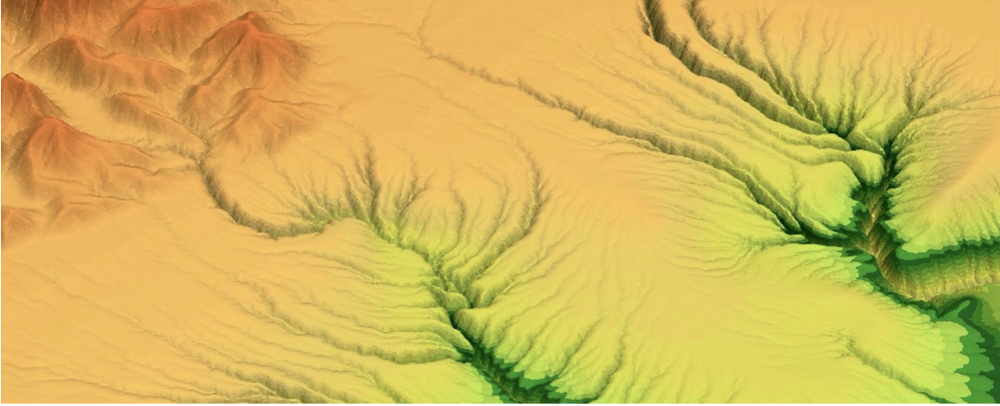

Lecture notes on Geomorphology & Stratigraphy
=======================================================

   Stream power law model of river incision on a generic landscape experiencing differential rainfall and uplift.

.. note::
  Analysing landscapes and earth surface processes that shape them in different environments with an emphasis on *planetary and regional-scale controls*.

.. toctree::
   :maxdepth: 3
   :name: Earth surface processes
   :caption: Earth surface processes

   tectonics
   hillslope
   sedtransport
   landform
   glacial
   arid
   model

.. figure:: images/stratigraphy.png
   :scale: 58 %
   :alt: stratigraphy
   :align: center

   Generated 2D cross-section of a deltaic system under the influence of long-term sea-level change.

.. note::
  Focussing on source-to-sink systems and sedimentary basins evolution with practical applications to deltaic systems stratigraphy, stratal stacking patterns, shoreline trajectories and systems tracts.

.. toctree::
   :maxdepth: 3
   :name: Deltaic Systems
   :caption: Deltaic Systems

   deltaicsystems
   quantitativestrata
