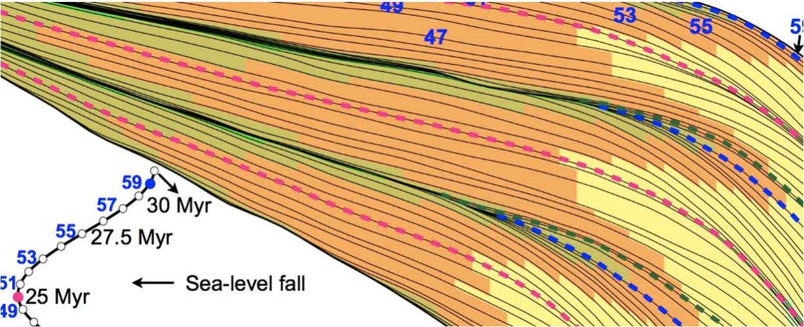

Lecture notes on Geomorphology & Stratigraphy
=======================================================

These notes discuss three components of Earth Surface evolution.

.. important::
  We will do **computer-based exercises during both lectures and practicals** so you will need to bring an electronic device (preferably a laptop but a tablet with internet access could work). As there will be a lot to cover, it is also recommended to go through each chapter prior to the lecture to be well prepared and able to get the most of it during classes.

.. image:: https://readthedocs.org/projects/earthsurface/badge/?version=latest
  :target: https://earthsurface.readthedocs.io/en/latest/?badge=latest
  :alt: Documentation Status

A- Introduction to landscape dynamics
-------------------------------------

.. raw:: html

    <iframe width="660" height="400" src="https://kitware.github.io/vtk-js/examples/SceneExplorer/index.html?fileURL=https://raw.githubusercontent.com/tristan-salles/PVGlance.github.io/master/global_LEM.vtkjs" frameborder="0" allowfullscreen></iframe>

   Global scale erosion deposition accumulations induced by landscape evolution over 100 Ma forced with plate tectonics, paleoclimates and paleotopographies.

.. note::
  Analysing landscapes and earth surface processes that shape them with an emphasis on *planetary and regional-scale controls* on landforms and landscape dynamics.

B- Quantitative approach to geomorphology
-----------------------------------------

.. figure:: images/geomorphology.png
   :scale: 60 %
   :alt: geomorphology
   :align: center

   Stream power law model of river incision on a generic landscape experiencing differential rainfall and uplift.

.. note::
 Understanding the main geomorphic processes (i.e. *hillslope* & *fluvial* systems) from a quantitative perspective by explaining the empirical laws that governs them and their mathematical formalisms.

.. toctree::
   :maxdepth: 3
   :name: Earth surface processes
   :caption: Earth surface processes

   tectonics
   hillslope
   sedtransport
   landform
   glacial
   arid
   model

C- Source-to-sink systems and stratigraphy
------------------------------------------

   Generated 2D cross-section of a deltaic system under the influence of long-term sea-level change.

.. note::
 Focussing on source-to-sink systems and sedimentary basins evolution with practical applications to deltaic systems stratigraphy, stratal stacking patterns, shoreline trajectories and systems tracts.

.. toctree::
   :maxdepth: 3
   :name: Deltaic Systems
   :caption: Deltaic Systems

   deltaicsystems
   quantitativestrata
