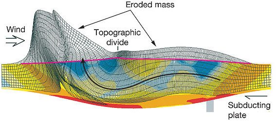
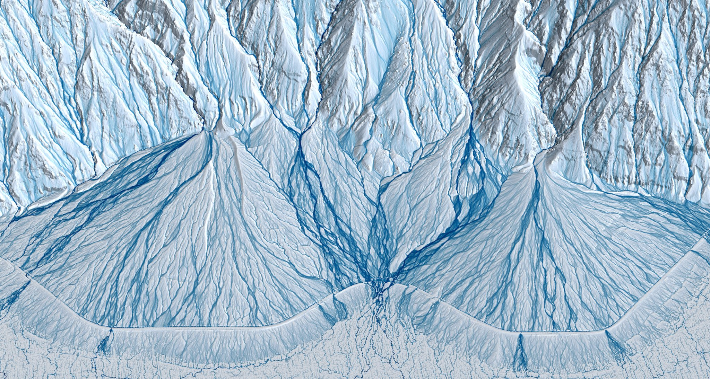
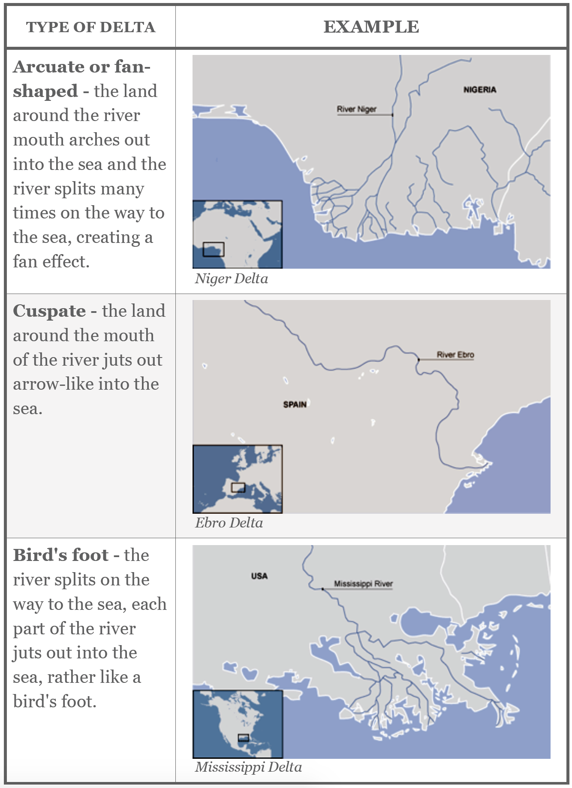
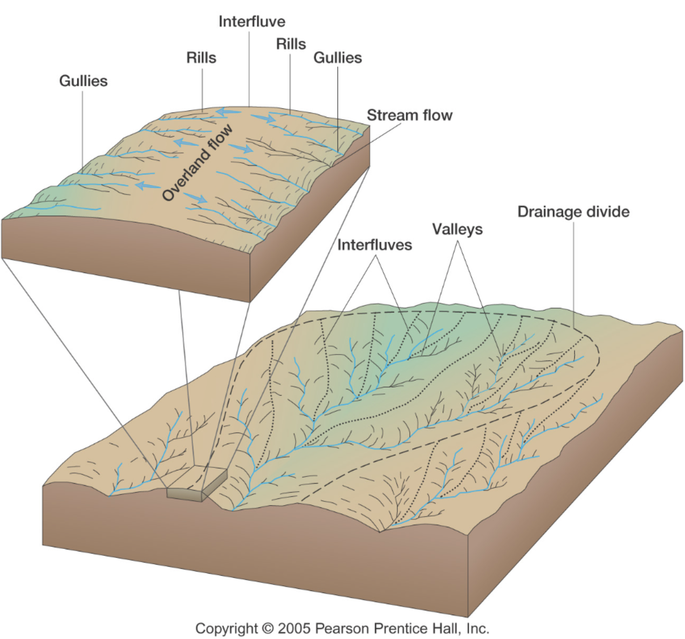
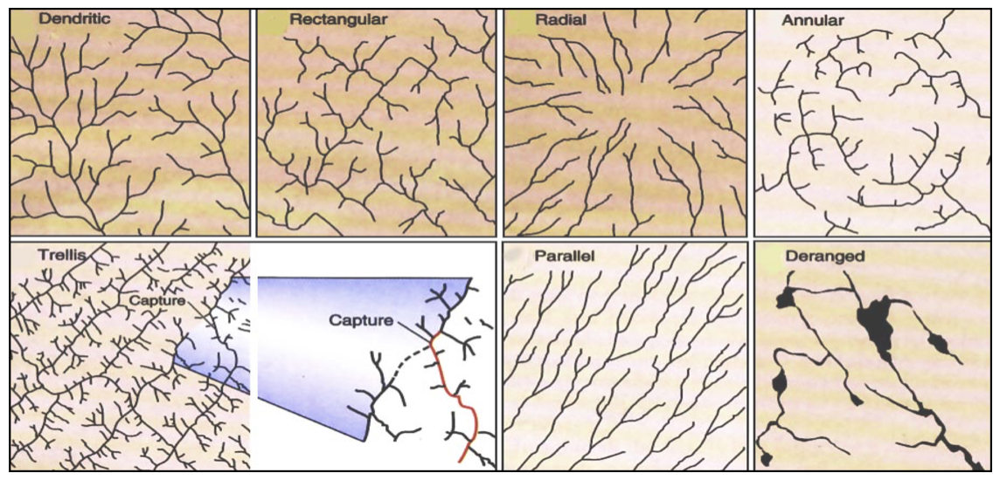
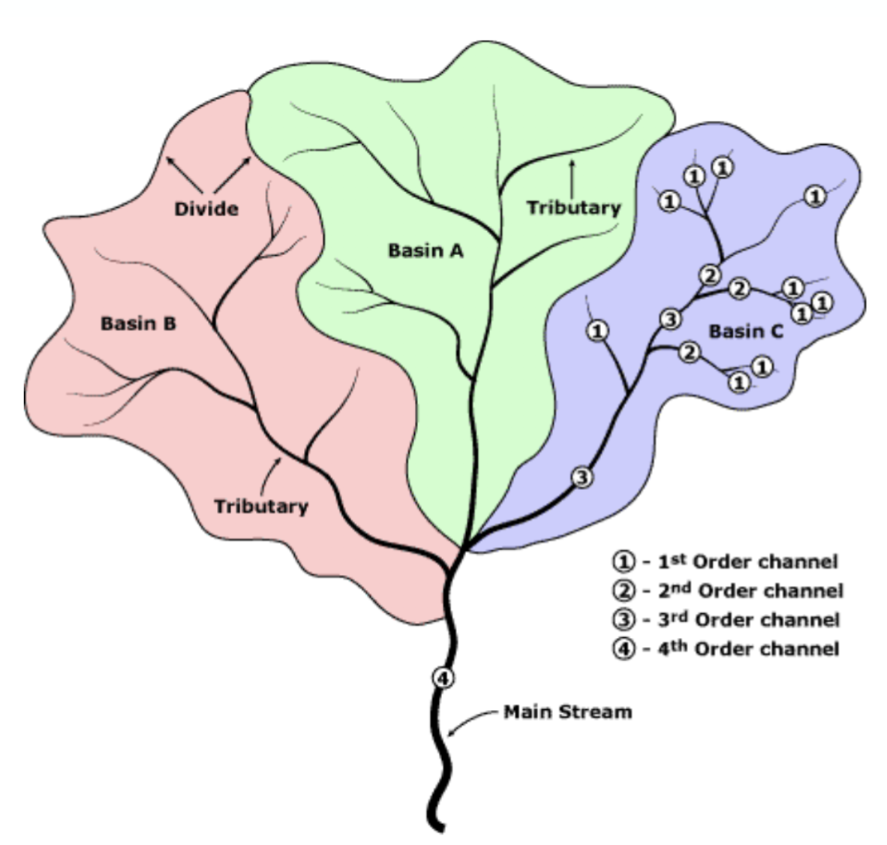

The fluvial system: hierarchical organisation and quantitative analysis
=========================================================================

This chapter focuses on the characterisation of fluvial systems. We will put the emphasis on specific landforms associated with river networks as well as the organisation of drainage basins and streams. We will also review some quantitative metrics used to understand landscape evolution in response to both climate and tectonic processes.

River morphology and landforms
------------------------------------------

..  admonition:: River long profiles, baselevel, and grade
    :class: toggle, toggle-shown, important

    .. figure:: images/graded.png
        :width: 100 %
        :alt: River longitudinal profile
        :align: center

    The longitudinal profile or long profile of a river is the gradient of its water-surface line from source to mouth. Streams with discharge increasing downstream have **concave long profiles**. This is because the **drag force of flowing water depends on the product of channel gradient and water depth**. Depth increases with increasing discharge and so, in moving downstream, a progressively lower gradient is sufficient to transport the bed load. Many river long profiles are not smoothly concave but contain flatter and steeper sections.

    The steeper sections, which start at **knickpoints**, may result from outcrops of hard rock, the action of local tectonic movements, sudden changes in discharge, or critical stages in valley development such as active headward erosion.

    **Baselevel** is the lowest elevation to which downcutting by a stream is possible. The ultimate baselevel for any stream is the **water body into which it flows** – sea, lake, or, in the case of some enclosed basins, playa, or salt lake. Main channels also prevent further downcutting by tributaries and so provide a baselevel. **Local baselevels** arise from bands of resistant rock, dams of woody debris, beaver ponds, and human-made dams, weirs, and so on.

    **Grade** is a state of a river system in which controlling variables and baselevel are **constant**. A graded stream is one in which, over a period of years, slope is delicately adjusted to provide, with available discharge and with prevailing channel characteristics, just the velocity required for the transportation of the load provided by the drainage basin. The **graded stream is a system in equilibrium**; its diagnostic characteristic is that any change in any of the controlling factors will cause a displacement of the equilibrium in a direction that will tend to absorb the effect of the change. If the baselevel changes, then **streams adjust their grade by changing their channel slope (through aggradation or degradation), or by changing their channel pattern, width, or roughness**. However, as the controlling variables usually change more frequently than the time taken for the channel properties to respond, a graded stream displays a quasi-equilibrium rather than a true steady state.

Preamble
----------------------

Tectonic geomorphology is the study of the interplay between tectonic and surface processes that shape the landscape in regions of active deformation and at time scales ranging from up to millions of years.

    Unidirectional moisture flux and mountain-belt evolution (from Dietrich & Perron 2006)

In this course, we will analyse different landforms, the modes of sediment transport, the main equations that are used to simulate geomorphological changes and some of the numerical techniques that exist to model landscape evolution.

During the practicals, we will make a quantitative assessment of the impact of tectonic forces on landscape and drainage evolution. We will also look at how climate, and in particular how the spatial pattern of precipitation, is affecting the topographic and tectonic evolution of mountain belts through erosion.

.. important::
  The goals for this course are:

  1. to better understand interactions between climate, tectonics and the Earth surface;
  2. get an overview of fluvial and hillslope processes and their importance;
  3. learn basic geomorphic transport laws to predict past and future landscape behaviour from present observations;
  4. use numerical modelling for quantitative analysis of landscape dynamics.

Tectonic processes govern the dynamic nature of Earth’s crust and shape the global distribution of continents, ocean basins, and landforms. Setting the template on which climate and erosion interact, tectonics elevates rocks above sea level where weathering prepares the ground for wind, rain, and rivers to erode and sculpt landscapes.

It is no coincidence that many of our planet’s major surface features coincide with the boundaries of tectonic plates, where uplift, deformation, and erosion are focused. The imprint of tectonics on geomorphology is apparent not only in the size, extent, and location of mountain ranges, but in the localised steepness of river profiles, the character of mountain slopes, and in the form of river networks that flow along regional joint patterns or are offset across faults.

River landforms
------------------

Most rivers are considered as reaches with different geomorphological
characteristics. The most simple division generally made is to divide
the river into **upper**, **middle** and **lower** river reaches.

Upper river
************

The uppermost portion of a river system includes the river headwaters and low-order streams at higher elevation. The upper river basin is usually characterised by steep gradients and by erosion that carries sediment downstream. Streams in this upper region are usually steep and torrential, and often include rapids and waterfalls. These streams generally have little floodplain, although part of the bank and surrounding land may be wetted during periods of high flow.

   Transition from upper to middle river. An imaginary of Death Valley with blue water raining and flowing over its bedrock and alluvial fans (based on Lidar elevation data from OpenTopography; byproduct of project from Clastics Lab)

Middle river
**************

In the middle course the river has more energy and a high volume of water. The gradient here is gentle and lateral erosion has widened the river channel. The river channel has also deepened. A larger river channel means there is less friction, so the water flows faster:

First video shows meandering rivers and their deposits from E. Steel (base image by Planetlabs, Queen's University). Second video shows a time-lapse animation of a short segment of the Mamore River (from Z. Sylvester, Clastic Lab, BEG).

.. raw:: html

    

    <iframe width="100%" height="380" src="https://www.youtube.com/embed/ZJAYDPoZzlM?rel=0" frameborder="0" allow="accelerometer; autoplay; encrypted-media; gyroscope; picture-in-picture" allowfullscreen></iframe>
    

.. raw:: html

    

    <iframe width="100%" height="380" src="https://www.youtube.com/embed/5UG1_GGWD6c?rel=0" frameborder="0" allow="accelerometer; autoplay; encrypted-media; gyroscope; picture-in-picture" allowfullscreen></iframe>
    

* As the river erodes laterally, to the right side then the left side, it forms large bends, and then horseshoe-like loops called meanders.
* The formation of meanders is due to both deposition and erosion and meanders gradually migrate downstream.
* The force of the water erodes and undercuts the river bank on the outside of the bend where water flow has most energy due to decreased friction.
* On the inside of the bend, where the river flow is slower, material is deposited, as there is more friction.
* Over time the horseshoe become tighter, until the ends become very close together. As the river breaks through, *e.g.* during a flood when the river has a higher discharge and more energy, and the ends join, the loop is cut-off from the main channel. The cut-off loop is called an oxbow lake.

Lower river
*************

The river channel is now deep and wide and the landscape around it is flat. However, as a river reaches the end of its journey, energy levels are low and deposition takes place.

Floodplains
^^^^^^^^^^^

The river now has a wide floodplain. A floodplain is the area around a
river that is covered in times of flood. A floodplain is a very fertile area due to the rich alluvium deposited by floodwaters. This makes floodplains a good place for agriculture. A build up of alluvium on the banks of a river can create levees, which raise the river bank.

Deltas
^^^^^^^^^^^

Deltas are found at the mouth of large rivers - for example, the Mississippi. A delta is formed when the river deposits its material faster than the sea can remove it.

Drainage basins
****************

The fluvial dissection of the landscape consists of valleys and their included channel ways organised into a system of connection known as a drainage network.

Drainage networks display many types of quantitative regularity that are useful in analysing both the fluvial systems and the terrains that they dissect (Howard, 1967). Drainage basins are the principal hydrologic unit considered in fluvial geomorphology. A drainage basin is the source for water and sediment that moves from higher elevation through the river system to lower elevations as they reshape the channel forms.

.. raw:: html

    

    <iframe width="100%" height="380" src="https://www.youtube.com/embed/v-b1nM0RbOs?rel=0" frameborder="0" allow="accelerometer; autoplay; encrypted-media; gyroscope; picture-in-picture" allowfullscreen></iframe>
    

The drainage basin is the land surface drained by a stream system; an interfluve is a divide, an area of higher land that separates one valley from the next (within a drainage basin); a drainage divide is an interfluve that separates two drainage basins.

.. note::
  The drainage pattern of the river reflects the rock materials and landscape through with the river flows; stream order is a hierarchical system to define river system complexity; and base level is a level below which a river cannot erode its channel.

Drainage basin patterns
********************************

The pattern of tributaries within a drainage basin depends largely on the type of rock beneath, and on structures within that rock (folds, fractures, faults, etc.). The three main types of drainage patterns are illustrated in the figure below.

   Stream drainage patterns (from Summerfield (1991)).

Dendritic patterns, which are by far the most common, develop in areas where the rock (or unconsolidated material) beneath the stream has no particular fabric or structure and can be eroded equally easily in all directions. Examples would be granite, gneiss, volcanic rock, and sedimentary rock that has not been folded.

Trellis drainage patterns typically develop where sedimentary rocks have been folded or tilted and then eroded to varying degrees depending on their strength.

Rectangular patterns develop in areas that have very little topography and a system of bedding planes, fractures, or faults that form a rectangular network.

Stream organisation
^^^^^^^^^^^^^^^^^^^^

Seen from above, river systems display a tree-like pattern, with many small streams feeding into fewer larger rivers and eventually into one very large river. Many systems have been developed to classify the different “levels” of streams in this pattern. In the system devised by **Strahler**, each level of stream is assigned an order.

**Order 1** streams are the very smallest, uppermost streams (*i.e.*, with no upstream tributaries). Two order 1 streams combine to form a **stream of order 2**. **Order 3** streams are formed from the confluence of two order 2 streams.

Each higher order of stream is formed from the confluence of two lower order streams, and the watersheds of lower-order streams are included within the watersheds of higher order streams. Orders 10–12 correspond to the main channels of large world rivers. In general, individual streams get wider and longer with increasing stream order.

Hierarchical organisation
^^^^^^^^^^^^^^^^^^^^^^^^^^

Characteristics of a river system depend on the landscape, climate, other geographical features and natural processes. Most river systems can be divided into different sections from the headwaters to the river mouth.

The physical characteristics of river systems are organised in a nested hierarchy, with physical processes operating at larger scales influencing those at successively finer resolutions, ultimately controlling the micro-scale distribution of hydraulic and sediment transport processes. The micro-, meso- and reach scales are therefore all equally critical elements within this hierarchy, with different geomorphic and ecological processes being relevant at each resolution.

.. figure:: images/hovius.png
   :scale: 45 %
   :alt: Stream organisation
   :align: center

   Left: empirical relationship between the length of streams and the area of their basins based on the Hack's law. Right: empirical relationship between average spacing of outlets for major drainages and the half-width of major mountain ranges from Hovius (1996).

Defining :math:`S` as the average spacing of outlets for major drainages and :math:`W` the half-width of major mountain ranges, **Hovius** (1996) managed to fit a regression curve that yields to:

.. math::

   S = 0.46 × W + 0.798

Large-scale observations have allowed thorough comparisons across scales defining fractal  river basins [Mandelbrot,1977, 1983]. One outstanding example of fractal relationship is **Hack’s law** [Hack, 1957; Mandelbrot, 1983; Rigon et al., 1996] inferring the upstream length :math:`L_i` at a given position :math:`i` to the total cumulative area :math:`A_i` at that position, seen quite early as a signature of fractal geometry. With :math:`\beta` a constant between *1.4* and *1.7* and :math:`\alpha` comprised between *0.5* and *0.6* for natural rivers, Hack’s law scales to:

.. math::

   L_i = \beta A_i^\alpha
