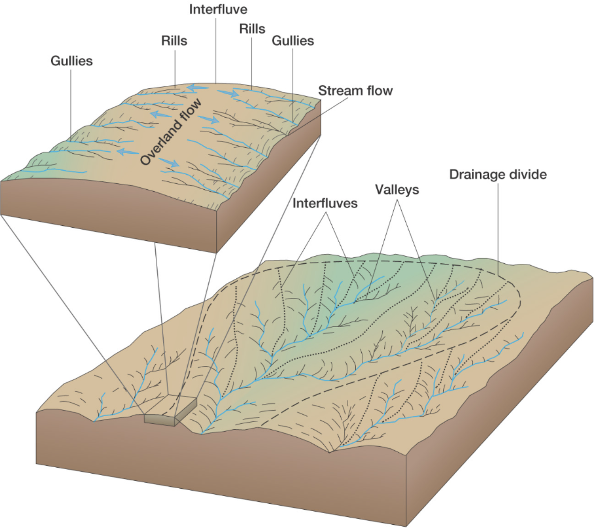
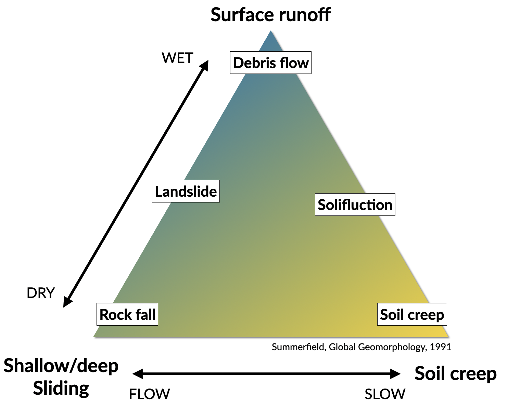
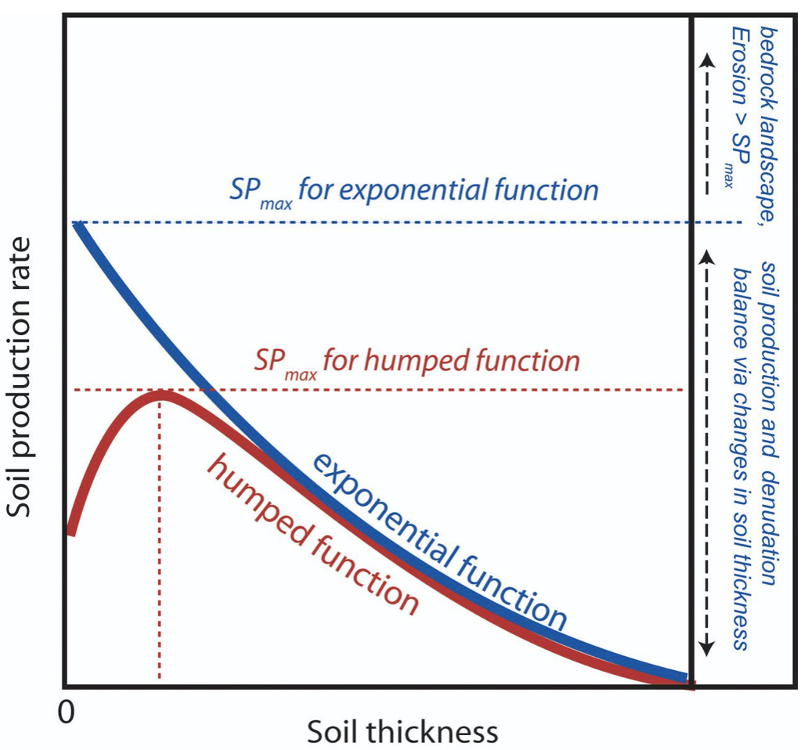
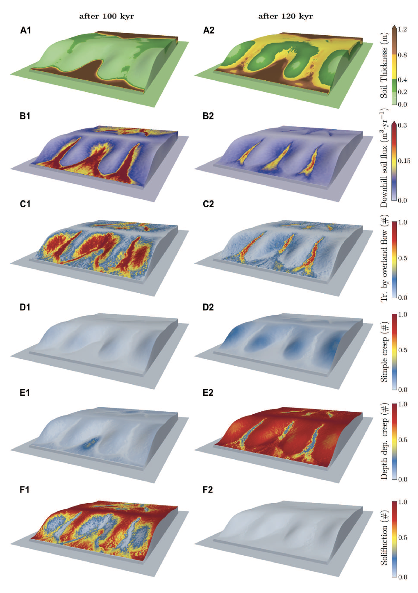
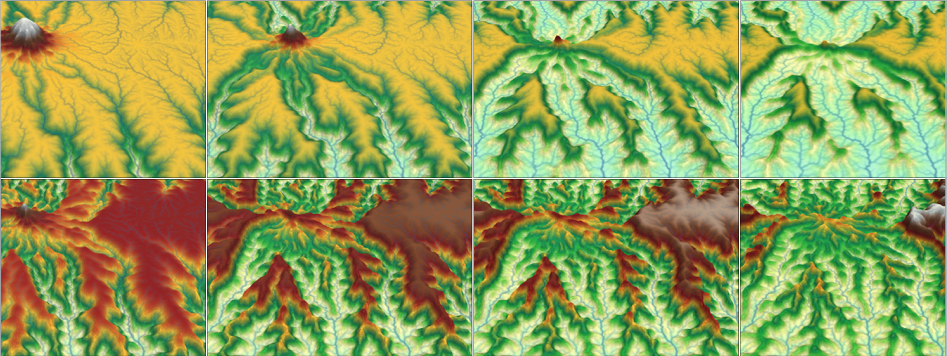

Landforms and hierarchical organisation
==========================================

Preamble
----------------------

Tectonic geomorphology is the study of the interplay between tectonic and surface processes that shape the landscape in regions of active deformation and at time scales ranging from up to millions of years.

.. figure:: images/dietrichperron.jpg
    :scale: 100 %
    :alt: Unidirectional moisture flux and mountain-belt evolution
    :align: center

    Unidirectional moisture flux and mountain-belt evolution (from Dietrich & Perron 2006)

In this course, we will analyse different landforms, the modes of sediment transport, the main equations that are used to simulate geomorphological changes and some of the numerical techniques that exist to model landscape evolution.

During the practicals, we will make a quantitative assessment of the impact of tectonic forces on landscape and drainage evolution. We will also look at how climate, and in particular how the spatial pattern of precipitation, is affecting the topographic and tectonic evolution of mountain belts through erosion.

.. important::
  The goals for this course are:

  1. to better understand interactions between climate, tectonics and the Earth surface;
  2. get an overview of fluvial and hillslope processes and their importance;
  3. learn basic geomorphic transport laws to predict past and future landscape behaviour from present observations;
  4. use numerical modelling for quantitative analysis of landscape dynamics.

Tectonic processes govern the dynamic nature of Earth’s crust and shape the global distribution of continents, ocean basins, and landforms. Setting the template on which climate and erosion interact, tectonics elevates rocks above sea level where weathering prepares the ground for wind, rain, and rivers to erode and sculpt landscapes.

It is no coincidence that many of our planet’s major surface features coincide with the boundaries of tectonic plates, where uplift, deformation, and erosion are focused. The imprint of tectonics on geomorphology is apparent not only in the size, extent, and location of mountain ranges, but in the localised steepness of river profiles, the character of mountain slopes, and in the form of river networks that flow along regional joint patterns or are offset across faults.

River landforms
------------------

Most rivers are considered as reaches with different geomorphological
characteristics. The most simple division generally made is to divide
the river into **upper**, **middle** and **lower** river reaches.

Upper river
************

The uppermost portion of a river system includes the river headwaters and low-order streams at higher elevation. The upper river basin is usually characterised by steep gradients and by erosion that carries sediment downstream. Streams in this upper region are usually steep and torrential, and often include rapids and waterfalls. These streams generally have little floodplain, although part of the bank and surrounding land may be wetted during periods of high flow.

.. figure:: images/deathvalley.jpeg
   :scale: 35 %
   :alt: deathvalley
   :align: center

   Transition from upper to middle river. An imaginary of Death Valley with blue water raining and flowing over its bedrock and alluvial fans (based on Lidar elevation data from OpenTopography; byproduct of project from Clastics Lab)

Middle river
**************

In the middle course the river has more energy and a high volume of water. The gradient here is gentle and lateral erosion has widened the river channel. The river channel has also deepened. A larger river channel means there is less friction, so the water flows faster:

First video shows meandering rivers and their deposits from E. Steel (base image by Planetlabs, Queen's University). Second video shows a time-lapse animation of a short segment of the Mamore River (from Z. Sylvester, Clastic Lab, BEG).

.. raw:: html

    

    <iframe width="100%" height="380" src="https://www.youtube.com/embed/ZJAYDPoZzlM?rel=0" frameborder="0" allow="accelerometer; autoplay; encrypted-media; gyroscope; picture-in-picture" allowfullscreen></iframe>
    

.. raw:: html

    

    <iframe width="100%" height="380" src="https://www.youtube.com/embed/5UG1_GGWD6c?rel=0" frameborder="0" allow="accelerometer; autoplay; encrypted-media; gyroscope; picture-in-picture" allowfullscreen></iframe>
    

* As the river erodes laterally, to the right side then the left side, it forms large bends, and then horseshoe-like loops called meanders.
* The formation of meanders is due to both deposition and erosion and meanders gradually migrate downstream.
* The force of the water erodes and undercuts the river bank on the outside of the bend where water flow has most energy due to decreased friction.
* On the inside of the bend, where the river flow is slower, material is deposited, as there is more friction.
* Over time the horseshoe become tighter, until the ends become very close together. As the river breaks through, *e.g.* during a flood when the river has a higher discharge and more energy, and the ends join, the loop is cut-off from the main channel. The cut-off loop is called an oxbow lake.

Lower river
*************

The river channel is now deep and wide and the landscape around it is flat. However, as a river reaches the end of its journey, energy levels are low and deposition takes place.

Floodplains
^^^^^^^^^^^

The river now has a wide floodplain. A floodplain is the area around a
river that is covered in times of flood. A floodplain is a very fertile area due to the rich alluvium deposited by floodwaters. This makes floodplains a good place for agriculture. A build up of alluvium on the banks of a river can create levees, which raise the river bank.

Deltas
^^^^^^^^^^^

.. image:: images/deltasp.png
   :scale: 37 %
   :alt: deltasp
   :align: center

Deltas are found at the mouth of large rivers - for example, the Mississippi. A delta is formed when the river deposits its material faster than the sea can remove it.

Drainage basins
****************

The fluvial dissection of the landscape consists of valleys and their included channel ways organised into a system of connection known as a drainage network.

Drainage networks display many types of quantitative regularity that are useful in analysing both the fluvial systems and the terrains that they dissect (Howard, 1967). Drainage basins are the principal hydrologic unit considered in fluvial geomorphology. A drainage basin is the source for water and sediment that moves from higher elevation through the river system to lower elevations as they reshape the channel forms.

.. raw:: html

    

    <iframe width="100%" height="380" src="https://www.youtube.com/embed/v-b1nM0RbOs?rel=0" frameborder="0" allow="accelerometer; autoplay; encrypted-media; gyroscope; picture-in-picture" allowfullscreen></iframe>
    

The drainage basin is the land surface drained by a stream system; an interfluve is a divide, an area of higher land that separates one valley from the next (within a drainage basin); a drainage divide is an interfluve that separates two drainage basins.

.. note::
  The drainage pattern of the river reflects the rock materials and landscape through with the river flows; stream order is a hierarchical system to define river system complexity; and base level is a level below which a river cannot erode its channel.

Stream organisation
^^^^^^^^^^^^^^^^^^^^

Seen from above, river systems display a tree-like pattern, with many small streams feeding into fewer larger rivers and eventually into one very large river. Many systems have been developed to classify the different “levels” of streams in this pattern. In the system devised by **Strahler**, each level of stream is assigned an order.

**Order 1** streams are the very smallest, uppermost streams (*i.e.*, with no upstream tributaries). Two order 1 streams combine to form a **stream of order 2**. **Order 3** streams are formed from the confluence of two order 2 streams.

Each higher order of stream is formed from the confluence of two lower order streams, and the watersheds of lower-order streams are included within the watersheds of higher order streams. Orders 10–12 correspond to the main channels of large world rivers. In general, individual streams get wider and longer with increasing stream order.

Hierarchical organisation
^^^^^^^^^^^^^^^^^^^^^^^^^^

Characteristics of a river system depend on the landscape, climate, other geographical features and natural processes. Most river systems can be divided into different sections from the headwaters to the river mouth.

The physical characteristics of river systems are organised in a nested hierarchy, with physical processes operating at larger scales influencing those at successively finer resolutions, ultimately controlling the micro-scale distribution of hydraulic and sediment transport processes. The micro-, meso- and reach scales are therefore all equally critical elements within this hierarchy, with different geomorphic and ecological processes being relevant at each resolution.

.. figure:: images/hovius.png
   :scale: 45 %
   :alt: Stream organisation
   :align: center

   Left: empirical relationship between the length of streams and the area of their basins based on the Hack's law. Right: empirical relationship between average spacing of outlets for major drainages and the half-width of major mountain ranges from Hovius (1996).

Defining :math:`S` as the average spacing of outlets for major drainages and :math:`W` the half-width of major mountain ranges, **Hovius** (1996) managed to fit a regression curve that yields to:

.. math::

   S = 0.46 × W + 0.798

Large-scale observations have allowed thorough comparisons across scales defining fractal  river basins [Mandelbrot,1977, 1983]. One outstanding example of fractal relationship is **Hack’s law** [Hack, 1957; Mandelbrot, 1983; Rigon et al., 1996] inferring the upstream length :math:`L_i` at a given position :math:`i` to the total cumulative area :math:`A_i` at that position, seen quite early as a signature of fractal geometry. With :math:`\beta` a constant between *1.4* and *1.7* and :math:`\alpha` comprised between *0.5* and *0.6* for natural rivers, Hack’s law scales to:

.. math::

   L_i = \beta A_i^\alpha

Modes of sediment transport
---------------------------------------------

.. figure:: images/Hjulstromdiagram.png
   :scale: 65 %
   :alt: Hjulstrom diagram of sediment transport by running water
   :align: center

   Hjulstrom diagram of sediment transport by running water

Some definitions
*******************

Sediment transport is critical to understanding how rivers work because
it is the set of processes that mediates between the flowing water
and the channel boundary. Erosion involves the removal and transport
of sediment (mainly from the boundary) and deposition involves the
transport and placement of sediment on the boundary. Erosion and
deposition are what form the channel of any alluvial river as well as the
floodplain through which it moves.

The amount and size of sediment moving through a river channel are
determined by three fundamental controls: competence, capacity and
sediment supply.

Competence
^^^^^^^^^^^^^^^^^^^^^^^^^^

**Competence** refers to the largest size (diameter) of sediment particle or grain that the flow is capable of moving; it is a hydraulic limitation. If a river is sluggish and moving very slowly it simply may not have the power to mobilise and transport sediment of a given size even though such sediment is available to transport. So a river may be competent or incompetent with respect to a given grain size. If it is incompetent it will not transport sediment of the given size. If it is competent it may transport sediment of that size if such sediment is available (that is, the river is not supply-limited).

Capacity
^^^^^^^^^^^^^^^^^^^^^^^^^^

**Capacity** refers to the maximum amount of sediment of a given size that a stream can transport in traction as bedload. Given a supply of sediment, capacity depends on channel gradient, discharge and the calibre of the load (the presence of fines may increase fluid density and increase capacity; the presence of large particles may obstruct the flow and reduce capacity). Capacity transport is the competence-limited sediment transport (mass per unit time) predicted by all sediment transport equations, examples of which we will examine below. Capacity transport only occurs when sediment supply is abundant (non-limiting).

Sediment supply
^^^^^^^^^^^^^^^^^^^^^^^^^^

**Sediment supply** refers to the amount and size of sediment available for sediment transport. Capacity transport for a given grain size is only achieved if the supply of that calibre of sediment is not limiting (that is, the maximum amount of sediment a stream is capable of transporting is actually available). Because of these two different potential constraints (hydraulics and sediment supply) distinction is often made between supply-limited and capacity-limited transport. Most rivers probably function in a sediment-supply limited condition although we often assume that this is not the case.

Much of the material supplied to a stream is so fine (silt and clay) that, provided it can be carried in suspension, almost any flow will transport it. Although there must be an upper limit to the capacity of the stream to transport such fines, it is probably never reached in natural channels
and the amount moved is limited by supply. In contrast, transport of coarser material (say, coarser than fine sand) is largely capacity limited.

Sediment transport
*******************

The sediment load of a river is transported in various ways although these distinctions are to some extent arbitrary and not always very practical in the sense that not all of the components can be separated in practice:

1. Dissolved load
2. Suspended load
3. Intermittent suspension (saltation) load
4. Wash load
5. Bed load

   Sediment transport stages regarding the hydrologic, hydraulic, and geomorphological conditions: adopted from Marshak 2005.

Dissolved load
^^^^^^^^^^^^^^^^^^^^^^^^^^

**Dissolved load** is material that has gone into solution and is part of the fluid moving through the channel. Since it is dissolved, it does not depend on forces in the flow to keep it in the water column.

In sediment-transport theory an important distinction is made between dissolved material and clastic material. Clastic material is all the particulate matter (undissolved material) carried by a river regardless of the grain size. The clastic load of a river is moved by several mechanisms that are the basis for recognizing the two principal sediment transport modes: *suspended-sediment load* and *bed-material load*.

Suspended-sediment load
^^^^^^^^^^^^^^^^^^^^^^^^^^

**Suspended-sediment load** is the clastic (particulate) material that moves through the channel in the water column. These materials, mainly silt and sand, are kept in suspension by the upward flux of turbulence generated at the bed of the channel. The upward currents must equal or exceed the particle fall-velocity for suspended-sediment load to be sustained.

The size and concentration of suspended-sediment typically varies logarithmically with height above the bed. That is, concentration and grain size form linear plots with the logarithm of height above the bed. Coarse sand is highly concentrated near the bed and declines with height at a faster rate than does fine sand. Fine silt is so easily suspended that it is far more uniformly distributed in a vertical section than is the coarser material. Similarly, the grain-size distribution within a sample of sand displays far more vertical variation than does the vertical distribution of grain size within the silt range. The former is too large for the flow to move much of it into the upper water column and the latter is so small and easily suspended that it is well represented at all levels thus giving rise to a more uniform grain-size profile.

.. figure:: images/profiles.png
   :scale: 32 %
   :alt: vertical profiles
   :align: center

   Typical vertical profiles of suspended-sediment concentration (A) & grain size in open-channel flows (B)

Wash load
^^^^^^^^^^^^^^^^^^^^^^^^^^

Although **wash load** is part of the suspended-sediment load it is useful here to make a distinction. Unlike most suspended-sediment load, wash load does not rely on the force of mechanical turbulence generated by flowing water to keep it in suspension. It is so fine (in the clay range) that it is kept in suspension by thermal molecular agitation (sometimes known as Brownian motion, named for the early 19th century botanist who described the random motion of microscopic pollen spores and dust). Because these clays are always in suspension, wash load is that component of the particulate or clastic load that is “washed” through the river system. Unlike coarser suspended sediment, wash load tends to be uniformly distributed throughout the water column. That is, unlike the coarser load, it does not vary with height above the bed.

Distinction is made between fully-suspended load and bed load by classifying the intermediate and transient transport state as saltation load transport. These are particles that bounce along the channel, partly supported by the turbulence in the flow and partly by the bed. They follow a distinctively asymmetric trajectory. Saltation load may be measured as suspended load (when in the water column) or as bedload (when on the bed). Although the distinction between saltation load and other types of sediment load may be important to those studying the physics of grain movement, most geomorphologists are content to ignore it as a special case.
ore uniform grain-size profile.

Bed load
^^^^^^^^^^^^^^^^^^^^^^^^^^

**Bed load** is the clastic (particulate) material that moves through the channel fully supported by the channel bed itself. These materials, mainly sand and gravel, are kept in motion (rolling and sliding) by the shear stress acting at the boundary. Unlike the suspended load, the bed-load component is almost always capacity limited (that is, a function of hydraulics rather than supply). A distinction is often made between the bed-material load and the bed load.

**Bed-material load** is that part of the sediment load found in appreciable quantities in the bed (generally > 0.062 mm in diameter) and is collected in a bed-load sampler. That is, the bed material is the source of this load component and it includes particles that slide and roll along the bed (in bed-load transport) but also those near the bed transported in saltation or suspension. Bed load, strictly defined, is just that component of the moving sediment that is supported by the bed (and not by the flow).

Theory of sediment entrainment
*******************************

.. figure:: images/liftdrag.png
   :scale: 47 %
   :alt: Lift & drag forces acting on a submerged particle.
   :align: center

   Lift & drag forces acting on a submerged particle.

At a very simple deterministic level of analysis, a particle of sediment will begin to move when the force of the flowing water applied to it equals its submerged weight. This simple analysis leads to:

.. math::

   \tau_{cr} = K g (\rho_s - \rho) D

where :math:`K = \eta /\tan(\phi)` and :math:`\eta = n D^2` (a packing coefficient) and :math:`\phi` is the internal angle of friction of the sediment.

Although this simple analytical approach (called the White analysis, after its originator) is useful because it highlights the general structural relationships (balance of forces) involved in this problem, it is not of much practical use because it greatly oversimplifies the actual complex forces involved. That is, there is more to this problem of specifying the entrainment conditions than merely balancing mean boundary shear stress and the submerged weight of the particle. Mean boundary shear stress is just one of several impelling forces and the particle submerged weight is just one of several inertial forces. Unfortunately, the other forces are very difficult to characterise in a precise quantitative.

The most widely used semi-empirical approach to defining the threshold of sediment motion was proposed in the early 1900’s by the German physicist Albert F. Shields. Shields (1936) plotted the dimensionless shear stress (:math:`\theta = \tau_{cr} / (g(\rho_s - \rho)D)`) against the particle Reynolds number (:math:`Re_p = D / \delta_0`) where :math:`\delta_0` is the thickness of the laminar sublayer.

The dimensionless shear stress in the Shields diagram is commonly termed the Shields stress or the Shields parameter. Several aspects of the Shields diagram are particularly noteworthy:

.. figure:: images/shield.png
   :scale: 65 %
   :alt: Shields Diagram from Van Rijn (1984).
   :align: center

   Shields Diagram from Van Rijn (1984).

1. The lowest Shields stress occurs in the sand range (0.06-2.00 mm). Sand is small enough to have small mass but too large for adhesion forces to come into play.
2. Silt/clay, in spite of the smaller size, requires a higher shear stress for motion than sand. Here adhesion forces become overwhelmingly large and bind the sediment together into a mass that is very resistant to erosion.
3. The Shields parameter for gravel is constant at 0.06, implying that Shields stress here becomes a simple function of grain size. This is a quite remarkable finding and allows us, as we will see below, to derive a simple relationship between the size of gravel and the shear stress required to move it.
4. The Shields parameter applies well to natural gravel-bed rivers.

Hillslope processes
---------------------------------------------

In hilly and mountainous regions, long-term downslope movement of soil on hillslopes can play a crucial role governing the rate at which landscape evolves through time. Indeed, hillslopes represent the most important part (over 90 %) of landscapes that are not currently glaciated, the remainder part of these landscapes consisting of river channels and their floodplains. Although river incision is often considered to mainly drive landscape response to tectonic or climatic change, hillslope erosion processes produce and deliver sediments to channels, which are known to influence river incision rates either as tools for erosion or as a cover protecting the underlying bedrock from erosion. Considering weathering and hillslope transport processes is therefore vital to understand how landscape evolves in response to climatic variations.

This section describes the processes involved in the transport of material over hillslopes. Hillslopes provide the gradients enabling material to be transported from the slopes themselves towards the valley bottoms, directly by gravity alone, or by water flowing down over the surface. Gravity has the potential to transfer material downslope if the material resistance to counteact it is insufficient. Similarly, water flowing along the surface exert a drag on soil particles and have the potential to entrain material. After the gradient has fallen below a critical threshold to keep the material in transport, deposition occurs. Flowing water is an important transporting agent on which the emphasis is placed here.

In the following, a brief overview is given of some of the main characteristics, morphologies of mass movements and erosion.

Terminology
*******************************

.. note::
  Conventionally, slope processes in which gravity alone is the dominant transporting agent are called **mass movements**. Processes in which other agents dominate are called erosion, *e.g.* wind or water erosion.

The terminology depends on **what is moving** and **how it moves** and is defined as: *slide*, *fall*, *flow*, and *heave* (note: not mutually exclusive categories):

1. Slide is when the material maintains continuous contact with the surface.
2. Fall  refers to the free fall of material (looses contact with the surface).
3. Flow involves continuous movement with the material behaving in a plastic to liquid manner.
4. Heave is a slow movement where the particles are pushed up perpendicular to the sloping surface then "let down" in the direction of gravity.

Speed & type of movements
*******************************

Slow movements
^^^^^^^^^^^^^^^

.. figure:: images/creep.png
   :scale: 42 %
   :alt: soil creep
   :align: center

   Soil creep process and associated typical features.

Generally used for processes having speed ranging from 1mm/yr to 1mm/day. The most common of these movements is the downward motion of surface material called **soil creep**. This is the slowest type of mass wasting, requiring years of gradual movement to have a pronounced effect on a slope. Slopes creep due to the expansion and contraction of surface sediment, and the pull of gravity. The pull of gravity is a constant, but the forces causing **expansion and contraction** of sediment are not. The presence of water is generally required, but in a desert lacking
vegetative ground cover even dry sediment will creep due to daily
heating and cooling of surface sediment grains.

Two other types of slow movements are:

**Frost heaving** that occurs when water gets behind or underneath an object and freezes.

**Solifluction** that refers to the downslope movement of debris under saturated conditions. Solifluction is the mass movement of soil and regolith affected by alternate freezing and thawing. This process is characteristic of saturated soils in high latitudes, both within and beyond the permafrost zone. A number of features contribute to active solifluction:

1. frequent freeze-thaw cycles
2. saturated soils and regolith, after snow melt and heavy rainfall
3. frost-susceptible materials, with significant contents of silt and clay, at least at depth
4. extensive regolith across a range of slope angles

Moderate movements
^^^^^^^^^^^^^^^^^^^^

It corresponds to speed ranging from 1 cm/day to 1 cm/sec. The main hillslope processes in this category are:

1. **Slump**: the downward and outward movement of earth traveling as a unit or as a series of units.
2. **Earthflows** are slow but perceptible movements.
3. **Debris slide** that involves the movement of comparatively dry unconsolidated material.

.. raw:: html

    

    <iframe width="100%" height="400" src="https://www.youtube.com/embed/AYHradcVYyQ?rel=0" frameborder="0" allow="accelerometer; autoplay; encrypted-media; gyroscope; picture-in-picture" allowfullscreen></iframe>
    

These types of movements like for example **rock slide** or **landslide** occur where there is a tilted, **pre-existing plane of weakness** within a slope which serves as a slide surface for overlying sediment/rock to move downward. Such planes of weakness are either flat sedimentary surfaces (usually where one layer of sediment or sedimentary rock is in contact with another layer), planes of cleavage (determined by mineral foliation) within metamorphic rocks, or a fracture (fault or joint) within a body of rock. Rock slides can be massive, occasionally involving an entire mountainside, making them a real hazard in areas where a surface of weakness tilts in the same direction as the surface of the slope (the video above illustrates the evolution of a coastal landslide at Mud Creek in California (Warrick et al., 2020)). Rock slides can be triggered by **earthquakes** or by the **saturation of a slope with water**.

.. raw:: html

    

    <iframe width="100%" height="400" src="https://www.youtube.com/embed/Etm6c94eX-Y?rel=0" frameborder="0" allow="accelerometer; autoplay; encrypted-media; gyroscope; picture-in-picture" allowfullscreen></iframe>
    

At the top corner of the Summerfield's triangle, the **debris flows** as the name implies, contains a **variety of particles or fragments**, mainly small to large rock fragments but also trees, animal carcasses, cars and buildings.
Debris flows usually contain a **high water content** which enables them to travel at fairly high velocity for some distance from where they originated. Debris flows tend to follow the paths of pre-existing stream channels and valleys, but debris flows are **much denser than water**, so they can destroy anything in their paths such as houses, bridges, or highways.

Rapid movements
^^^^^^^^^^^^^^^^^^^^

Fastest type of movements that can go quite fast (*e.g.*, free fall).

A rock fall consists of one or maybe a few rocks that detach from the high part of a steep slope, dropping and perhaps bouncing a few times as they move **very rapidly down slope**.

.. raw:: html

    

    <iframe width="100%" height="400" src="https://www.youtube.com/embed/uOJfcTZME0U?rel=0" frameborder="0" allow="accelerometer; autoplay; encrypted-media; gyroscope; picture-in-picture" allowfullscreen></iframe>
    

Rock falls are very dangerous because they can occur without warning, and because the rocks are **traveling at high velocity**.

.. tip::
  You can usually tell where rock falls are common by identifying **talus at the base** of steep slopes.

Soil production
*******************************

**Weathering** is the breakdown of rocks at the Earth’s surface, by the action of rainwater, extremes of temperature, and biological activity. It does not involve the removal of rock material. There are three types of weathering, physical, chemical and biological.

.. note::
  Erosion is the process by which soil and rock particles are worn away and moved elsewhere by wind, water or ice. Weathering involves no moving agent of transport.

.. figure:: images/soil2.png
   :scale: 48 %
   :alt: s2s
   :align: center

   Top: Example of regolith in the field (WA - Australia). Left: Regolith and weathering (rock decay) in the Critical Zone (Pope, 2015). Right: :math:`q_s` is the downhill mass transport resulting from the action of multiple processes.
   :math:`P_s` is rate of conversion of rock into soil. :math:`U` is the apparent rate of uniform mass uplift (from Bovy 2012, modified from Dietrich et al. (1995)). Soil thickness :math:`h` and depth below the ground surface :math:`h_\star` are both measured vertically.

As mentioned above, soil production, or rock weathering, is the result of a variety of chemical and mechanical processes. It is, however, difficult for geomorphologists to consider each of these processes separately while studying the form of the landscape. Bedrock weathering rates are thus usually estimated using empirical soil production functions, *i.e.*, relationships between weathering rates and soil depth.

Soil production function
^^^^^^^^^^^^^^^^^^^^^^^^^

A minimum soil cover is needed for bedrock weathering, as soil acts as a reservoir of water essential to weathering processes such as freeze-thaw or solutional processes. At depths beyond which soil production is maximised, soil production is self limiting as thicker soil progressively buffers the underlying bedrock from weathering.

This behaviour can be represented by a **humped** function. This relationship has been assumed for 100 years, but has not been quantitatively tested until recently. Heimsath et al. (1997, 1999) have first applied field methods and cosmogenic dating to hillslopes in northern California to determine soil production rates as a function of soil depth. These observations suggest an exponential decrease in soil production with increasing soil depth, as proposed earlier by Dietrich et al. (1995).

   Schematic representation of the exponential soil production function proposed by Dietrich et al. (1995) and Heimsath et al. (1997, 1999), and the humped soil production function initially proposed by Gilbert (1877) (redrawn from (Humphreys and Wilkinson, 2007).

Soil production equation
^^^^^^^^^^^^^^^^^^^^^^^^^

Bedrock weathering is modelled using the exponential soil production function used by Heimsath et al. (1997, 1999). The rate of weathering :math:`P_s` (m/yr) is given by:

.. math::
 P_s = P_0 exp(− \frac{h}{h_0})

where :math:`P_0` is expressed in (m/yr) and :math:`h_0` (m) is a characteristic soil depth (soil production ‘damping’ depth) at which :math:`Ps = (1/e)P_0`.

This soil production law has been calibrated at different sites (in northern California and southern Australia) using both soil thickness and cosmogenic radionucleides (CRN) measurements (Heimsath et al., 1999, 2000). For these sites, the authors reported values of :math:`P_0` between :math:`5 \cdot 10^{−5}` and :math:`8 \cdot 10^{−5}` m/yr and a value of :math:`h_0 \simeq 0.5` m.

Hillslope: the diffusion equation
*********************************

Formulations for hillslope erosion are mainly derived considering hillslope form (*e.g.*, convex, convex-concave, planar). In many models, sediment transport rate on hillslopes is assumed to be equal to a linear function of topographic gradient. Such an expression has its origin in the pioneering studies of convex hillslopes by Davis (1892) and Gilbert (1909). Combined with the application of mass conservation, this leads to the diffusion equation that describes the rate of elevation change :math:`\delta h/ \delta t`:

.. math::
  \frac{\delta h}{ \delta t} = - \nabla \cdot q_s

.. math::
  q_s = - \kappa \nabla z

.. math::
  \frac{\delta h}{ \delta t} = \kappa \nabla^2 z

where :math:`z` is elevation, :math:`\nabla \cdot` is the spatial divergence operator, :math:`\nabla z` is the topographic gradient (*i.e.*, the local slope), :math:`q_s` is the soil flux in the positive direction of :math:`\nabla z`, and :math:`\kappa` is the hillslope diffusivity.

Modelling soil transport
^^^^^^^^^^^^^^^^^^^^^^^^^^

Although the linear dependence of soil transport on local slope has been widely assumed, only a few observations support this relationship. Morevover, it is well admitted that sediment transport on hillslopes result from a variety of processes, such as landsliding, rain-splash, depth-dependent creep, or overland flow. Other transport laws have therefore been proposed. These laws, still based on the process/form principle, state that transport rates depend non-linearly on local slope, on depth of soil movement and/or on drainage area or overland flow discharge. Some authors have proposed new parameterisation of soil transport which involves several processes, *i.e.*, in which soil transport on slopes results from the combination of multiple geomorphic transport laws.

Considering no aeolian input nor significant loss by dissolution, the local rate of soil thickness change, :math:`\delta h/ \delta t` (m/yr), is determined by the balance between soil production and soil transport:

.. math::
  \frac{\delta h}{ \delta t} = P_s - \nabla \cdot q_s

where soil thickness :math:`h` (m) is measured vertically, :math:`P_s` is the rate of bedrock weathering or soil production (m/yr), :math:`q_s` is the total downhill soil flux, and :math:`\nabla \cdot` is the spatial divergence operator.

Soil bulk (dry) density of most soils varies within the range of 1.1-1.6 g/cm3, while the density of soil particles (*i.e.*, the bedrock weathered material) has a short range of 2.6-2.7 g/cm3 in most mineral soils. A value of  :math:`\simeq 2` is therefore acceptable.

The local rate of surface elevation change, :math:`\delta z/ \delta t` (m/yr), is related the rate of soil thickness change:

.. math::
  \frac{\delta z}{ \delta t} = \frac{\delta h}{ \delta t} - P_s + U

where :math:`U` (m/yr) is a source term that can either represent the rate of incision of channel streams at the hillslope boundaries or uniform uplift.

   From CLICHE model (Bovy, 2012) snapshots of a specific simulation under Pleniglacial conditions (after 100 kyr of simulation, left hand-side) and present-day conditions (at the end of the simulation, right-hand side). A. Soil thickness. B. Local volumetric downhill soil flux (all processes). C-F. Contribution to the local downhill soil flux from transport by overland flow, simple creep, depth dependent creep and solifluction (unit-less). Note that the soil fluxes involved here are the averages over an entire elongated cycle in the simulation.

Simple creep
^^^^^^^^^^^^^^^^^^^^^^^^^

The parameterisation of soil transport used here includes the widely-used transport law which states that transport rate depends linearly on topographic gradient. This law—here termed as **simple creep** has in fact been used to represent a variety of transport processes such as creep or rain splash.

Downslope simple creep is commonly regarded as operating in a shallow superficial layer. We write:

.. math::
  q_d = - \kappa_d \nabla z

Note that because of the multi-process parameterisation of soil transport, the coefficient :math:`\kappa_d` is not necessary equivalent to the coefficient of diffusion-based models. **Its value is also clearly scale-dependent**.

Depth-dependent creep
^^^^^^^^^^^^^^^^^^^^^^^^^

Beside linear creep, a few field observations but numerous laboratory and modelling studies have supported depth-dependent, viscous-like flow of soil. The general expression for depth-dependent creep is given by:

.. math::
  q_{dd} = - \kappa_{dd}  h^p (\nabla z)^l

Different authors have provided different values for the soil thickness and topographic gradient exponents. For example, Heimsath et al. (2005) used p = l = 1, although, generally, the velocity of soil displacement declines exponentially with depth. Due to a lack of constraints, Braun et al. (2001) have adopted values from Manning’s equation for liquid flow (p = 1.67 and l = 0.5). In most cases, p ranges from 1.5 to 2.0 and l ranges from 0.5 to 1.0.

Fluvial processes
-------------------

    Preferential erosion and low relief preservation.

Fundamentals of landscape evolution modelling
---------------------------------------------

In this module we will focus on the main equations developed in landscape evolution models (LEMs). These models are quantitative tools used to simulate Earth surface processes and the evolution of the land surface. LEMs can be used to deduce whether hypotheses about landscape evolution are likely to be valid, by making quantitative predictions about their development.

Recent development of modules has extended process representation to include, for example, modules of dynamic vegetation growth, floodplain evolution, dynamic adjustment of channel width, representation of sediment grain size, and debris flows.

The Modelling Geomorphic Systems: Landscape Evolution chapter from D. A. Valters 2016 presents an overview of the current approaches used in landscape evolution modelling.

Drainage reorganisation at various scales
---------------------------------------------

Continental-scale drainages host the world’s largest rivers and offshore sediment accumulations, many of which contain significant petroleum reserves. Rate of sediment supply in these settings may be a signal of external controls (e.g., tectonics, climate) on landscape evolution, yet deciphering between these controls remains a major challenge in interpreting the ancient stratigraphic record.
In this module we will explore drainage reorganisation at catchment, regional and continental scales, we will discuss the role of tectonics and climates on catchment dynamics, drainage networks responses and subsequent landscape evolution.

Labs
-----

LAB 1: Role of climate change in drainage network reorganisation
******************************************************************

This lab is an upscaled version of an experimental model from Bonnet & Crave 2003. simulate mountain range formation by upscaling the analogue experiment presented in previous section. The example illustrates long-term landscape evolution of an active mountain range. It shows how the constant valley spacing, achieved at steady state on both sides of the range, is progressively shifted due to a precipitation gradient applied across the mountain belt.

You will apply different climatic conditions and perform morphometrics and hydrometrics analysis using Badlands to quantitatively evaluate the catchment dynamics.

LAB 2: Role of climate change in drainage network reorganisation
******************************************************************

Using Badlands, you will simulate the main processes responsible for the formation of the Grand Canyon. You will be able to modify the erosive power of the water flow, the hillslope coefficients and the climate/tectonic forces to see how different the Grand Canyon might have looked as it developed through different types of bedrock.

You will analyse the development and propagation of knickpoints within the main valleys for different initial conditions of fault activity.

LAB 3: Role of flexural isostasy in foreland basin formation
******************************************************************

Flexure of the lithosphere is a frequently observed process by which loads bend the elastic outer shell of Earth. Using Badlands, you will simulate how variation in elastic thicknesses of the underlying plate is controlling basin formation and test the feedback mechanisms between surface processes, sedimentation and flexure with a set of simple models.

It will give you some insights on large-scale geometry of the sedimentary infill as related to orogen tectonics evolution of foreland basins.
