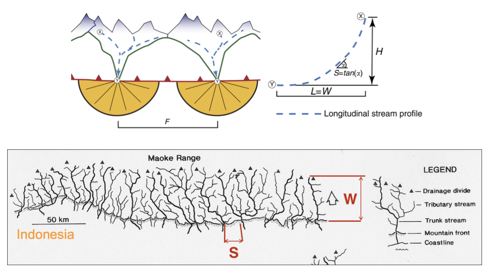

Fluvial landforms & hierarchical organisation
=========================================================================

..  admonition:: Chapter structure
    :class: toggle

    - Drainage networks characterisation from stream order and patterns
    - River morphology and landforms: profiles, knickpoints and basin zonation
    - Geomorphic transport laws

The section focuses on the characterisation of fluvial systems. We will put the emphasis on specific landforms associated with river networks as well as the organisation of drainage basins and streams. Finally we will review some of the geomorphic transport laws that predict landscape form and evolution.

..  admonition:: Learning outcomes
    :class: toggle

    - To understand the different components of fluvial catchments;
    - To consider how drainage networks are labelled and how they interact with other components of sediment routing systems;
    - To evaluate how simple geomorphic transport laws derived from field evidence can be used to estimate landform and fluvial landscape evolution.

Drainage networks
------------------

.. note::
  This section is mainly based on R.J. Huggett book: Fundamentals of Geomorphology (3rd ed.), 2011 (`link <https://sudartomas.files.wordpress.com/2012/11/fundamentalsofgeomorphology_routledgefundamentalsofphysicalgeography.pdf>`_).

Drainage networks display many types of quantitative regularity that are useful in analysing both the fluvial systems and the terrains that they dissect (Howard, 1967). Drainage basins are the principal hydrologic unit considered in fluvial geomorphology. A drainage basin is the source for water and sediment that moves from higher elevation through the river system to lower elevations as they reshape the channel forms.

.. note::
  The fluvial dissection of the landscape consists of **valleys** and their included **channel** ways organised into a system of connection known as a **drainage network**. As such a river system can be considered as a network in which nodes (stream tips and stream junctions) are joined by links (streams). Stream segments or links are the basic units of stream networks.

..  admonition:: Drainage basin definitions
    :class: toggle, toggle-shown

    .. image:: images/drainagebasin.png
       :width: 70 %
       :alt: Drainage basins
       :align: center

    The **drainage basin** is the land surface drained by a **stream system**; an **interfluve** is a **divide**, an area of higher land that separates one valley from the next (within a drainage basin); a **drainage divide** is an interfluve that separates two drainage basins.

    .. raw:: html

        

        <iframe width="100%" height="380" src="https://www.youtube.com/embed/v-b1nM0RbOs?rel=0" frameborder="0" allow="accelerometer; autoplay; encrypted-media; gyroscope; picture-in-picture" allowfullscreen></iframe>
        

Stream order
*****************

Seen from above, river systems display a tree-like pattern, with many small streams feeding into fewer larger rivers and eventually into one very large river. **Stream order** is used to denote the **hierarchical relationship between stream segments** and **allows drainage basins to be classified according to size**.

.. image:: images/Strahler.png
   :width: 70 %
   :alt: Stream order
   :align: center

Stream order is a basic property of stream networks because it relates to the relative discharge of a channel segment. Several stream-ordering systems exist, the most commonly used being the one devised by **Arthur N. Strahler**. In **Strahler’s ordering** system, a stream segment with no tributaries that flows from the stream source is denoted as a **first order segment**. A **second-order segment** is created by joining two first-order segments, a third-order segment by joining two second-order segments, and so on.

As shown in the figure above, **there is no increase in order when a segment of one order is joined by another of a lower order**. Strahler’s system takes no account of distance and all fourth-order basins are considered as similar.

.. note::
  Strahler’s stream order has been applied to many river systems and it has been proved statistically to be related to a number of drainage basin morphometry elements. Each higher order of stream is formed from the confluence of two lower order streams, and the watersheds of lower-order streams are included within the watersheds of higher order streams. **Orders 10–12 correspond to the main channels of large world rivers**. In general, individual streams get wider and longer with increasing stream order.

Drainage basin patterns
********************************

Most stream networks are adapted to regional slope and geological structures, picking out the main fractures in the underlying rocks. The high degree of conformity between stream networks and geological structure is evident in the main drainage patterns presented in the figure below.

..  admonition:: Drainage patterns explained...
    :class: toggle, toggle-shown

    .. figure:: images/patterns.png
       :width: 100 %
       :alt: patterns
       :align: center

       Drainage patterns controlled by structure or slope (from Summerfield, 1991).

    - **Dendritic drainage** has a spreading, tree-like pattern with an irregular branching of tributaries in many directions and at almost any angle. It occurs mostly on horizontal and uniformly resistant strata and unconsolidated sediments and on homogeneous igneous rocks where there are no structural controls. **Pinnate drainage**, which is associated with very steep slopes, is a special dendritic pattern wherein the tributaries are more or less parallel and join the main stream at acute angles.

    - **Parallel drainage** displays regularly spaced and more or less parallel main streams with tributaries joining at acute angles. Parallel dip streams dominate the pattern. It develops where strata are uniformly resistant and the regional slope is marked, or where there is strong structural control exerted by a series of closely spaced faults, monoclines, or isoclines.

    - **Trellis drainage** has a dominant drainage direction with a secondary direction parallel to it, so that primary tributaries join main streams at right angles and secondary tributaries run parallel to the main streams. It is associated with alternating bands of hard and soft dipping or folded beds or recently deposited and aligned glacial debris. Fold mountains tend to have trellis drainage patterns.

    - **Radial drainage** has streams flowing outwards in all directions from a central elevated tract. It is found on topographic domes, such as volcanic cones and other sorts of isolated conical hills. On a large scale, radial drainage networks form on rifted continental margins over mantle plumes, which create lithospheric domes.

    - **Rectangular drainage** displays a perpendicular network of streams with tributaries and main streams joining at right angles. It is less regular than trellis drainage, and is controlled by joints and faults.

    - **Angulate drainage** is a variant of rectangular drainage and occurs where joints or faults join each other at acute or obtuse angles rather than at right angles.

    - **Annular drainage** has main streams arranged in a circular pattern with subsidiary streams lying at right angles to them. It evolves in a breached or dissected dome or basin in which erosion exposes concentrically arranged hard and soft bands of rock.

    - **Deranged drainage** forms on newly exposed land, such as that exposed beneath a retreating ice sheet, where there is almost no structural or bedrock control and drainage is characterised by irregular stream courses with short tributaries, lakes, and swamps.

River morphology and landforms
------------------------------------------

River long profiles, baselevel, and grade
********************************************

..  admonition:: Definitions
    :class: toggle, toggle-shown, important

    .. figure:: images/graded.png
        :width: 100 %
        :alt: River longitudinal profile
        :align: center

        River long profiles, baselevel and knickpoints (adapted from Bierman & Montgomery: Key Concepts in Geomorphology, 2014)

    The longitudinal profile or long profile of a river is the gradient of its water-surface line from source to mouth. Streams with discharge increasing downstream have **concave long profiles**. This is because the **drag force of flowing water depends on the product of channel gradient and water depth**. Depth increases with increasing discharge and so, in moving downstream, a progressively lower gradient is sufficient to transport the bed load. Many river long profiles are not smoothly concave but contain flatter and steeper sections.

    The steeper sections, which start at **knickpoints**, may result from outcrops of hard rock, the action of local tectonic movements, sudden changes in discharge, or critical stages in valley development such as active headward erosion.

    **Baselevel** is the lowest elevation to which downcutting by a stream is possible. The ultimate baselevel for any stream is the **water body into which it flows** – sea, lake, or, in the case of some enclosed basins, playa, or salt lake. Main channels also prevent further downcutting by tributaries and so provide a baselevel. **Local baselevels** arise from bands of resistant rock, dams of woody debris, beaver ponds, and human-made dams, weirs, and so on.

    **Grade** is a state of a river system in which controlling variables and baselevel are **constant**. A graded stream is one in which, over a period of years, slope is delicately adjusted to provide, with available discharge and with prevailing channel characteristics, just the velocity required for the transportation of the load provided by the drainage basin. The **graded stream is a system in equilibrium**; its diagnostic characteristic is that any change in any of the controlling factors will cause a displacement of the equilibrium in a direction that will tend to absorb the effect of the change. If the baselevel changes, then **streams adjust their grade by changing their channel slope (through aggradation or degradation), or by changing their channel pattern, width, or roughness**. However, as the controlling variables usually change more frequently than the time taken for the channel properties to respond, a graded stream displays a quasi-equilibrium rather than a true steady state.

Knickpoints
****************

As we saw above, rivers in equilibrium with the environment have smooth, concave long profiles, however a dynamic knickpoint, which is a sharp break in slope in the long profile of a river (*e.g.* a waterfall) can be formed when the system is perturbed by external factors such as changes in tectonic or climatic conditions.

Knickpoints migrate upstream, separating a downstream reach, broadly in equilibrium with the new conditions (red in diagram above), and an upstream reach which is yet to adjust (green in diagram). Understanding the development and migration of knickpoints through landscapes is therefore fundamental for inferring historic landscape forcings and predicting possible future landscape responses to change.

   Knickpoints (often waterfalls) are often located at dynamic boundaries within landscapes, separating a downstream reach characterised by steep channels and long steep hillslopes (highlighted in red) from a low relief landscape upstream (shown in green) (Hurst et al., 2012).

Knickpoints generally retreat very slowly through landscapes which makes the erosion processes very difficult to monitor in real time. Experimental flume tanks can allow these processes to be simulated in a controlled environment, as the timescale of knickpoint migration is reduced and the controls on formation and retreat processes can be isolated and quantified.

River landforms
********************************************

Most rivers are considered as reaches with different geomorphological characteristics. The most simple division generally made is to divide the river into **upper**, **middle** and **lower** river reaches.

   Upper River: headwaters, Middle river: low gradient valleys and flood plains, Lower river: depositional zone (from T.L. Thornberry-Ehrlich, Colorado State University)

Upper river
^^^^^^^^^^^^^

The uppermost portion of a river system includes the river headwaters and low-order streams at higher elevation. The upper river basin is usually characterised by steep gradients and by erosion that carries sediment downstream. Streams in this upper region are usually steep and torrential, and often include rapids and waterfalls. These streams generally have little floodplain, although part of the bank and surrounding land may be wetted during periods of high flow.

Middle river
^^^^^^^^^^^^^

In the middle course the river has more energy and a high volume of water. The gradient here is gentle and lateral erosion has widened the river channel. The river channel has also deepened. A larger river channel means there is less friction, so the water flows faster.

- As the river erodes laterally, to the right side then the left side, it forms large bends, and then horseshoe-like loops called meanders.
- The formation of meanders is due to both deposition and erosion and meanders gradually migrate downstream.
- The force of the water erodes and undercuts the river bank on the outside of the bend where water flow has most energy due to decreased friction.
- On the inside of the bend, where the river flow is slower, material is deposited, as there is more friction.
- Over time the horseshoe become tighter, until the ends become very close together. As the river breaks through, *e.g.* during a flood when the river has a higher discharge and more energy, and the ends join, the loop is cut-off from the main channel. The cut-off loop is called an oxbow lake.

Lower river
^^^^^^^^^^^^^

The river channel is now deep and wide and the landscape around it is flat. However, as a river reaches the end of its journey, energy levels are low and deposition takes place.

Floodplains
^^^^^^^^^^^

In addition to the streams themselves, the depositional habits of fluvial systems produce striking landforms. Fluvial deposits are sediments deposited by the flowing water of a stream.

   Illustration of channel features from Chaco Culture National Historical Park geologic report (from T.L. Thornberry-Ehrlich, Colorado State University).

A floodplain is the relatively flat surface adjacent to the river or stream. During floods, when the stream overflows its banks, water flows over the floodplain and deposits sediment. Through fluvial processes, streams construct floodplains that accommodate their maximum flood capacity. Geomorphic features of the floodplain include:

- Natural levees—river may be immediately flanked by a buildup of sediment that forms natural levees. These provide some defense against flooding, but are occasionally breached in areas producing flood-plain splays—coarse fan-shaped deposit of sediment created during high flow events
- Oxbows and oxbow lakes—See below, features of a Meandering Stream Channel
- Point Bars—See below, features of a Meandering Stream Channel
- Terraces

..  admonition:: Limited conditions for fluvial erosion
    :class: toggle, toggle-shown, important

    A striking difference between the two landscapes is the dominance of bedrock on the slopes in the right panel in the figure below and the absence of any bedrock exposure in the left panel. **This difference matters because the processes responsible for erosion of bedrock hillslopes will differ greatly from those that transport loose soil material downslope**.

    **Bedrock hillslopes emerge where the potential erosion rate exceeds the production rate of loose debris or soil from the bedrock**. Such conditions may be met where channel incision rates or uplift rates are high, or the rate of production from bedrock is low.

    .. figure:: images/limited.png
       :width: 100 %
       :alt: Limited conditions for landscape evolution
       :align: center

       Transport-limited (left) vs weathering-limited (right) landscapes.

    1. **Transport-limited** landscapes: delivery of sediment to streams is limited by the rate at which soil and rock can be transported (supply >> capacity). The forces that cause erosion and transport of sediment are not sufficient to remove all landscape materials. Transport-limited slopes occur where weathering processes are efficient at producing debris but where transport processes are inefficient at removing it from the slope. Such slopes lack free faces and faceted appearances, and they are generally covered with a soil mantle.

    2. **Weathering-limited (detachment-limited)** landscapes: delivery of sediment to streams is limited by the rate of sediment production (supply << capacity) by the various mechanisms of chemical weathering, physical weathering, and erosional detachment (overland flow; mass movement). The forces that cause erosion and transport of sediment are sufficient to remove all landscape materials. On weathering-limited slopes, transport processes are so efficient that debris is removed more quickly than it can be generated by further weathering. Such landscapes develop a faceted or angular morphology in which an upper free face, or cliff, contributes debris to a lower slope of accumulation.

Geomorphic transport laws
------------------------------------------

A geomorphic transport law is a mathematical statement derived from a physical principle or mechanism, which expresses the mass flux or erosion caused by one or more processes in a manner that: 1) can be parameterised from field measurements, 2) can be tested in physical models, and 3) can be applied over geomorphically significant spatial and temporal scales. Such laws are a compromise between physics-based theory that requires extensive information about materials and their interactions, which may be hard to quantify across real landscapes, and rules-based approaches, which cannot be tested directly but only can be used in models to see if the model outcomes match some expected or observed state.

Hydraulic geometry
*********************

The assumption is frequently made that discharge and drainage area (the entire geographical area drained by a river and its tributaries) scale linearly or nearly linearly:

.. math::
  Q = k A^c

where :math:`k` is the theoretical discharge for a unit area watershed (:math:`A = 1`), :math:`Q` is river discharge (m3/s), :math:`A` is drainage area (m2), and :math:`c` is the scaling power dependency.

The controlling influence of discharge upon channel form, resistance to flow, and flow velocity is explored in the concept of **hydraulic geometry**. The key to this concept is the discharge equation:

.. math::
  Q = w d v

where :math:`Q` is stream discharge (m3/s), :math:`w` is the stream width (m), :math:`d` is the mean depth of the stream in a cross-section (m), and :math:`v` is the mean flow velocity in the cross-section (m/s). **Hydraulic geometry considers the relationships between the average channel form and discharge**. Width, depth, and velocities variables are power functions of discharge (Leopold and Maddock 1953):

.. math::
  w = a Q^b, \, d=cQ^f, \, v=kQ^m

The exponents indicate the increase in hydraulic variable (width, depth, and velocity) per unit increase in discharge. Now, discharge is the product of width and depth (cross-sectional area) and velocity, so:

.. math::
  Q = w d v = ack Q^{(b+f+m)}

which gives: :math:`ack=1` and :math:`b+f+m=1`. The values of the exponents vary with location, climate, and discharge conditions. Proceeding downstream on the same river, width, depth, and velocity all increase regularly with increasing discharge.  As a rule of thumb, the mean velocity and width–depth ratio (:math:`w/d`) both increase down stream along alluvial channels as discharge increases. If discharge stays the same, then the product :math:`w d v` does not change. Any change in width or depth or velocity causes compensating changes in the other two components.

The stream power incision law is a commonly used physically based model for bedrock incision. The incision rate, :math:`E`, can be written as:

.. math::
  E = \kappa A^m S^n

where :math:`\kappa` is the erodibility coefficient, :math:`A` is the upslope drainage area, :math:`S` is the downstream slope, and :math:`m` and :math:`n` are exponents. The :math:`m/n` ratio is between 0.35 and 0.60. This range is consistent with results inferred from field work and map studies.

Relationship between streams length and basins area
*****************************************************

   Left: Illustration of the Hack's law (1957) from Rigon et al., 1996. Right: Length–Area dataset from 22000 river basins (grey circles) in Bhutan Himalaya. Green and blue lines show the original Hack’s law and the law proposed by Montgomery and Dietrich (1992), respectively (from Sassolas-Serrayet et al., 2018).

**Hack's law** is an empirical relationship between the length of streams and the area of their basins. If :math:`L` is the length of the longest stream in a basin, and :math:`A` is the area of the basin, then Hack's law may be written as

.. math::
  L = c A^h

where :math:`c` is a constant between *1.4* and *1.7* and the exponent :math:`h` is slightly less than 0.6 in most basins. :math:`h` varies slightly from region to region and slightly decreases for larger basins.

.. note::
  This large-scale observation of fluvial landform characteristic is an example of fractal relationship. It shows that the upstream length :math:`L_i` at a given position :math:`i` can be inferred from the total cumulative area :math:`A_i` at that position (which is a specific signature of fractal geometry).

Relationship between valley spacing and mountain width
****************************************************************

A frequent feature of drainage networks in linear sections of mountain ranges is the apparent regular spacing between transverse rivers at the mountain front. Addressing this observation, and in particular the consistency of this regularity, Hovius (1996) analysed the drainage of 11 different linear mountain belts worldwide.

  Top: empirical relationship between average spacing of outlets for major drainages and the half-width of major mountain ranges. Bottom: sample drainage network in the linear section of the Maoke Range (from Hovius 1996).

His study showed that the outlets of the major transverse rivers at the front of these topographies are not only regularly spaced but also that their spacing :math:`S` is on average proportional to the width :math:`W` of the range (measured from the drainage divide to the front) following the relation:

.. math::
   S = 0.46 W + 0.798

.. important::
  An important aspect of this observation is the regularity of spacing ratios between the mountain ranges despite strong differences in climate and rock uplift rates.This seems to constitute a paradox as in many current landscape evolution models, the patterns of drainage network growth, as seen for example in drainage density and channel spacing, depend on both climate and tectonics.

Controls on the width of bedrock and alluvial channels
****************************************************************

Channel width and its variation with water discharge importantly influence bed shear-stress patterns, and thus play a first-order role in controlling the pattern and tempo of bedrock channel incision. Given challenges to measure channel width in mountainous terrain, classical hydraulic geometry relationships among width, discharge, and drainage area developed for lowland alluvial rivers are often applied. There is some indication that these relationships are appropriate – the widths of bedrock and alluvial channels both appear to scale similarly with drainage area across many orders of magnitude and, in fact, appear to have physically similar widths at comparable drainage areas as illustrated in the figure below.

   Bedrock channel width as a function of upstream drainage area in graded bedrock rivers. Power-law scaling relations for alluvial gravel-bedded rivers (e.g., Parker et al., 2007) and mixed bedrock–alluvial rivers (Hack, 1957) are shown for comparison (from Whipple et al., 2013).

This scaling suggests that the factors governing bedrock and alluvial channel width are similar. Although it is convenient to model bedrock channel width as a simple power-law function of drainage area, it has been hypothesised that width also depends on uplift rate and serves as an important mode of channel adjustment to base-level change.

Relationship between river slope and drainage area
****************************************************************

As we have seen in the first section, river profiles carry information on tectonic and/or climatic perturbations in the form of knickpoints migrating in upstream direction. Of particular importance is the analysis of river profiles to detect those zones of  gradient changes.

A means to quantify deviations from the graded profile consists in plotting the **channel steepness index** (:math:`k_{sn}`-values) along streams allowing detection and visualisation of perturbation zones in specific networks.

.. figure:: images/ksn.png
   :width: 90 %
   :alt: ksn
   :align: center

   Relationship between river slope and drainage area and plot of :math:`k_{sn}` along river streams using the Topotoolbox package.

The use of the channel steepness index (:math:`k_{sn}`) which is derived from the slope–area regression, has widely been applied to detect zones subject to different rock uplift rates. This slope–area regression has the following form:

.. math::
  S = k_{sn} A^{-\theta}

where :math:`S` is the channel slope, :math:`k_{sn}` is referred as the steepness index, :math:`A` is the drainage area (surrogate of stream discharge) and :math:`\theta` is the concavity of the longitudinal profile. :math:`\theta` ranges between 0.3 and 0.8 and often takes on the value 0.45.

Transient adjustments identification
****************************************************************

Evaluating whether river profiles reflect steady-state or transient conditions has been performed using plots of slope versus drainage area (discussed above), but noisy topographic data can complicate interpretations of these plots. In particular, step-like changes in channel elevation over distance associated with digital elevation models introduce imprecision into determinations of channel slopes. An alternative approach involves integrating the slope-area equation under the assumption of spatially invariant uplift and erodibility (Perron and Royden, 2013).

The integral method only requires the extraction of elevation and drainage area along the channel, and is therefore less subject to topographic noise than slope-area analysis. The technique involves integrating equation the stream power equation along the channel, assuming spatially constant incision equal to uplift (steady-state) and erodibility.

  River network and longitudinal profile before and after river capture. a χ map for the river network before river capture. b :math:`\chi` map for the present river network. c :math:`\chi`-elevation plot for the Paleo Chaiwen and Yihe Rivers before capture. d :math:`\chi`-elevation plot for the present Chaiwen, Yihe, and Reversed Rivers (Fan et al., 2018).

Performing the integration in the upstream direction from a base level :math:`x_b` to an observation point :math:`x`  yields to:

.. math::
 \chi = \int_{x_b}^x \left( \frac{A_0}{A(x)} \right)^{\frac{m}{n}} dx

where :math:`A_0` is a reference drainage area, :math:`m`, :math:`n` coefficients from the stream power law.  Values of :math:`\chi` are determined using assumed values of :math:`m/n` between 0 and 1. A plot of bed elevations versus :math:`\chi` (a chi plot) is produced. **If a profile is in steady state, the plot should be linear**.

.. important::
  An advantage of the chi-plot approach is that it removes the effect of drainage area, so that locations within a drainage network with similar elevations have similar values of χ, even if the drainage areas of those locations differ. Thus, all rivers in steady state within an area of spatially uniform uplift and resistance should exhibit collinear chi plots.

Transient adjustments of longitudinal profiles, characterised by knickpoints and knickzones, are depicted on chi plots as local increases in change of elevation per unit change in χ, which produce positive deviations from a linear profile. Differences in slopes of transformed profiles upstream and downstream of knickpoints also define differences between adjusted sections of profiles below knickpoints and unadjusted sections of profiles above knickpoints.

..  admonition:: χ-plot as a measure of equilibrium.
    :class: toggle, toggle-shown, important

    .. figure:: images/chi1.jpg
      :width: 80 %
      :alt: chi-plot
      :align: center

      River basins and river profiles in equilibrium and disequilibrium (from Willett et al., 2014).

    The figure above shows change in size and shape of two drainage basins that share a common divide as they evolve from (A) a state of disequilibrium to (B) a steady state. The parameter :math:`\chi` provides a prediction of the steady-state elevation for a given point on a channel. The basin on the left (aggressor) has lower steady-state elevation at channel heads and therefore drives the drainage divide toward the basin on the right (victim). The lower panels show the evolution of the elevation of two channels that meet at the shared divide with respect to (C) :math:`\chi` and (D) distance along the channel. The slopes above the channel head attain a symmetric form at steady state, but do not differ strongly from this form under disequilibrium conditions. The disequilibrium channel profiles in (C) show that :math:`\chi` is discontinuous across the drainage divide, with larger :math:`\chi` values in the “victim” basin. At steady state, all channel points in both basins lie on a single linear trend, subject to the assumptions described in the text. Note that changes in elevation are subtle, whereas changes in χ are marked.
