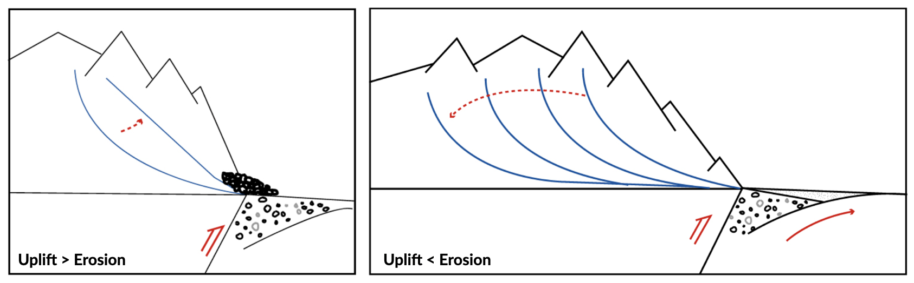
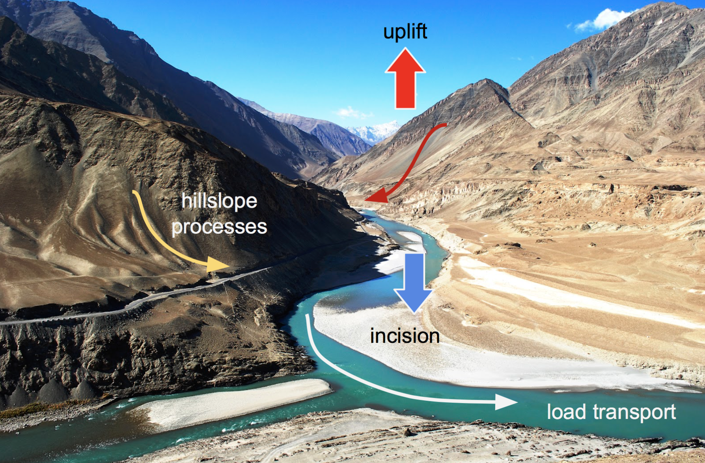
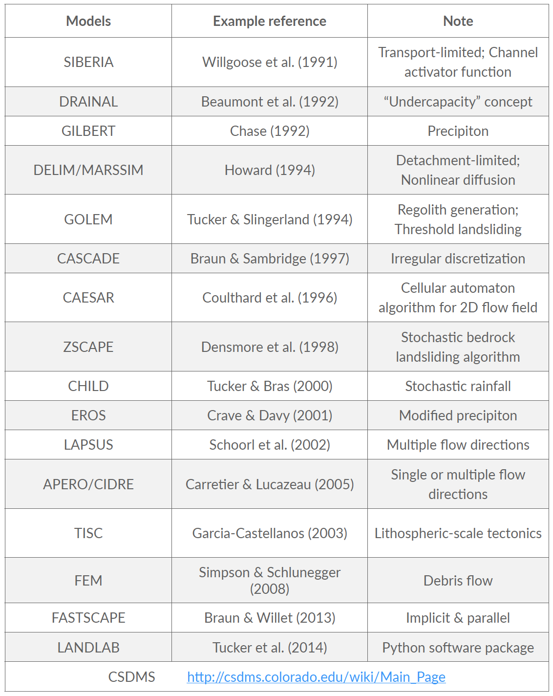
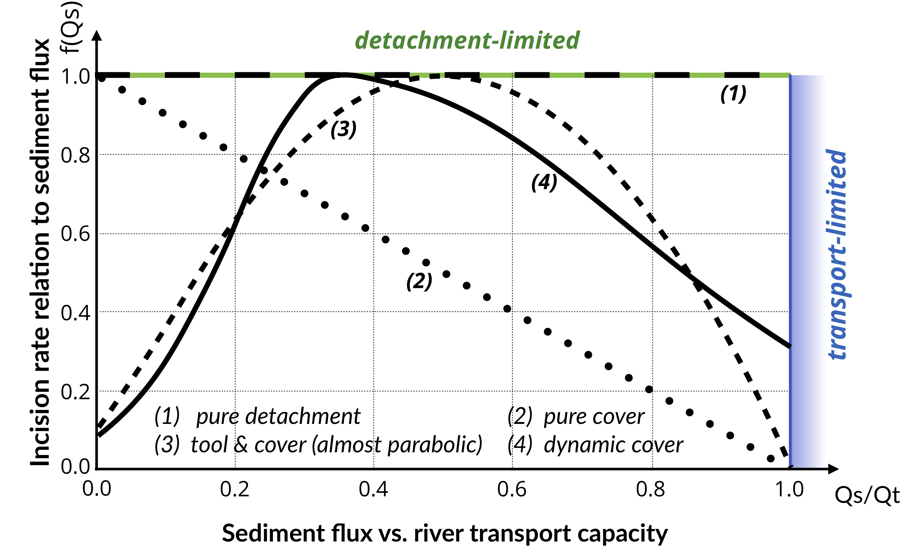
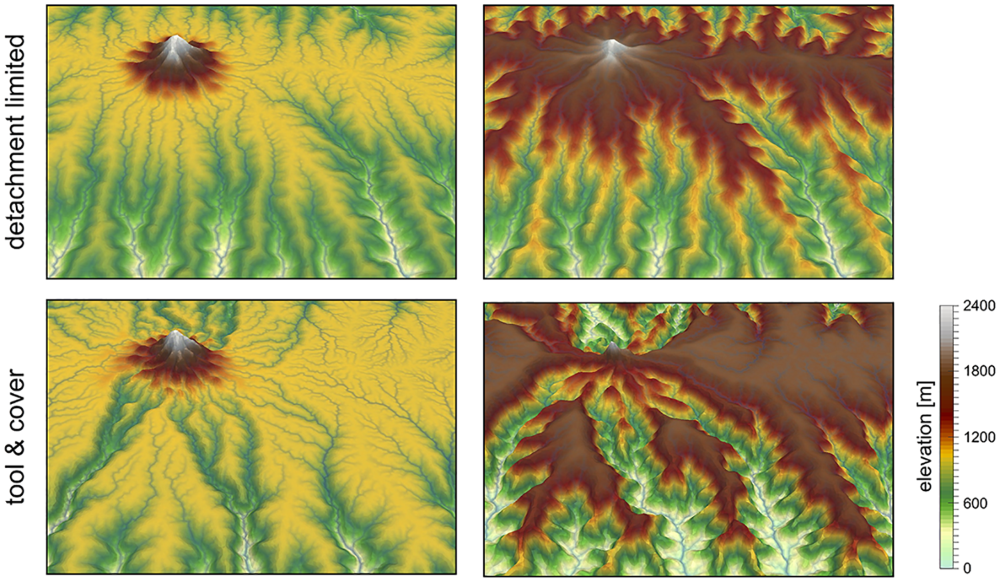
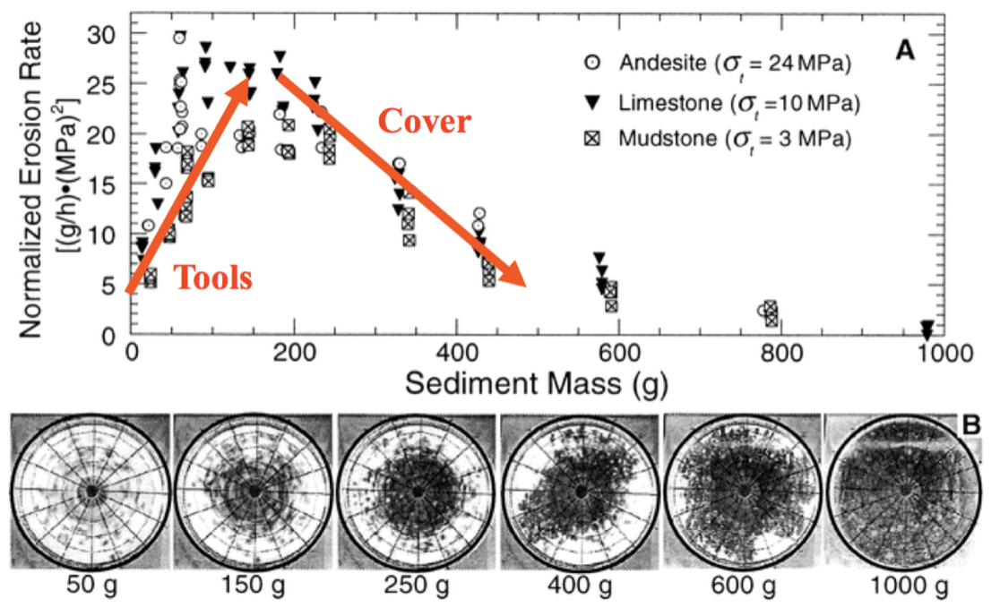
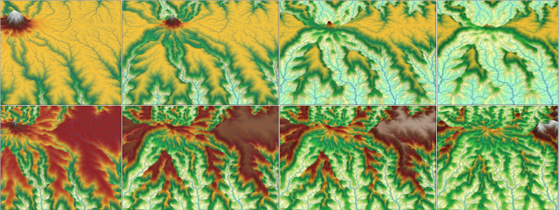

Surface processes model
==========================================

.. note::
  Water is one of the primary agents driving the constant erosion of the surface of the earth. Water aids in the degradation of rocks and then transports the resulting sediment downstream to some sedimentary basin, usually the ocean.

Even though the process of erosion is constantly occurring, sediments move down a river much more slowly. Sediments, particularly gravel, can only be moved when the river is flowing with high energy, like during a flood. As a result, sediments can be temporarily stored in fluvial deposits until the next storm comes along and washes some of the sediment downstream a little further. The sediment that gets washed away will probably be replaced by more sediment from upstream. In this manner, sediments inch their way downstream, getter ever smaller in the process.

Responses to tectonic & climate
---------------------------------------------

The sketches below illustrate the long-term response of longitudinal river profile subjects to change in either tectonic conditions or climatic forcing.

In the left panel, the uplift regime increases and the overall slope increases as well leading to higher erosion until a new equilibrium (steady-state) is reached. At steady-state the rate of rock uplift relative to some datum (or base-level), such as mean sea level, equals the erosion rate at every point in the landscape and consequently the overall topography does not change. Under these circumstances, the high velocity of the flow is able to transport coarse sediments on short distance.

In the right panel, the uplift remains constant but the precipitation is increased. As a result, the erosion increases and the slope decreases. A new steady-state is reached when the erosion equates the uplift regime. Under these circumstances, as the slope decreases, the velocity of the flow also decreases and finer sediments are transported and deposited in foreland basins.

Surface processes models
---------------------------------------------

The whole landscape evolution can basically be represented in a single equation:

.. math::
  \frac{\partial z}{\partial t} = U - E - \nabla \cdot q_s

All landscape must obey this fundamental statement about sediment transport. In this equation :math:`\frac{\partial z}{\partial t}` is the change in surface elevation,  :math:`U` is the uplift rate, :math:`E` is the erosion rate and :math:` \nabla \cdot  q_s` is the sediment flux divergence.

The erosion rate :math:`E` corresponds to sediment production from weathering and bedrock erosion by glacier, wind, water. The sediment fluxes is transported by hillslope
and fluvial transport processes.

   Surface processes are acting everywhere we have relief, but more obviously in mountain regions. In response to tectonic uplift, rivers incise into bedrock and insure the progressive lowering of the base level for hillslope processes to take place. Rivers also transport the eroded materials to the sedimentary basin.

Many geomorphological applications have demonstrated the usefulness of these models, whose predictions help researchers test simple to complex hypotheses on the nature of landscape evolution. Surface processes models (SPMs) also provide connection between small scale, measurable processes and their long-term geomorphic implications.

History
*********

The roots of landscape evolution theory can be found in the pioneering work of Gilbert (1877), who proposed a set of hypotheses to relate various landforms to the mechanisms of weathering, erosion and sediment transport. The first quantitative models appeared later in the 1960s (e.g., Culling, 1960; Scheidegger, 1961; Ahnert, 1970; Kirkby, 1971). These models formalise the concepts of Gilbert (1877) to the development of hillslope profiles. A few years later, these models were extended to two dimensions, although still focused on hillslope morphology.

   Partial list of existing landscape evolution models.

During the last two decades, as computers continued to get faster, a number of sophisticated numerical SPMs have been developed, mainly focusing on watershed and mountain belt evolution. Both hillslope and fluvial processes are involved in these models, which differ from each other by the parameterisation of these processes and their numerical resolution.

Continuity of mass
*******************

In the simplest case where there is no distinction between a regolith layer and the bedrock underneath, the mass continuity equations for a column of soil or rock is expressed as:

.. math::
  \frac{\partial z}{\partial t} = U - \nabla \cdot q_s

where the elevation  :math:`z` (m) is measured vertically,  :math:`q_s` is the total downhill soil flux, :math:`\nabla \cdot` is the spatial divergence operator and :math:`U` (m/yr) is a source term that can either represent the rate of incision of channel streams at the hillslope boundaries or uniform uplift.

Sediment transport
***************************

To describe the rates of sediment erosion/transport/deposition, several approaches have been proposed. In its simplest formalism a detachment-limited equation is often used.

Detachment-limited model
^^^^^^^^^^^^^^^^^^^^^^^^^^

The soil transport rate per unit width by flowing water, :math:`q_r`, is modelled as a power function of topographic gradient :math:`\nabla z` and surface water discharge per unit width :math:`q_w` (m2 /yr):

.. math::
  q_r = − \kappa_r q_w^m \nabla z^n

This detachment-limited incision rate, which is calculated as a power law function of fluvial discharge only applies where channel slope is positive. This brings the following relatioship:

.. math::
  \frac{\partial z}{\partial t} = − \kappa_r q_w^m \nabla z^n

This expression corresponds to a simplified form of the usual expression of sediment transport by water flow, in which the transport rate is assumed to be equal to the local carrying capacity, which is itself a function of boundary shear stress or stream power per unit width. We consider additionally no threshold for particle entrainment. Generally, the exponents m and n have values between 1 and 2.

.. raw:: html

    

    <iframe width="100%" height="350" src="https://www.youtube.com/embed/TVRH4dJabO8?rel=0" frameborder="0" allow="accelerometer; autoplay; encrypted-media; gyroscope; picture-in-picture" allowfullscreen></iframe>
    

Hillslope processes
^^^^^^^^^^^^^^^^^^^

In its most simple form, the parameterisation of hillslope transport is based on a linear dependence to the topographic gradient. This linear law has in fact been used to represent a variety of transport processes such as creep, biogenic activity or rain splash.

Downslope simple creep is commonly regarded as operating in a shallow superficial layer and is defined as:

.. math::
  q_d = − \kappa_d \nabla z

Note that because of the multi-process parameterisation of soil transport, the coefficient :math:`\kappa_d` is also scale-dependent, like the :math:`\kappa`-scale parameters of the other stream power law defined above.

Incision laws overview
***************************

Several formulations of river incision have been proposed to account for long term evolution of fluvial system. These formulations describe different erosional behaviours ranging from detachment-limited incision, governed by bed resistance to erosion, to transport-limited incision, governed by flow capacity to transport sediment available on the bed.

As we already discussed, mathematical representation of erosion processes in these formulations is often assumed to follow a stream power law. These relatively simple approaches have two main advantages. First, they have been shown to approximate the first order kinematics of landscape evolution across geologically relevant timescales (>104 years). Second, neither the details of long term catchment hydrology nor the complexity of sediment mobilisation dynamics are required. However, other formulations are sometimes necessary when addressing specific aspects of landscape evolution.

   Model space for stream power-based incision laws. It shows the dependence of river incision rate on sediment flux (adapted from Hobley et al., 2011).

Detachment-limited
^^^^^^^^^^^^^^^^^^^^^^

The simplest law to simulate fluvial incision is based on the detachment-limited stream power law (option 1, in the above figure), in which erosion rate  depends on drainage area :math:`A`, net precipitation :math:`P` and local slope :math:`S` and takes the form:

.. math::
  I = − \kappa_d P^l (PA)^m S^n

:math:`\kappa_d` is a dimensional coefficient describing the erodibility of the channel bed as a function of rock strength, bed roughness and climate, :math:`l`, :math:`m` and :math:`n` are dimensionless positive constants.

Default formulation assumes :math:`l = 0`, :math:`m = 0.5` and :math:`n = 1`. The precipitation exponent :math:`l` allows for representation of climate-dependent chemical weathering of river bed across non-uniform rainfall. In this model sediment deposition occurs solely in topographically closed depression and offshore.

Transport-limited
^^^^^^^^^^^^^^^^^^^^^^

   Illustration of the impact of detachment versus transport limited (tool & cover option 3) formulations on landscape dynamics. Evolution of dissection of an uplifting landscape composed of a flat surfaces dotted with an isolated peak, after 5 and 9 Ma of dissection. The modeling shows how the abundant bedload shed by the isolated peak boosts incision along the receiving streams (tool effect).

Here, volumetric sediment transport capacity (:math:`Q_t`) is defined using a power law function of unit stream power:

.. math::
  Q_t = − \kappa_t (PA)^m_t S^n_t

where :math:`\kappa_t` is a dimensional coefficient describing the transportability of channel sediment and :math:`m_t` and :math:`n_t` are dimensionless positive constants. In this equation, the threshold of motion (the critical shear stress) is assumed to be negligible.

An additional term is now introduced in the stream power model:

.. math::
  I = − \kappa f(Q_s) (PA)^m S^n

with :math:`f(Q_s)` representing a variety of plausible models for the dependence of river incision rate on sediment flux :math:`Q_s`. In the standard detachment-limited, :math:`f(Q_s)` is equal to unity, which corresponds to cases where :math:`Qs << Qt`. All sediment is dispersed downstream and the incision limiting factor is bedrock erodibility.

Addition of the transport-limited function results in the fact that, where sediment flux equals or exceeds transport capacity (:math:`Q_s/Q_t \ge 1`) the system becomes transport-limited and depositional if :math:`Qs/Qt > 1`. In this model the time-evolving distribution of erosion and sedimentation, is affected by the distribution of detachment-limited and transport-limited reaches, which is controlled by the respective values of :math:`\kappa_d` and :math:`\kappa_t`.

   Experimental study of bedrock abrasion by saltating particles (Sklar & Dietrich, 2001).
   The tool effect corresponds to impacting particles that remove rock, the more particles in the flow the higher the erosion rate. The cover effect corresponds to the effect of bed protection related to the amount of particles within the flow. The more particles the smaller the erosion rates.

The transition from one behaviour to the other can be treated either abruptly, progressively, through the use of one of the following formulations:

#. **Linear decline**: This model belongs to the undercapacity family of models: it assumes that stream incision represents the expenditure of the energy in excess of that needed to transport the bypassing sediment load. Stream incision potential decreases linearly from a maximum where sediment flux is negligible, to zero where sediment flux equals transport capacity (option 2).

#. **Almost parabolic**: Both qualitative and experimental observations have shown that sediment flux has a dual role in the river bed incision. First, when sediment flux is low relative to carrying capacity, erosion potential increases with sediment flux (tool effect: bedrock abrasion and plucking). Then, with increased sediment flux, erosion is inhibited (cover effect: sediments protect the bed from impacts by saltating particles) (option 3).

#. **Dynamic cover**: Typically gravel-river beds have an armoured layer of coarse grains on the surface, which acts to protect finer particles underneath from erosion. To account for sediment and spatial heterogeneity in the armouring of the river bed, Turowski et al. proposed a modified form of the ‘almost parabolic’ model that better estimates the original Sklar and Dietrich experiments (option 4).

   Preferential erosion and low relief preservation.
