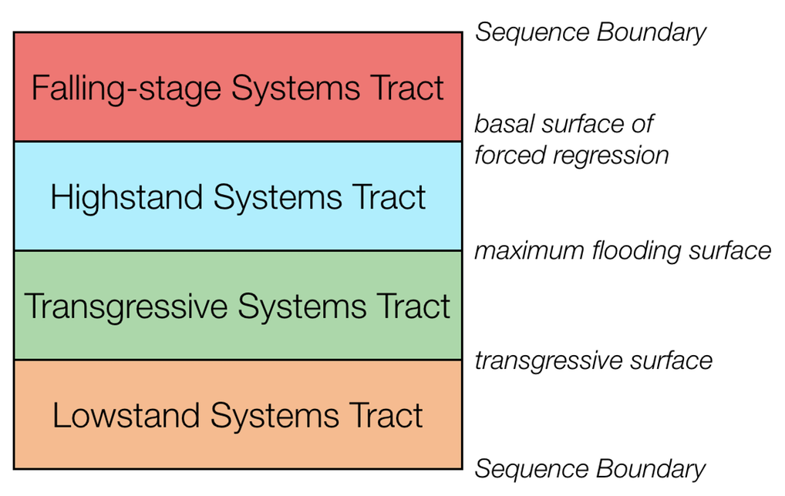
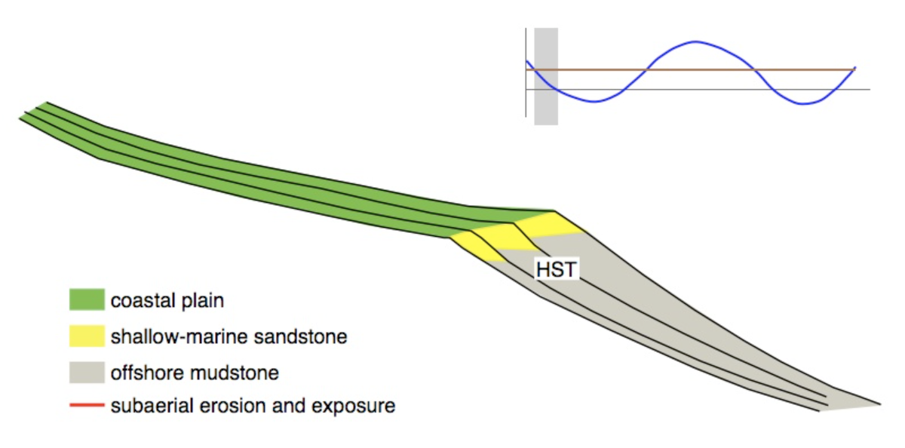
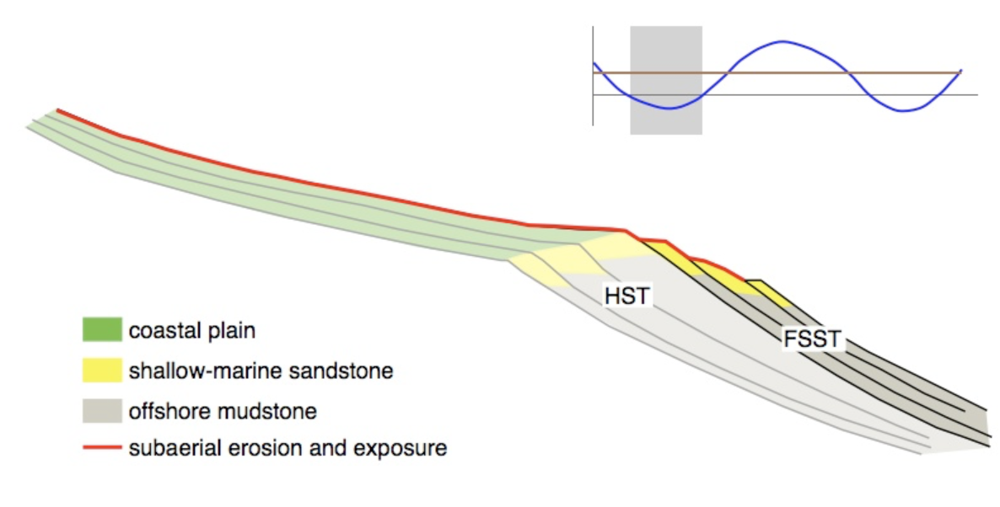
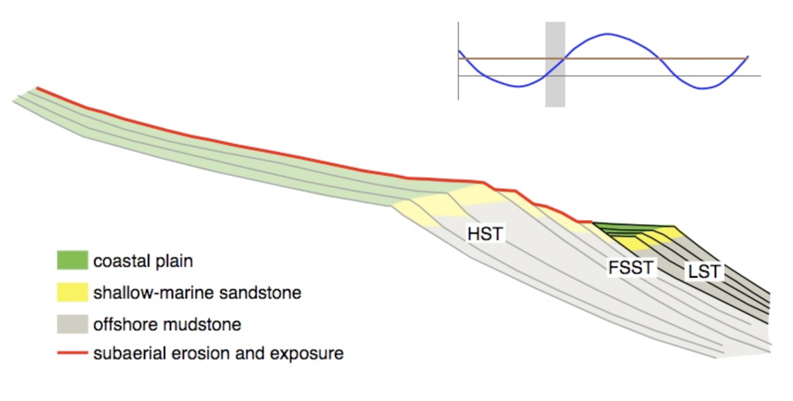
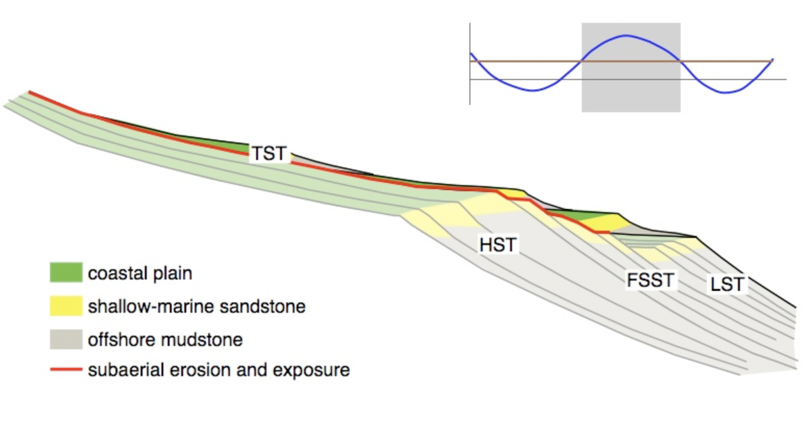
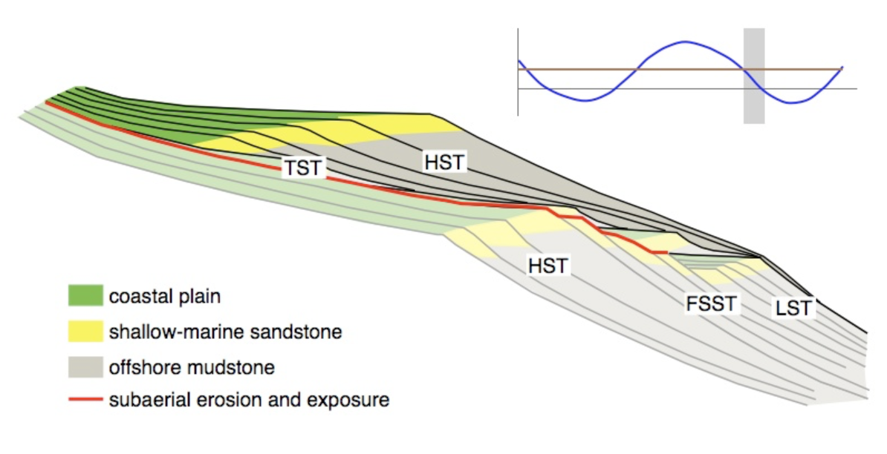
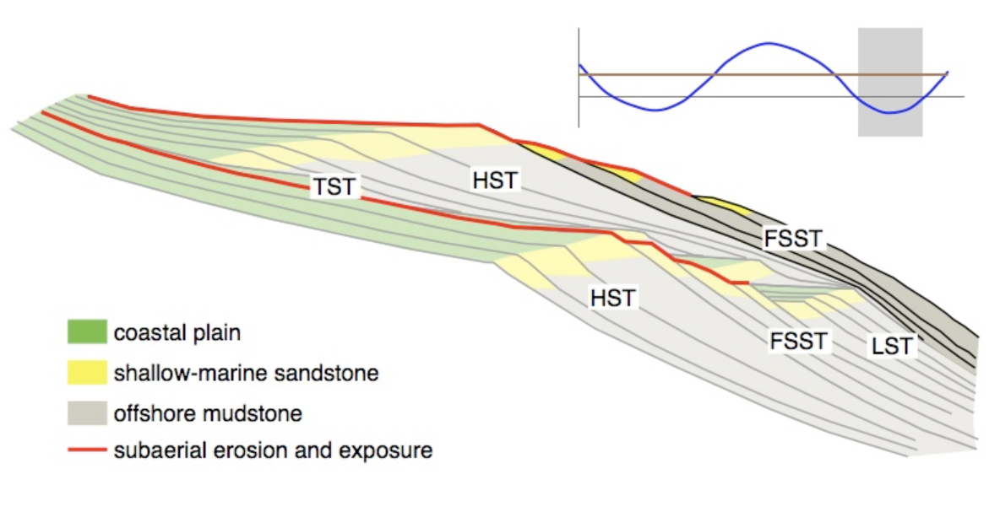
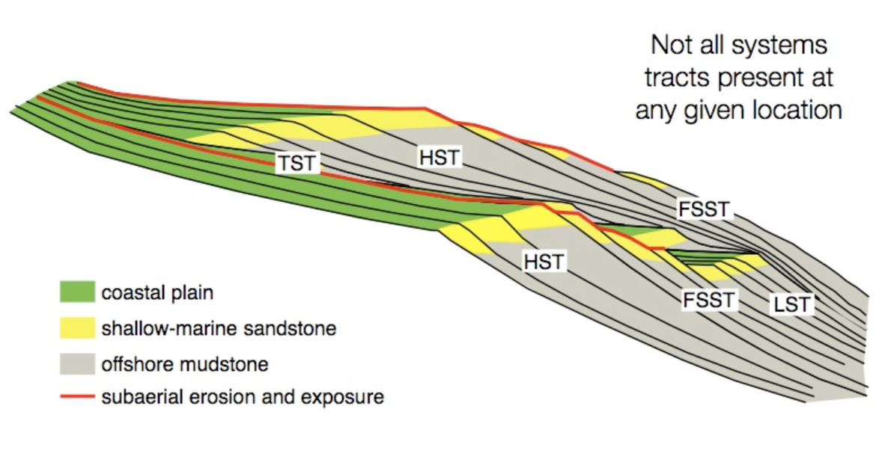
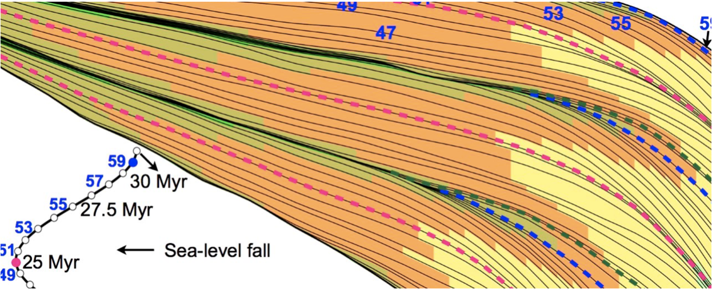
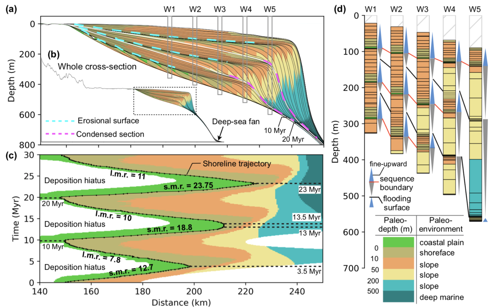

Sequence stratigraphy basics & quantitative interpretations
============================================================

Depositional sequences
-----------------------------

.. note::
  This section is from the **University of Georgia Stratigraphy Lab** website (strata.uga.edu)

.. important::
  A depositional sequence is defined as a relatively conformable succession of genetically related strata bounded by subaerial unconformities or their correlative conformities. These depositional sequences are bounded by subaerial unconformities. A subaerial unconformity is a surface formed through subaerial exposure and erosion, and includes features formed by downcutting rivers, soil processes, and karst processes.

A depositional sequence is the record of one cycle of relative sea level, that is, a fall and rise in relative sea level. As a result, depositional sequences have a predictable internal **series of surfaces** and **systems tracts**, which are suites of coexisting depositional systems, such as coastal plains, continental shelves, and submarine fans.

There are several models of systems tracts within depositional sequences. In this course, we will focus on what is called the **four systems tract model**. In it, a depositional sequence has four systems tracts, always in this order: **lowstand systems tract**, **transgressive systems tract**, **highstand systems tract**, and **falling-stage systems tract**.

  Systems tracts and surfaces in the four systems tract model (from UGA/Strata)

These systems tracts are bounded by important named surfaces. The lowstand and transgressive systems tracts are separated by the **transgressive surface**, also called the **maximum regressive surface**. The transgressive and highstand systems tracts are separated by the **maximum flooding surface**. The highstand and falling-stage systems tract are separated by the **basal surface of forced regression**. The base of the lowstand and the top of the highstand are **sequence boundaries**, that is, subaerial unconformities and their correlative surfaces.

Systems tracts
-----------------------------

.. important::
  Sequence stratigraphy is concerned with the **relative** rates of change in sea level and sedimentation, not the position of sea level per se. Consequently, all of the plots shown below show the rates of relative sea level change (in blue) and sedimentation (brown). The horizontal gray line indicates a zero rate of change.

1. When the blue relative sea-level rate curve lies above the gray line, **relative sea level is rising**.
2. As the blue curve climbs upward, relative sea level is rising more quickly, and as the blue curve descends towards the gray line, **relative sea level is still rising but at ever slower rates of rise**.
3. The opposite is true when the blue curve lies below the gray line: as the blue curve falls below the gray line, **relative sea level** is falling at progressively faster rates, and as the blue curve rises upwards toward the gray line, sea level is falling, but at ever slower rates.

Sedimentation rate is depicted at always-positive rates, indicating that topography and climate are sufficient to supply sediment continuously. Although sediment supply is shown as a constant here, this is not a requirement; it only makes explaining the concepts of sequence stratigraphy easier.

.. important::
  Remember: these plots show the rate of change in sea level, not the position of sea level.

Highstand systems tract
************************************************

To understand the formation of a depositional sequence during changes in accommodation, it is easiest to start in the highstand systems tract (**HST**), that is immediately before the beginning of a relative fall in sea level. During this HST, relative sea level is undergoing a slow rise from the combined effects of subsidence and eustasy. Given the rate of rise in relative sea level, sediment supply is sufficient to outpace it, causing **progradational stacking**.

Because the rate of relative rise in sea level is progressively declining through the HST, the progradational stacking is initially relatively weak, almost aggradational, but becomes progressively stronger over time.

Falling-stage systems tract
************************************************

Through the HST, the rate of relative sea-level rise slows, and eventually, relative sea level will begin to fall, marking the beginning of the falling-stage systems tract (**FSST**). A relative fall in sea level has two important consequences.

1. First, a **subaerial unconformity** begins to develop. Rivers erode into underlying sediments, first at the highstand shoreline forming what is called an incised valley (not shown on the cross-section). These incised valleys deepen and lengthen seaward as relative sea level continues to fall, and they also lengthen landwards through headward erosion. Between these downcutting rivers, areas that had previously experience sedimentation on the coastal plain or shelf are now subaerially weathered. and become sites of soil formation. Note that because rivers are incised, there is no widespread fluvial sedimentation during the falling-stage systems tract.
2. Second, an **erosional surface** often forms on the shelf, as the sediment surface becomes perched above the equilibrium surface for waves. Much of this erosion occurs during storms. Once equilibrium is reached, marine deposition continues, burying this surface of forced regression. During a stepped fall in sea level, several of these surfaces of forced regression may form, but the first and lowest of these is called the basal surface of forced regression and it is what defines the base of the falling-stage systems tract.

Lowstand systems tract
************************************************

In the latter part of the FSST, the rate of relative fall begins to slow, followed by the beginning of a rise in relative sea level, which marks the start of the lowstand systems tract (**LST**).

As was true in the HST, the rate of relative rise in sea level is sufficiently slow that the rate of sedimentation outpaces it, causing **progradational stacking**. In addition, rivers begin to readjust their grade, starting the filling of the valleys cut during the FSST. In their seaward ends, these valleys can be flooded by the ocean, forming estuaries. Estuaries can be efficient sediment traps, preventing sediment from dispersing onto the shelf. Incised valleys are filled first at their downstream ends, and it may take a substantial amount of time, even into later systems tracts, for the upstream ends of the valleys to be buried. This buried surface of subaerial erosion and weathering is the sequence boundary.

Because the rate of relative rise in sea level increases throughout the LST, this progradational stacking becomes weaker and eventually approaches **aggradational stacking**.

Transgressive systems tract
************************************************

As the rate of relative sea-level rise increases, it eventually outpaces the supply of sediment, leading to **retrogradational stacking** in the transgressive systems tract (**TST**).

Retrogradational stacking is marked by well-developed flooding surfaces, that is, flooding surfaces with pronounced deepening. As a result, flooding surfaces within the transgressive systems tract are much more prominent than anywhere else in a depositional sequence. The first of these large flooding surfaces is called the transgressive surface, and it separates the underlying lowstand systems tract from the overlying transgressive systems tract. Also called the maximum regressive surface, it marks the most seaward reach of the shoreline within the sequence.

The rapid relative rise in sea level leads to the formation well-developed estuaries, and their trapping of sediment hinders the dispersal of sediment to the shelf. This starvation of sediment further promotes retrogradational stacking and commonly causes siliciclastic TST parasequences to be thin. This starvation of sediment also promotes the formation of features that indicate stratigraphic condensation, such as the formation of authigenic minerals, accumulations of marine fossils, unusually bioturbated horizons, and the formation of firmgrounds and hardgrounds.

Highstand systems tract
************************************************

The rate of relative sea-level rise slows through the latter half of the TST, and eventually the rate of sedimentation will again exceed the rate of accommodation, causing the return of progradational stacking in HST. The point of turnaround from retrogradational stacking in the TST to progradational stacking in the HST commonly corresponds to the most landward reach of the shoreline within a sequence. In most cases, it also marks the deepest-water facies within a sequence, and it is therefore called the maximum flooding surface.

Any remaining estuaries are filled with sediment during the HST, with rivers subsequently forming deltas that prograde out onto the shelf. This return of sediment to the shelf, after prolonged starvation during the TST, favours the development of progradational stacking.

Falling-stage systems tract
************************************************

The end of the depositional sequence is marked by the return of a fall in sea level and the formation of the next falling-stage systems tract.

Complete sequence
************************************************

A complete sequence begins at one sequence boundary and ends at the next one; that is a complete sequence is bounded above and below by subaerial unconformities, which often correspond to substantial hiatuses. A complete sequence consists of four systems tracts, from bottom to top: lowstand systems tract, transgressive systems tract, highstand systems tract, falling-stage systems tract.

Although all four systems tracts will be developed in the sedimentary basin, not all will be present at any given spot. For example, falling-stage and lowstand systems tracts are commonly absent in depositionally updip areas. Likewise, transgressive and highstand systems tracts may be thin, absent, or difficult to distinguish in depositionally downdip areas. This spatial segregation of systems tracts that it is unusual to see all four systems tracts developed at one location, and it usually can occur only when the magnitudes of rise and fall in relative sea level are quite small. Expect systems tracts to be absent, but in a predictable way.

Quantitative interpretations
-----------------------------

As we have seen, the stratigraphic architecture of deltas is the end-result of complex interactions among upstream catchment processes that regulate the location and magnitude of the fluvial sediment discharge, and downstream basinal controls that include the *shape and quantity of accommodation space* for sediment accumulation and the *type and energy of coastal processes* that redistribute these sediments. Together, all of these controls determine the mode and degree of partitioning of sediment between the delta and the wider receiving basin.

To quantify these controls are their importance (either in isolation or when combined), two main approaches are often used.

Analogue approach
**********************

Physical modelling of delta sedimentary systems over geological time spans has to resort to analogue modelling since full scaling cannot be achieved within the spatial and temporal restrictions that are imposed by a laboratory set-up. Such analogue models are suitable for systematic investigation of a sedimentary delta system's sensitivity to allocyclic changes by isolating governing parameters.

The scaling of physical models of sedimentary systems (flume models) is commonly based on the scaling of a series of dimensionless physical parameters in order to model fluid flow and sediment transport. In the ideal case, every variable occurring in nature is perfectly scaled. However, many modellers need to apply time scaling, which introduces distortion to their model results. The condition of having flow variables (such as Reynolds and Froude numbers) identical to those occurring in nature has to be relaxed. As a model departs further from 1:1 hydraulic scaling, it reaches a point where hydrodynamic scaling is no longer possible.

.. important::
  Entire sedimentary systems with real-world dimensions from tens to hundreds of kilometres that evolve over geological time spans can thus only be modelled as analogue flume models and not as true-scaled, hydraulic models.

.. raw:: html

    

    <iframe width="100%" height="400" src="https://www.youtube.com/embed/69WkErjiK_8?rel=0" frameborder="0" allow="accelerometer; autoplay; encrypted-media; gyroscope; picture-in-picture" allowfullscreen></iframe>
    

An example of such experimental models from the Jurassic Tank (Paola - UMN/SAFL) is provided above and can be used to *slice* the analogue model and look at the obtained stratigraphic packages based on imposed sediment delivery, tectonic and sea-level forcings.

Numerical approach
**********************

.. note::
  We will be working with numerical models during the practicals using badlands code.

Stratigraphic forward modelling (SFM) allows geologists to forward project the deposition and evolution of sedimentary facies within a stratigraphic framework with given prior boundary conditions. The method can approximate depositional processes while taking into consideration a range of factors that affect basin evolution and sedimentation.

.. raw:: html

    

    <iframe width="100%" height="380" src="https://www.youtube.com/embed/LEoR4pFpftE?rel=0" frameborder="0" allow="accelerometer; autoplay; encrypted-media; gyroscope; picture-in-picture" allowfullscreen></iframe>
    

Such models can be used to *test and quantify concepts of basin evolution, to predict facies distribution and architecture, to test exploration scenarios rapidly in frontier basins, to constrain interpretations of subsurface data, and to perform sensitivity tests that evaluate fundamental controls on observed basin stratigraphy*.

.. raw:: html

    <iframe width="660" height="400" src="https://kitware.github.io/vtk-js/examples/SceneExplorer/index.html?fileURL=https://raw.githubusercontent.com/tristan-salles/PVGlance.github.io/master/cross_sec1.v.vtkjs" frameborder="0" allowfullscreen></iframe>

   Example of stratigraphic record obtained using the stratigraphic forward model badlands.

These models can be also used to test how the rate of change of accommodation (at the shoreline) and the rate of sediment supply are controlling regression and transgression in the geological record, or retreat and advance of a coastal depositional system.

   Stratal stacking patterns on a vertical cross-section crosswise to the continental margin (a). Solid black lines shown on each subplot are stratigraphic layers plotted at 0.5 Myr intervals. Different colours stand for different depositional environments that are defined based on water depth (c). b. Wheeler diagram or chronostratigraphy chart. The black dots are shoreline positions through time. The coloured lines are stratigraphic surfaces identified based on stratal terminations, stacking trends, and shoreline trajectory (SB: sequence boundaries—TS: transgressive surfaces—MFS: maximum flooding surfaces). c. Virtual cores P1 to P5 extracted at different positions across the shelf (see location in a). Solid lines connect condensed sections and unconformities produced at low to sea-level fall. d) Synthetic wells at different locations over the cross-sections.
