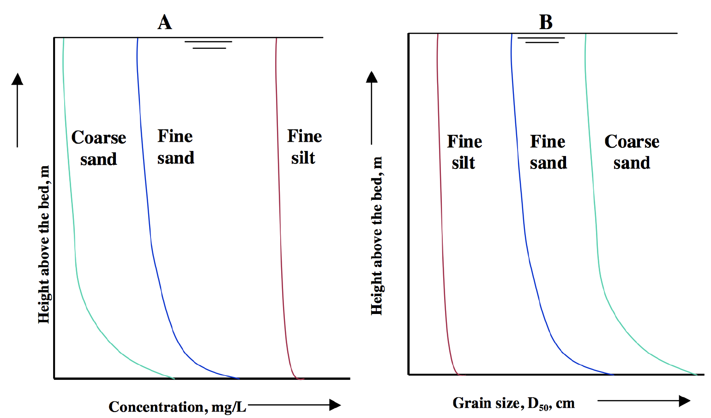
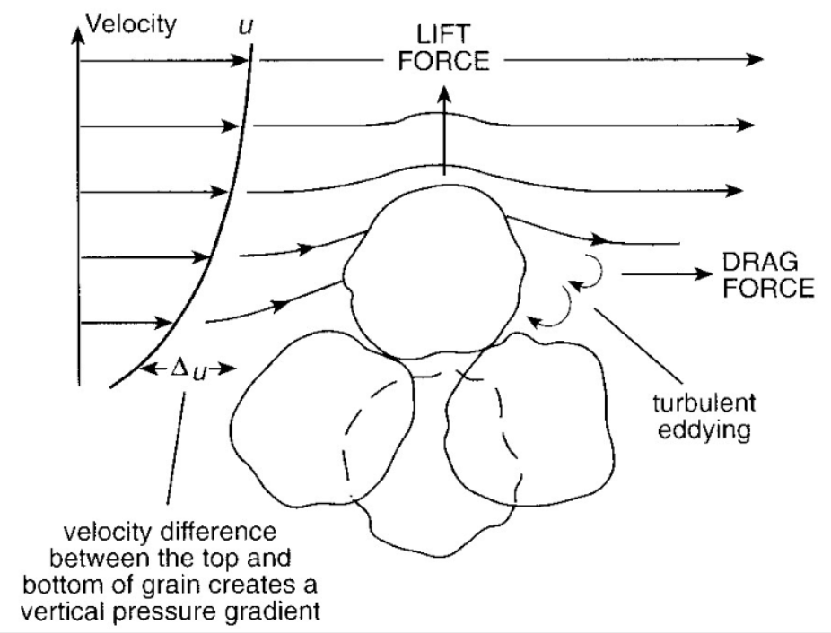

Modes of sediment transport
==========================================

.. figure:: images/Hjulstromdiagram.png
   :scale: 65 %
   :alt: Hjulstrom diagram of sediment transport by running water
   :align: center

   Hjulstrom diagram of sediment transport by running water

Some definitions
*******************

Sediment transport is critical to understanding how rivers work because
it is the set of processes that mediates between the flowing water
and the channel boundary. Erosion involves the removal and transport
of sediment (mainly from the boundary) and deposition involves the
transport and placement of sediment on the boundary. Erosion and
deposition are what form the channel of any alluvial river as well as the
floodplain through which it moves.

The amount and size of sediment moving through a river channel are
determined by three fundamental controls: competence, capacity and
sediment supply.

Competence
^^^^^^^^^^^^^^^^^^^^^^^^^^

**Competence** refers to the largest size (diameter) of sediment particle or grain that the flow is capable of moving; it is a hydraulic limitation. If a river is sluggish and moving very slowly it simply may not have the power to mobilise and transport sediment of a given size even though such sediment is available to transport. So a river may be competent or incompetent with respect to a given grain size. If it is incompetent it will not transport sediment of the given size. If it is competent it may transport sediment of that size if such sediment is available (that is, the river is not supply-limited).

Capacity
^^^^^^^^^^^^^^^^^^^^^^^^^^

**Capacity** refers to the maximum amount of sediment of a given size that a stream can transport in traction as bedload. Given a supply of sediment, capacity depends on channel gradient, discharge and the calibre of the load (the presence of fines may increase fluid density and increase capacity; the presence of large particles may obstruct the flow and reduce capacity). Capacity transport is the competence-limited sediment transport (mass per unit time) predicted by all sediment transport equations, examples of which we will examine below. Capacity transport only occurs when sediment supply is abundant (non-limiting).

Sediment supply
^^^^^^^^^^^^^^^^^^^^^^^^^^

**Sediment supply** refers to the amount and size of sediment available for sediment transport. Capacity transport for a given grain size is only achieved if the supply of that calibre of sediment is not limiting (that is, the maximum amount of sediment a stream is capable of transporting is actually available). Because of these two different potential constraints (hydraulics and sediment supply) distinction is often made between supply-limited and capacity-limited transport. Most rivers probably function in a sediment-supply limited condition although we often assume that this is not the case.

Much of the material supplied to a stream is so fine (silt and clay) that, provided it can be carried in suspension, almost any flow will transport it. Although there must be an upper limit to the capacity of the stream to transport such fines, it is probably never reached in natural channels
and the amount moved is limited by supply. In contrast, transport of coarser material (say, coarser than fine sand) is largely capacity limited.

Sediment transport
*******************

The sediment load of a river is transported in various ways although these distinctions are to some extent arbitrary and not always very practical in the sense that not all of the components can be separated in practice:

1. Dissolved load
2. Suspended load
3. Intermittent suspension (saltation) load
4. Wash load
5. Bed load

.. figure:: images/transport.jpg
   :scale: 70 %
   :alt: Sediment transport
   :align: center

   Sediment transport stages regarding the hydrologic, hydraulic, and geomorphological conditions: adopted from Marshak 2005.

Dissolved load
^^^^^^^^^^^^^^^^^^^^^^^^^^

**Dissolved load** is material that has gone into solution and is part of the fluid moving through the channel. Since it is dissolved, it does not depend on forces in the flow to keep it in the water column.

In sediment-transport theory an important distinction is made between dissolved material and clastic material. Clastic material is all the particulate matter (undissolved material) carried by a river regardless of the grain size. The clastic load of a river is moved by several mechanisms that are the basis for recognizing the two principal sediment transport modes: *suspended-sediment load* and *bed-material load*.

Suspended-sediment load
^^^^^^^^^^^^^^^^^^^^^^^^^^

**Suspended-sediment load** is the clastic (particulate) material that moves through the channel in the water column. These materials, mainly silt and sand, are kept in suspension by the upward flux of turbulence generated at the bed of the channel. The upward currents must equal or exceed the particle fall-velocity for suspended-sediment load to be sustained.

The size and concentration of suspended-sediment typically varies logarithmically with height above the bed. That is, concentration and grain size form linear plots with the logarithm of height above the bed. Coarse sand is highly concentrated near the bed and declines with height at a faster rate than does fine sand. Fine silt is so easily suspended that it is far more uniformly distributed in a vertical section than is the coarser material. Similarly, the grain-size distribution within a sample of sand displays far more vertical variation than does the vertical distribution of grain size within the silt range. The former is too large for the flow to move much of it into the upper water column and the latter is so small and easily suspended that it is well represented at all levels thus giving rise to a more uniform grain-size profile.

   Typical vertical profiles of suspended-sediment concentration (A) & grain size in open-channel flows (B)

Wash load
^^^^^^^^^^^^^^^^^^^^^^^^^^

Although **wash load** is part of the suspended-sediment load it is useful here to make a distinction. Unlike most suspended-sediment load, wash load does not rely on the force of mechanical turbulence generated by flowing water to keep it in suspension. It is so fine (in the clay range) that it is kept in suspension by thermal molecular agitation (sometimes known as Brownian motion, named for the early 19th century botanist who described the random motion of microscopic pollen spores and dust). Because these clays are always in suspension, wash load is that component of the particulate or clastic load that is “washed” through the river system. Unlike coarser suspended sediment, wash load tends to be uniformly distributed throughout the water column. That is, unlike the coarser load, it does not vary with height above the bed.

Distinction is made between fully-suspended load and bed load by classifying the intermediate and transient transport state as saltation load transport. These are particles that bounce along the channel, partly supported by the turbulence in the flow and partly by the bed. They follow a distinctively asymmetric trajectory. Saltation load may be measured as suspended load (when in the water column) or as bedload (when on the bed). Although the distinction between saltation load and other types of sediment load may be important to those studying the physics of grain movement, most geomorphologists are content to ignore it as a special case.
ore uniform grain-size profile.

Bed load
^^^^^^^^^^^^^^^^^^^^^^^^^^

**Bed load** is the clastic (particulate) material that moves through the channel fully supported by the channel bed itself. These materials, mainly sand and gravel, are kept in motion (rolling and sliding) by the shear stress acting at the boundary. Unlike the suspended load, the bed-load component is almost always capacity limited (that is, a function of hydraulics rather than supply). A distinction is often made between the bed-material load and the bed load.

**Bed-material load** is that part of the sediment load found in appreciable quantities in the bed (generally > 0.062 mm in diameter) and is collected in a bed-load sampler. That is, the bed material is the source of this load component and it includes particles that slide and roll along the bed (in bed-load transport) but also those near the bed transported in saltation or suspension. Bed load, strictly defined, is just that component of the moving sediment that is supported by the bed (and not by the flow).

Theory of sediment entrainment
*******************************

   Lift & drag forces acting on a submerged particle.

At a very simple deterministic level of analysis, a particle of sediment will begin to move when the force of the flowing water applied to it equals its submerged weight. This simple analysis leads to:

.. math::

   \tau_{cr} = K g (\rho_s - \rho) D

where :math:`K = \eta /\tan(\phi)` and :math:`\eta = n D^2` (a packing coefficient) and :math:`\phi` is the internal angle of friction of the sediment.

Although this simple analytical approach (called the White analysis, after its originator) is useful because it highlights the general structural relationships (balance of forces) involved in this problem, it is not of much practical use because it greatly oversimplifies the actual complex forces involved. That is, there is more to this problem of specifying the entrainment conditions than merely balancing mean boundary shear stress and the submerged weight of the particle. Mean boundary shear stress is just one of several impelling forces and the particle submerged weight is just one of several inertial forces. Unfortunately, the other forces are very difficult to characterise in a precise quantitative.

The most widely used semi-empirical approach to defining the threshold of sediment motion was proposed in the early 1900’s by the German physicist Albert F. Shields. Shields (1936) plotted the dimensionless shear stress (:math:`\theta = \tau_{cr} / (g(\rho_s - \rho)D)`) against the particle Reynolds number (:math:`Re_p = D / \delta_0`) where :math:`\delta_0` is the thickness of the laminar sublayer.

The dimensionless shear stress in the Shields diagram is commonly termed the Shields stress or the Shields parameter. Several aspects of the Shields diagram are particularly noteworthy:

.. figure:: images/shield.png
   :scale: 65 %
   :alt: Shields Diagram from Van Rijn (1984).
   :align: center

   Shields Diagram from Van Rijn (1984).

1. The lowest Shields stress occurs in the sand range (0.06-2.00 mm). Sand is small enough to have small mass but too large for adhesion forces to come into play.
2. Silt/clay, in spite of the smaller size, requires a higher shear stress for motion than sand. Here adhesion forces become overwhelmingly large and bind the sediment together into a mass that is very resistant to erosion.
3. The Shields parameter for gravel is constant at 0.06, implying that Shields stress here becomes a simple function of grain size. This is a quite remarkable finding and allows us, as we will see below, to derive a simple relationship between the size of gravel and the shear stress required to move it.
4. The Shields parameter applies well to natural gravel-bed rivers.
