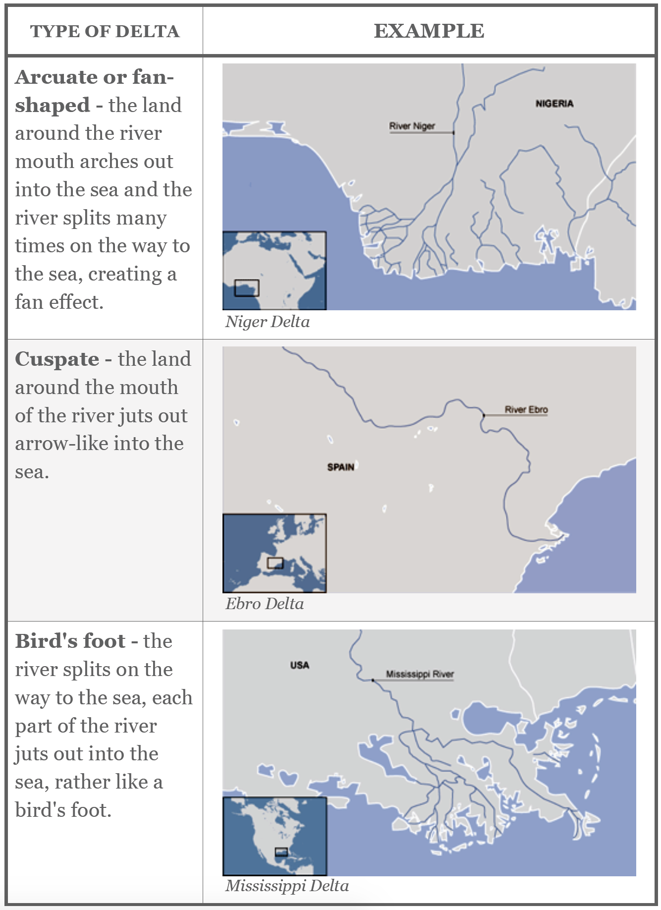

Quantitative geomorphology
==========================================

Preamble
----------------------

Tectonic geomorphology is the study of the interplay between tectonic and surface processes that shape the landscape in regions of active deformation and at time scales ranging from up to millions of years.

.. figure:: images/dietrichperron.jpg
    :scale: 100 %
    :alt: Unidirectional moisture flux and mountain-belt evolution
    :align: center

    Unidirectional moisture flux and mountain-belt evolution (from Dietrich & Perron 2006)

In this course, we will analyse different landforms, the modes of sediment transport, the main equations that are used to simulate geomorphological changes and some of the numerical techniques that exist to model landscape evolution.

During the practicals, we will make a quantitative assessment of the impact of tectonic forces on landscape and drainage evolution. We will also look at how climate, and in particular how the spatial pattern of precipitation, is affecting the topographic and tectonic evolution of mountain belts through erosion.

.. important::
  The goals for this course are:

  1. to better understand interactions between climate, tectonics and the Earth surface;
  2. get an overview of fluvial and hillslope processes and their importance;
  3. learn basic geomorphic transport laws to predict past and future landscape behaviour from present observations;
  4. use numerical modelling for quantitative analysis of landscape dynamics.

Tectonic processes govern the dynamic nature of Earth’s crust and shape the global distribution of continents, ocean basins, and landforms. Setting the template on which climate and erosion interact, tectonics elevates rocks above sea level where weathering prepares the ground for wind, rain, and rivers to erode and sculpt landscapes.

It is no coincidence that many of our planet’s major surface features coincide with the boundaries of tectonic plates, where uplift, deformation, and erosion are focused. The imprint of tectonics on geomorphology is apparent not only in the size, extent, and location of mountain ranges, but in the localised steepness of river profiles, the character of mountain slopes, and in the form of river networks that flow along regional joint patterns or are offset across faults.

River landforms
------------------

Most rivers are considered as reaches with different geomorphological
characteristics. The most simple division generally made is to divide
the river into **upper**, **middle** and **lower** river reaches.

Upper river
************

The uppermost portion of a river system includes the river headwaters and low-order streams at higher elevation. The upper river basin is usually characterised by steep gradients and by erosion that carries sediment downstream. Streams in this upper region are usually steep and torrential, and often include rapids and waterfalls. These streams generally have little floodplain, although part of the bank and surrounding land may be wetted during periods of high flow.

.. figure:: images/deathvalley.jpeg
   :scale: 35 %
   :alt: deathvalley
   :align: center

   Transition from upper to middle river. An imaginary of Death Valley with blue water raining and flowing over its bedrock and alluvial fans (based on Lidar elevation data from OpenTopography; byproduct of project from Clastics Lab)

Middle river
**************

In the middle course the river has more energy and a high volume of water. The gradient here is gentle and lateral erosion has widened the river channel. The river channel has also deepened. A larger river channel means there is less friction, so the water flows faster:

First video shows meandering rivers and their deposits from E. Steel (base image by Planetlabs, Queen's University). Second video shows a time-lapse animation of a short segment of the Mamore River (from Z. Sylvester, Clastic Lab, BEG).

.. raw:: html

    

    <iframe width="100%" height="380" src="https://www.youtube.com/embed/ZJAYDPoZzlM?rel=0" frameborder="0" allow="accelerometer; autoplay; encrypted-media; gyroscope; picture-in-picture" allowfullscreen></iframe>
    

.. raw:: html

    

    <iframe width="100%" height="380" src="https://www.youtube.com/embed/5UG1_GGWD6c?rel=0" frameborder="0" allow="accelerometer; autoplay; encrypted-media; gyroscope; picture-in-picture" allowfullscreen></iframe>
    

* As the river erodes laterally, to the right side then the left side, it forms large bends, and then horseshoe-like loops called meanders.
* The formation of meanders is due to both deposition and erosion and meanders gradually migrate downstream.
* The force of the water erodes and undercuts the river bank on the outside of the bend where water flow has most energy due to decreased friction.
* On the inside of the bend, where the river flow is slower, material is deposited, as there is more friction.
* Over time the horseshoe become tighter, until the ends become very close together. As the river breaks through, *e.g.* during a flood when the river has a higher discharge and more energy, and the ends join, the loop is cut-off from the main channel. The cut-off loop is called an oxbow lake.

Lower river
*************

The river channel is now deep and wide and the landscape around it is flat. However, as a river reaches the end of its journey, energy levels are low and deposition takes place.

Floodplains
^^^^^^^^^^^

The river now has a wide floodplain. A floodplain is the area around a
river that is covered in times of flood. A floodplain is a very fertile area due to the rich alluvium deposited by floodwaters. This makes floodplains a good place for agriculture. A build up of alluvium on the banks of a river can create levees, which raise the river bank.

Deltas
^^^^^^^^^^^

Deltas are found at the mouth of large rivers - for example, the Mississippi. A delta is formed when the river deposits its material faster than the sea can remove it.

Geomorphological units & hillslope processes
---------------------------------------------

.. raw:: html

    

    <iframe width="100%" height="380" src="https://www.youtube.com/embed/v-b1nM0RbOs?rel=0" frameborder="0" allow="accelerometer; autoplay; encrypted-media; gyroscope; picture-in-picture" allowfullscreen></iframe>
    

The fluvial dissection of the landscape consists of valleys and their included channel ways organized into a system of connection known as a drainage network. Drainage networks display many types of quantitative regularity that are useful in analyzing both the fluvial systems and the terrains that they dissect (Howard, 1967). Drainage basins are the principal hydrologic unit considered in fluvial geomorphology. A drainage basin is the source for water and sediment that moves from higher elevation through the river system to lower elevations as they reshape the channel forms.
In the first part of the lecture we will look at the different components of a drainage basin. Then we will describe the dominant types of processes present on hillslopes where both gravity and running water are active. We will discuss the physical principles underlying mass movements and slope stability.

Fundamentals of landscape evolution modelling
---------------------------------------------

.. figure:: images/lowrelief.png
    :scale: 80 %
    :alt: Preferential erosion
    :align: center

    Preferential erosion and low relief preservation.

In this module we will focus on the main equations developed in landscape evolution models (LEMs). These models are quantitative tools used to simulate Earth surface processes and the evolution of the land surface. LEMs can be used to deduce whether hypotheses about landscape evolution are likely to be valid, by making quantitative predictions about their development.

Recent development of modules has extended process representation to include, for example, modules of dynamic vegetation growth, floodplain evolution, dynamic adjustment of channel width, representation of sediment grain size, and debris flows.

The Modelling Geomorphic Systems: Landscape Evolution chapter from D. A. Valters 2016 presents an overview of the current approaches used in landscape evolution modelling.

Drainage reorganisation at various scales
---------------------------------------------

Continental-scale drainages host the world’s largest rivers and offshore sediment accumulations, many of which contain significant petroleum reserves. Rate of sediment supply in these settings may be a signal of external controls (e.g., tectonics, climate) on landscape evolution, yet deciphering between these controls remains a major challenge in interpreting the ancient stratigraphic record.
In this module we will explore drainage reorganisation at catchment, regional and continental scales, we will discuss the role of tectonics and climates on catchment dynamics, drainage networks responses and subsequent landscape evolution.

Labs
-----

LAB 1: Role of climate change in drainage network reorganisation
******************************************************************

This lab is an upscaled version of an experimental model from Bonnet & Crave 2003. simulate mountain range formation by upscaling the analogue experiment presented in previous section. The example illustrates long-term landscape evolution of an active mountain range. It shows how the constant valley spacing, achieved at steady state on both sides of the range, is progressively shifted due to a precipitation gradient applied across the mountain belt.

You will apply different climatic conditions and perform morphometrics and hydrometrics analysis using Badlands to quantitatively evaluate the catchment dynamics.

LAB 2: Role of climate change in drainage network reorganisation
******************************************************************

Using Badlands, you will simulate the main processes responsible for the formation of the Grand Canyon. You will be able to modify the erosive power of the water flow, the hillslope coefficients and the climate/tectonic forces to see how different the Grand Canyon might have looked as it developed through different types of bedrock.

You will analyse the development and propagation of knickpoints within the main valleys for different initial conditions of fault activity.

LAB 3: Role of flexural isostasy in foreland basin formation
******************************************************************

Flexure of the lithosphere is a frequently observed process by which loads bend the elastic outer shell of Earth. Using Badlands, you will simulate how variation in elastic thicknesses of the underlying plate is controlling basin formation and test the feedback mechanisms between surface processes, sedimentation and flexure with a set of simple models.

It will give you some insights on large-scale geometry of the sedimentary infill as related to orogen tectonics evolution of foreland basins.
