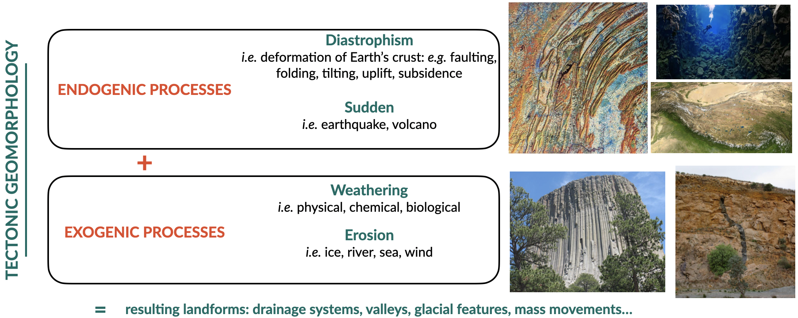
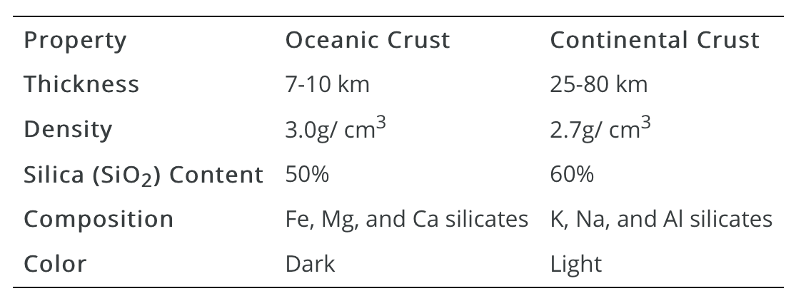
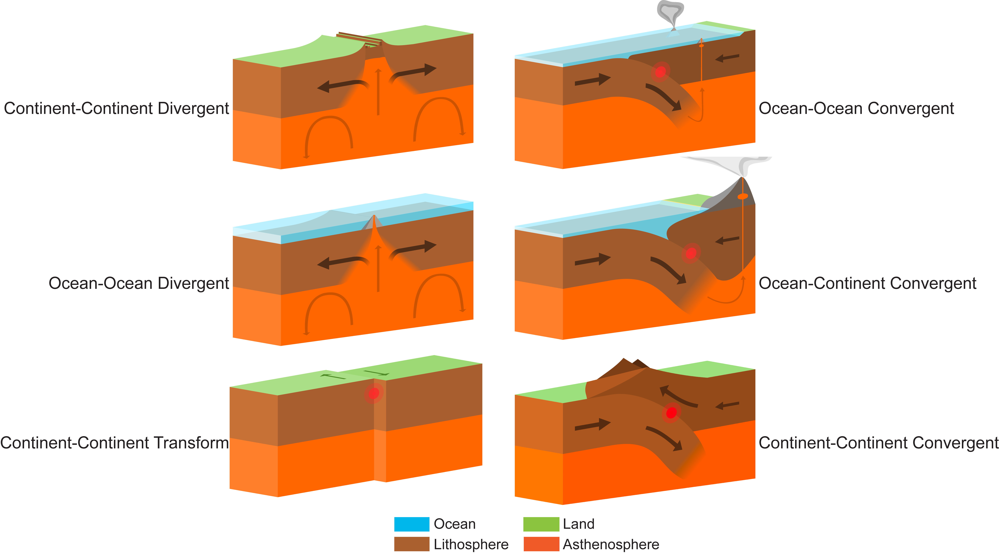
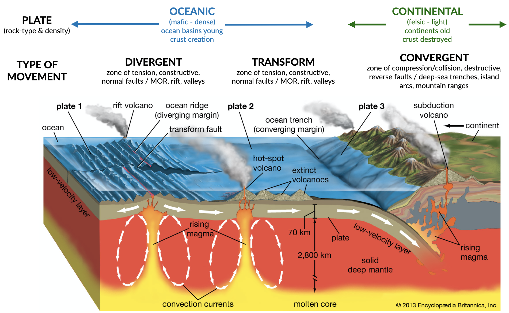

Tectonics, passive margins & dynamic topography
=================================================

Preamble
----------------------

..  admonition:: Chapter structure
    :class: toggle

    - Plate tectonics - refresher
    - Tectonic landforms
    - Margin types
    - Continental rifting / Passive margin evolution
    - Dynamic topography theory
    - Eastern Highlands evolution Australia

Geomorphological processes are natural mechanisms of weathering, erosion, and deposition that result in the modification of the surficial materials and landforms at the Earth’s surface. The landforms that are found on the surface of the Earth are tectonic landforms, *e.g.*  landforms that are created by massive Earth movements due to plate tectonics and mantle convection. This includes landforms with some of the following geomorphic features: fold mountains, rift valleys, volcanoes, and weathering landforms created by the physical or chemical decomposition of rock through weathering.

   Tectonics strongly influence the genesis of geomorphic landscapes. Tectonic (**endogenic**) processes provide the input for landform creation, denudational (**exogenic**) processes create the output.

..  admonition:: Learning outcomes
    :class: toggle

    - Recognise the broad tectonic controls on landform and landscape dynamics
    - Understand the creation of passive margins
    - Explore the tectonic setting and the influence of dynamic topography on Australia's landscape

Plate tectonics refresher
---------------------------

Plate tectonics is the fundamental mechanism that drives geological processes in the geosphere. Plate tectonic theory is based on an understanding of the Earth's internal structure, the different types of tectonic plates and plate boundaries, and the driving forces of plate movements. The occurrence of earthquakes and volcanoes, the distribution of different rock types, and the **Rock Cycle**, as well as the processes of mountain building, continental rifting and seafloor spreading, can be concisely explained by plate tectonic processes.

Tectonic plates are composed of Earth’s crust and the uppermost, rigid portion of the mantle. Together they are called the lithosphere. Earth’s crust comes in 2 *flavours*: **oceanic** and **continental**.

Lithospheric plates move around the globe in different directions and come in many different shapes and sizes. Their rate of movement is **millimeters to a few centimeters per year**, similar to the rate that your fingernails grow. Motion between tectonic plates can be **divergent**, **convergent**, or **transform**.

.. important::
  In divergent boundaries plates are moving away from each other, in convergent boundaries plates are moving toward each other, and in transform boundaries plates are sliding past each other. The type of crust on each plate determines the geologic behaviour of the boundary (see figure below).

   These models show 6 main types of plate tectonic boundaries. Blue indicates ocean, green indicates land, brown indicates the lithosphere, and orange is the asthenosphere. The bold arrows on the plates indicate their relative motion. Also shown are gray volcanoes. Ocean-ocean transform boundaries (not shown) exist on a small scale associated with spreading at mid-ocean ridges, and continent-ocean transform and divergent boundaries are rare (former) or don’t exist (latter). Image credit: Adapted from Wikimedia Commons user Domdomegg, CC BY.

From continental drift to plate tectonics
************************************************

The foundations of plate tectonics began with a German scientist named **Alfred Wegener**, who proposed the idea of **continental drift** in 1915. Think about it, 1915, what kind of evidence could someone possibly have to propose such a big idea? It turns out that Wegener had 4 pieces of evidence that he claimed supported his idea: 1) The continents looked like they fit together like pieces of a puzzle; 2) There were matching fossils on continents that were separated by oceans; 3) There were matching mountain ranges on continents that were separated by oceans; 4) There was paleoclimate evidence that suggested some continents were closer to the polar regions and some were close to the equator. Wegener took his idea one step further and proposed that all of the continents were together in one giant supercontinent 200 million years ago called Pangea. Like many great ideas in science, Wegener’s idea of continental drift was not accepted by his peers, in part because he did not have a well-developed hypothesis to explain what was causing the continents to drift. It wasn’t until the 1960’s that his idea was expanded upon by scientists like Harry Hess.

.. raw:: html

   

   <iframe width="100%" height="350" src="https://www.youtube.com/embed/OroYviR7Qz8?rel=0" frameborder="0" allow="accelerometer; autoplay; encrypted-media; gyroscope; picture-in-picture" allowfullscreen></iframe>
   

Plate tectonics, earthquakes, and volcanoes
************************************************

Plate tectonic boundaries are often associated with earthquakes and volcanic activity, and by looking at maps for the distribution of earthquakes and volcanoes around the world, you can interpret the boundaries between the major tectonic plates.

Generally, **divergent plate boundaries** are characterised by shallow earthquakes and some volcanism. **Convergent boundaries** have a range of earthquake depths from shallow to deep, and many have volcanoes as a result of subduction. Subduction occurs in convergent boundaries where the denser, oceanic plate descends into the mantle beneath the overriding plate. Convergent boundaries also tend to produce linear and curved mountain belts. **Transform boundaries** typically have shallow earthquakes and no volcanoes.

Associated landforms to different plate movements
**************************************************

Geologists can observe most of the processes occurring at plate tectonic boundaries today (earthquakes, volcanoes, mountain building, etc.) Understanding the plate tectonic activity of the geologic past, however, is more difficult because the events have already happened.

Hence, geologists use processes that occur in the present to interpret processes that occurred in the past. This is known as **uniformitarianism**. One way geologists can interpret ancient plate tectonic activity is to look at the topography of an area (via satellite imagery, topographic maps, shaded relief maps, and digital elevation models).

..  admonition:: Convergent boundary and topography
    :class: toggle

    .. figure:: images/convergent.png
        :width: 70 %
        :alt: Convergent
        :align: center

        Convergent boundaries are associated with zones of compression/collision, (destructive settings) exhibiting reverse faults and deep-sea trenches, as well as island arcs, mountain ranges.

    Generally speaking, plate tectonic activity tends to produce elevation changes at or near the plate boundary, especially in convergent settings.
    The collision of two plates leads to **suturing**; the two plates become one when the collision ends. Evidence of these ancient boundaries is most commonly in the form of **linear mountain belts that are not currently near a plate tectonic boundary**. For example, an eroded, linear mountain belt in the middle of a continent would indicate that area was part of a convergent boundary deep in the geologic past, and likely a continent-continent collision.

    .. figure:: images/Uraltopomap-1.jpg
       :width: 70 %
       :alt: Ural mountains
       :align: center

       The Ural Mountains in Russia were created during a continent-continent collision in convergent mode. They formed during an orogeny 240 to 300 million years ago and now serve as the boundary between Europe and Asia.

Distinction between active & passive margins
---------------------------------------------------------

Continental rifting and break-up
---------------------------------------------------------

Mantle-driven tectonic / dynamic topography
---------------------------------------------------------

150 Ma of continental scale evolution of Australian landscape
---------------------------------------------------------------------
