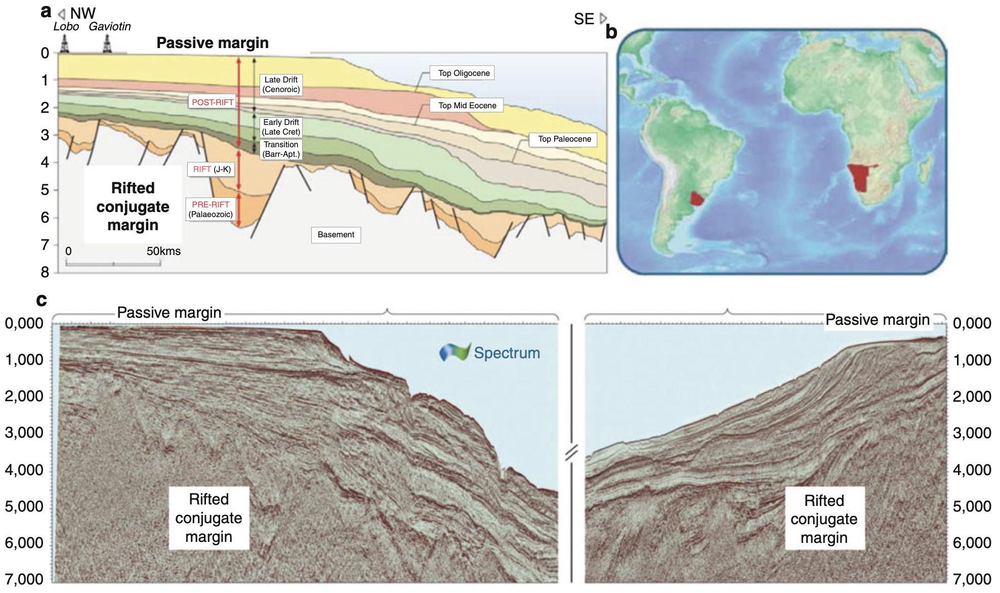
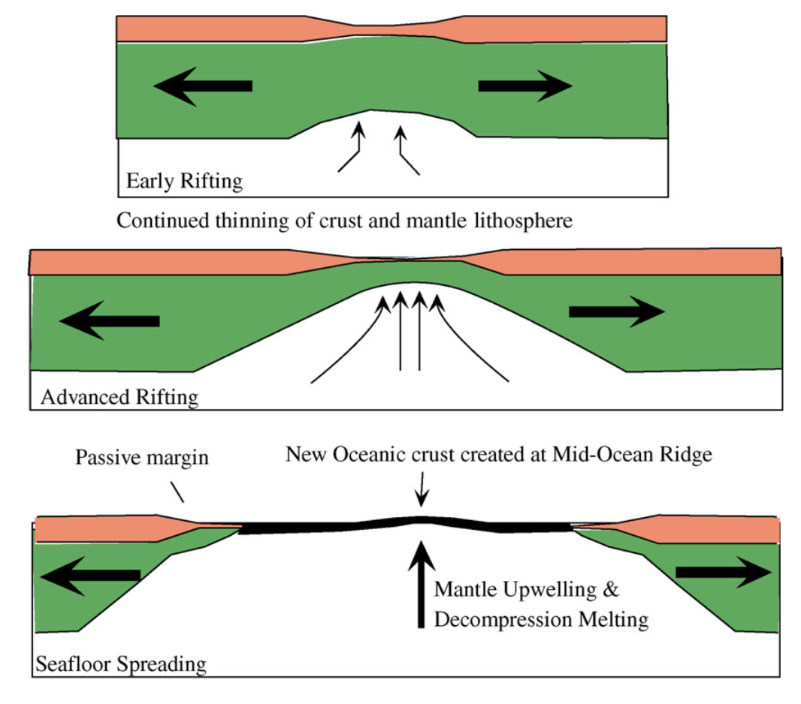
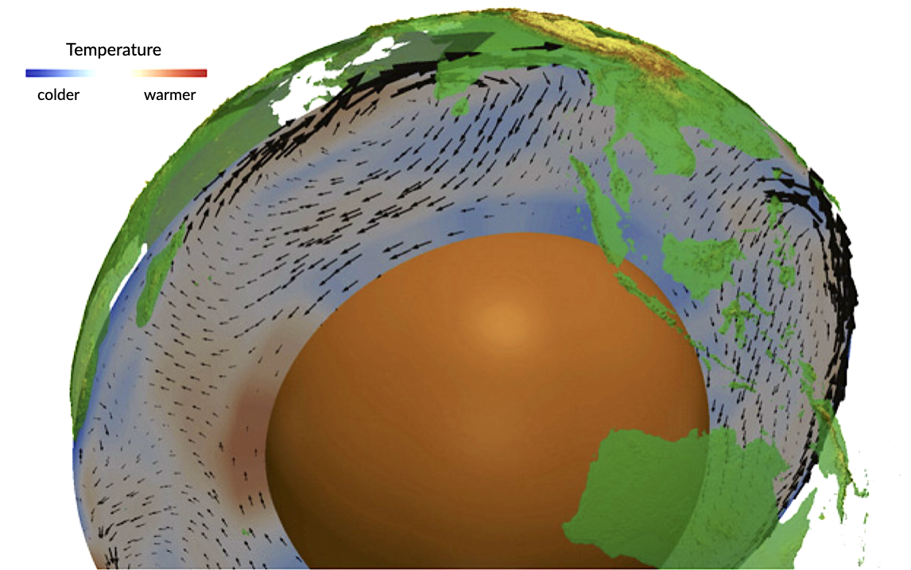
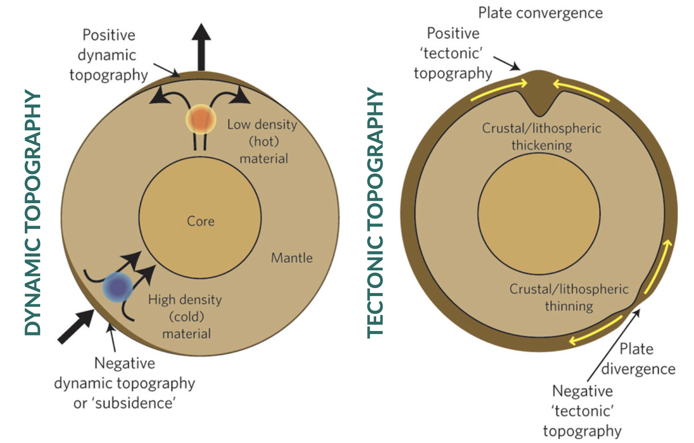
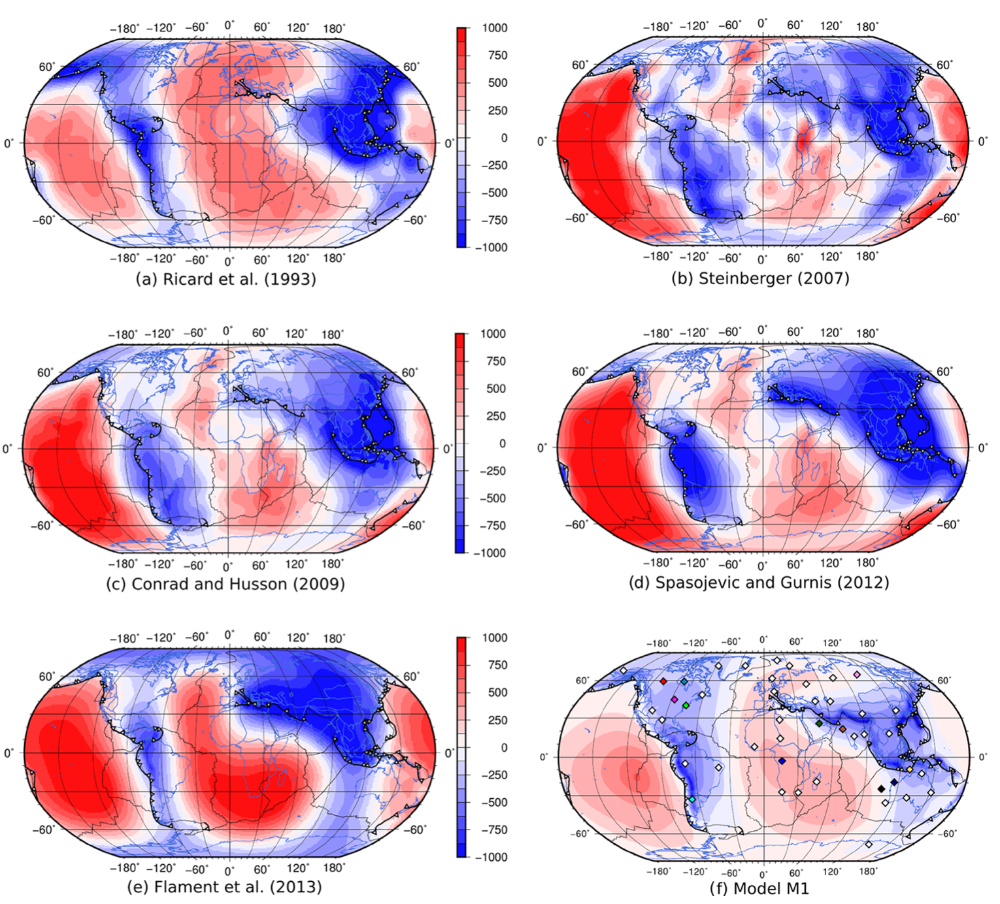
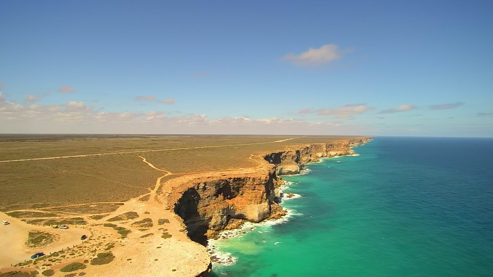

Tectonics, passive margins & dynamic topography
=================================================

..  admonition:: Chapter structure
    :class: toggle

    - Plate tectonics - refresher
    - Tectonic landforms
    - Margin types
    - Continental rifting / Passive margin evolution
    - Dynamic topography theory
    - Eastern Highlands evolution Australia

Geomorphological processes are natural mechanisms of weathering, erosion, and deposition that result in the modification of the surficial materials and landforms at the Earth’s surface. The landforms that are found on the surface of the Earth are tectonic landforms, *e.g.*  landforms that are created by massive Earth movements due to plate tectonics and mantle convection. This includes landforms with some of the following geomorphic features: fold mountains, rift valleys, volcanoes, and weathering landforms created by the physical or chemical decomposition of rock through weathering.

   Tectonics strongly influence the genesis of geomorphic landscapes. Tectonic (**endogenic**) processes provide the input for landform creation, denudational (**exogenic**) processes create the output.

..  admonition:: Learning outcomes
    :class: toggle

    - Recognise the broad tectonic controls on landform and landscape dynamics
    - Understand the creation of passive margins
    - Explore the tectonic setting and the influence of dynamic topography on Australia's landscape

Plate tectonics refresher
---------------------------

Plate tectonics is the fundamental mechanism that drives geological processes in the geosphere. Plate tectonic theory is based on an understanding of the Earth's internal structure, the different types of tectonic plates and plate boundaries, and the driving forces of plate movements. The occurrence of earthquakes and volcanoes, the distribution of different rock types, and the **Rock Cycle**, as well as the processes of mountain building, continental rifting and seafloor spreading, can be concisely explained by plate tectonic processes.

Tectonic plates are composed of Earth’s crust and the uppermost, rigid portion of the mantle. Together they are called the lithosphere. Earth’s crust comes in 2 *flavours*: **oceanic** and **continental**.

.. figure:: images/crust.png
   :scale: 35 %
   :alt: Comparison of oceanic and continental crust
   :align: center

Lithospheric plates move around the globe in different directions and come in many different shapes and sizes. Their rate of movement is **millimeters to a few centimeters per year**, similar to the rate that your fingernails grow. Motion between tectonic plates can be **divergent**, **convergent**, or **transform**.

.. important::
  In divergent boundaries plates are moving away from each other, in convergent boundaries plates are moving toward each other, and in transform boundaries plates are sliding past each other. The type of crust on each plate determines the geologic behaviour of the boundary (see figure below).

.. figure:: images/plate-boundaries-summary.png
   :scale: 10 %
   :alt: Plate boundaries summary
   :align: center

   These models show 6 main types of plate tectonic boundaries. Blue indicates ocean, green indicates land, brown indicates the lithosphere, and orange is the asthenosphere. The bold arrows on the plates indicate their relative motion. Also shown are gray volcanoes. Ocean-ocean transform boundaries (not shown) exist on a small scale associated with spreading at mid-ocean ridges, and continent-ocean transform and divergent boundaries are rare (former) or don’t exist (latter). Image credit: Adapted from Wikimedia Commons user Domdomegg, CC BY.

From continental drift to plate tectonics
************************************************

The foundations of plate tectonics began with a German scientist named **Alfred Wegener**, who proposed the idea of **continental drift** in 1915. Think about it, 1915, what kind of evidence could someone possibly have to propose such a big idea? It turns out that Wegener had 4 pieces of evidence that he claimed supported his idea: 1) The continents looked like they fit together like pieces of a puzzle; 2) There were matching fossils on continents that were separated by oceans; 3) There were matching mountain ranges on continents that were separated by oceans; 4) There was paleoclimate evidence that suggested some continents were closer to the polar regions and some were close to the equator. Wegener took his idea one step further and proposed that all of the continents were together in one giant supercontinent 200 million years ago called Pangea. Like many great ideas in science, Wegener’s idea of continental drift was not accepted by his peers, in part because he did not have a well-developed hypothesis to explain what was causing the continents to drift. It wasn’t until the 1960’s that his idea was expanded upon by scientists like Harry Hess.

.. raw:: html

   

   <iframe width="100%" height="350" src="https://www.youtube.com/embed/OroYviR7Qz8?rel=0" frameborder="0" allow="accelerometer; autoplay; encrypted-media; gyroscope; picture-in-picture" allowfullscreen></iframe>
   

Plate tectonics, earthquakes, and volcanoes
************************************************

Plate tectonic boundaries are often associated with earthquakes and volcanic activity, and by looking at maps for the distribution of earthquakes and volcanoes around the world, you can interpret the boundaries between the major tectonic plates.

Generally, **divergent plate boundaries** are characterised by shallow earthquakes and some volcanism. **Convergent boundaries** have a range of earthquake depths from shallow to deep, and many have volcanoes as a result of subduction. Subduction occurs in convergent boundaries where the denser, oceanic plate descends into the mantle beneath the overriding plate. Convergent boundaries also tend to produce linear and curved mountain belts. **Transform boundaries** typically have shallow earthquakes and no volcanoes.

.. figure:: images/plates.png
  :width: 100 %
  :alt: Different plates
  :align: center

Plate movements
-----------------

Associated landforms to different plate movements
*******************************************************

Geologists can observe most of the processes occurring at plate tectonic boundaries today (earthquakes, volcanoes, mountain building, etc.) Understanding the plate tectonic activity of the geologic past, however, is more difficult because the events have already happened.

Hence, geologists use processes that occur in the present to interpret processes that occurred in the past. This is known as **uniformitarianism**. One way geologists can interpret ancient plate tectonic activity is to look at the topography of an area (via satellite imagery, topographic maps, shaded relief maps, and digital elevation models).

.. figure:: images/platemvt.png
    :width: 100 %
    :alt: Plate types
    :align: center

When most people think about tectonic plate boundaries, they often visualise parallel, symmetric lines separating the plates. This is not always the case in the real world as many plate boundaries are curved or segmented. There are other factors that affect the shape of a boundary. Evidence of these plate boundaries are contained in the topography of continents.

..  admonition:: Divergent boundary and topography
    :class: toggle

    .. figure:: images/divergent.png
        :width: 100 %
        :alt: Divergent
        :align: center

        Divergent boundaries are associated with zones of tension, they are constructive and contains normal faults as well as mid-ocean ridges, rift and valleys.

    Divergent boundaries are places where plates pull apart from each other. This occurs above rising convection currents. The rising current pushes up on the bottom of the lithosphere, lifting it and flowing laterally beneath it. This lateral flow causes the plate material above to be dragged along in the direction of flow. At the crest of the uplift, the overlying plate is stretched thin, breaks and pulls apart.

    When a divergent boundary occurs beneath oceanic lithosphere, the rising convection current below lifts the lithosphere, producing a mid-ocean ridge. Effects that are found at a divergent boundary between oceanic plates include: a submarine mountain range such as the Mid-Atlantic Ridge; volcanic activity in the form of fissure eruptions; shallow earthquake activity; creation of new seafloor and a widening ocean basin.

    When a divergent boundary occurs beneath a thick continental plate, the pull-apart is not vigorous enough to create a clean, single break through the thick plate material. Here the thick continental plate is arched upwards from the convection current's lift, pulled thin by extensional forces, and fractured into a rift-shaped structure. Effects that are found at this type of plate boundary include: a rift valley sometimes occupied by long linear lakes or a shallow arm of the ocean; numerous normal faults bounding a central rift valley; shallow earthquake activity along the normal faults. Volcanic activity sometimes occurs within the rift.

..  admonition:: Convergent boundary and topography
    :class: toggle

    .. figure:: images/convergent.png
        :width: 100 %
        :alt: Convergent
        :align: center

        Convergent boundaries are associated with zones of compression/collision, (destructive settings) exhibiting reverse faults and deep-sea trenches, as well as island arcs, mountain ranges.

    Generally speaking, plate tectonic activity tends to produce elevation changes at or near the plate boundary, especially in convergent settings.
    The collision of two plates leads to **suturing**; the two plates become one when the collision ends. Evidence of these ancient boundaries is most commonly in the form of **linear mountain belts that are not currently near a plate tectonic boundary**. For example, an eroded, linear mountain belt in the middle of a continent would indicate that area was part of a convergent boundary deep in the geologic past, and likely a continent-continent collision.

    .. figure:: images/Uraltopomap-1.jpg
       :width: 70 %
       :alt: Ural mountains
       :align: center

       The Ural Mountains in Russia were created during a continent-continent collision in convergent mode. They formed during an orogeny 240 to 300 million years ago and now serve as the boundary between Europe and Asia.

..  admonition:: Transform boundary and topography
    :class: toggle

    Transform Plate Boundaries are locations where two plates slide past one another. The fracture zone that forms a transform plate boundary is known as a transform fault. Most transform faults are found in the ocean basin and connect offsets in the mid-ocean ridges. A smaller number connect mid-ocean ridges and subduction zones.

    A smaller number of transform faults cut continental lithosphere. The most famous example of this is the San Andreas Fault Zone of western North America. The San Andreas connects a divergent boundary in the Gulf of California with the Cascadia subduction zone. Another example of a transform boundary on land is the Alpine Fault of New Zealand.

    .. figure:: images/NZ.jpg
      :width: 100 %
      :alt: NZ mountains
      :align: center

      The Southern Alps rise dramatically beside the Alpine Fault on New Zealand's West Coast. About 500 kilometres long; northwest at top.

Distinction between active & passive margins
*******************************************************

An **active continental margin** is found on the leading edge of the continent where it is crashing into an oceanic plate. An excellent example is the west coast of South America. Active margins are commonly the sites of tectonic activity: earthquakes, volcanoes, mountain building, and the formation of new igneous rock. Because of the mountainous terrain, most of the rivers are fairly short, and the continental shelf is narrow to non-existent, dropping off quickly into the depths of the subduction trench.

**Passive continental margins** are found along the remaining coastlines. Because there is no collision or subduction taking place, tectonic activity is minimal and the earth's weathering and erosional processes are winning. This leads to lots of low-relief (flat) land extending both directions from the beach, long river systems, and the accumulation of thick piles of sedimentary debris on the relatively wide continental shelves. Again South America provides a great example. The Amazon River, whose source is in the Andes Mountains (the active margin) drains east across the interior of South America to the coast, where it enters the Atlantic Ocean and deposits the tremendous volume of sedimentary materials it eroded from the continent. As such, passive margins are sedimentary wedges that overlie an inactive and subsiding weld between rifted continental crust and newly formed and younger oceanic crust.

    Conjugate passive margins overlying rifted continental margins of Uruguay in South America and Namibia in West Africa now widely separated by oceanic crust of the South Atlantic Ocean modified from GEO ExPro (2012). (a) Section showing underlying rifts overlain by passive margin of Uruguay. (b) Locations of conjugate margins in Uruguay and Namibia. (c) Seismic sections showing conjugate rift and passive margins

..  admonition:: Spreading ocean basins & passive margins
    :class: toggle

    .. figure:: images/seafloor.png
        :width: 95 %
        :alt: Seafloor
        :align: center

        Passive continental margins are adjacent to spreading ocean basins (*e.g.* Africa/SE America; W Europe/NE America; Antartica/S Australia;  India/W Australia; SE Australia/New Zealand). As shown here, the relative ages of sea floor rocks are oldest away from the ridge. This supports the idea that the sea floor is spreading away from the ridge.

    Passive margins are one of the main stages in the Wilson cycle of ocean opening and their ages, and ages of deformation are key indicators of the timing of ocean openings and closings through geologic time.

Continental rifting
*******************************************************

**Continental rifting** (or simply **rifting**) is the process by which continental lithosphere undergoes regional horizontal extension. A rift or rift system is a belt of continental lithosphere that is currently undergoing extension, or underwent extension in the past. During rifting, the lithosphere stretches with a component roughly perpendicular to the trend of the rift; in an oblique rift, the stretching direction is at an acute angle to the rift trend.

    Seafloor Spreading in which tectonic plates—large slabs of Earth's lithosphere—split apart from each other. Illustration by Joshua Doubek, Wikimedia. CC-BY-SA-3.0

Geologists distinguish between **active** and **inactive** rifts, based on the timing of the extension. **Active rifts**, like the East African Rift, are places on Earth where extension currently takes place. In active rifts, an array of recent normal faults cuts the crust, earthquakes rumble with unnerving frequency, and volcanic eruptions occasionally bury the countryside in ash and lava. The faulting taking place in active rifts yields a distinctive topography characterised by the occurrence of linear ridges separated by non marine or shallow-marine sedimentary basins.

In **inactive rifts**, places where extensional deformation ceased some time ago, we find inactive normal faults and thick sequences of conglomerates, evaporites, and volcanics. A preserved inactive rift can also be called an **unsuccessful rift**, in that its existence reflects the occurrence of a rifting event that stopped before it succeeded in splitting a continent in two.

A **successful rift** is one in which extensional deformation completely splits a continent into two pieces. When this happens a new mid-ocean ridge (oceanic spreading center) forms between the now separate continent fragments, and seafloor spreading produces new oceanic lithosphere. Typically, 20 to 60 million years pass between inception of a rift and the time (called the rift–drift transition) at which active rift faulting ceases and seafloor spreading begins. Once active faulting ceases in a successful rift, the relicts of the rift underlie the continental margins on either side of a new ocean basin. Since no tectonic activity happens along such continental margins after they have formed, we refer to them as **passive margins** as discussed above.

..  admonition:: Models of continental rifting
    :class: toggle

    .. figure:: images/shear.png
      :width: 100 %
      :alt: pure and simple shear
      :align: center

      Pure shear rift model (left side) and simple shear rift model (right side). The two models represent idealised and simplified models that permit to discuss the major predictions for the evolution and final structure of the South Atlantic hyper-extended rift system (from Unternehr et al., 2010).

    In the pure-shear model, the crustal and lithospheric extension during rifting is uniform and symmetrical. The rifting is perpendicular to the rift axis and stretches across the upper and lower crust. Faulting and deformation  occurs in upper brittle crust. In this model, there is a rapid subsidence associated with initial stretching. Subsequently, subsidence slows down as lithosphere extends away from the thermal anomaly.

    The simple-shear model suggests that lithospheric extension is governed by a major shallow dipping normal fault that cuts completely through the crust. The model is asymmetrical with non-uniform deformation of the crust and the creation of an upper plate/lower plate model of rifting. Faulting occurs in brittle crust of upper plate (domino effect). The lower plate side is more ductile with less deformation.

    `Link to A/Prof Patrice Rey <http://www.geosci.usyd.edu.au/users/prey/ACSGT/EReports/eR.2003/GroupB/Report1/models.html>`_ pure and simple shear model explanations.

Dynamic topography
---------------------------------------------------------

So far, we have seen that most surface topography can be explained by horizontal plate movement causing thickening and thinning (stretching) of the lithosphere. Because of the different densities and thicknesses of oceanic and  lithospheric crust, elevation should reflect the principle of **isostasy** (*e.g.* `isostatic equilibrium <https://study.com/academy/lesson/isostasy-definition-equation-examples.html>`_ of the crust or the lithosphere resting on a fluid  mantle).

However, many observations do not match up with the long-wavelength geoid. These observations suggest the presence of a **residual topography**. This residual topography
corresponds to the removal of the isostatic and post-glacial rebound contributions to  topography (*i.e.* due to tectonic crustal deformation, glacial isostatic adjustment, erosion, or sediment loading).

This missmatch with observations is induced by vertical forces arising from buoyancy-induced flow within the Earth's mantle and is named **dynamic topography**. While this process was first recognised decades ago, the full extent to which dynamic topography affects landscape evolution and interacts with the Earth climate system as a whole (e.g. ice sheets and oceans) has only recently been explored.

   Three-dimensional view of the conveyor belt beneath India (Becker and Faccenna, 2011). Mantle flow pushes Earth's surface up or drags it down, causing kilometer-scale topographic anomalies.

Definition of mantle dynamic topography
************************************************

Today's surface topography is shaped by crustal isostasy, in which, for example, crustal roots support mountain belts, and dynamic topography, which is driven by stresses in the sub-crustal mantle that are caused by (shallow) isostatic and (deeper) flow-driven contributions. Both of these components evolve with time as lateral density variations in the sub-crustal mantle convect and cool the rocky mantle. This leads to spatio-temporal changes in dynamic topography that contribute to the evolution of Earth's surface.

   Left. Dynamic topography - Simple sketch illustrating how flow in the mantle generates dynamic surface topography. The red and blue circles represent low (hot) and high (cold) density anomalies in the mantle; the black arrows represent the induced mantle flow; resulting dynamic topography is also shown. Right. Tectonic topography - Normal, isostatically compensated, tectonic topography is created by thinning or thickening of the crust and lithosphere in response to tectonic plate motions (yellow arrows). Where plates converge, the crust is thickened and mountains (or positive topography) are created; where plates diverge, the crust is thinned and a basin forms. Note that the deflections of the surface and crust are highly exaggerated in both diagrams. Real Earth topography is only a few kilometres high, which is very small in comparison to its 6,700 km radius (from Braun 2010).

While convection extends from the lithosphere to the core-mantle boundary, sensitivity studies reveal that density heterogeneity in the shallow mantle (*e.g.* the lithosphere and asthenosphere) contributes most to the overall topographic signal. The definition of dynamic topography used here includes the topographic signature of the lithosphere (*e.g.* cooling and subsidence of the oceanic lithosphere), as it constitutes the upper thermal-boundary layer of Earth's convective interior. However, it is important to note that a lithospheric signal is sometimes removed from models or observations in order to investigate sub-lithospheric or deep-mantle drivers of surface topography.

Present-day dynamic topography
************************************************

Estimates of present-day dynamic topography can be obtained by removing the crustal isostatic effect from the observed topography, which requires knowledge of the crustal thickness and density, as well as overlying sediment, water, and ice loads. Global estimates of dynamic topography reveal large-scale undulations with magnitudes that exceed 2 km. Within the oceans, a detailed assessment has shown that the sub-lithospheric contribution to dynamic topography has a magnitude that ranges from approx. -1.5 km (Australia-Antarctic discordance) to 2 km (around Iceland) and can have steep lateral gradients (e.g. 1 km of dynamic topography change over a lateral distance of 1000 km along the West African Margin; Hoggard et al. 2016).

   Comparison of present-day global dynamic topography as inferred from published mantle convection models: (a) Ricard et al. (1993), (b) Steinberger (2007), (c) Conrad and Husson (2009), (d) Spasojevic and Gurnis (2012), (e) Flament et al. (2013) and (f) model M1 (Rubey et al., 2017). Note the small amplitude, long wave-length of the dynamic topography (From Rubey et al., 2017).

These observations of dynamic topography can be used to improve numerical models of mantle convection and understand the dynamics of the Earth's interior. Models of present-day mantle convection require an input density field of the Earth's interior (estimated from seismic tomography), a rheological constitutive equation that describes the relationship between deformation and stress, and boundary conditions, which govern the tangential stresses at the surface and core-mantle boundary. Assuming conservation of mass and momentum, one can determine the instantaneous velocity and dynamic stress fields. The resulting dynamic topography is calculated by balancing radial stresses at the Earth's surface. Current mantle convection models provide satisfactory fits to the present-day observations of dynamic topography and gravity anomalies; however, debate over the largest and small-scale features still exists (Hoggard et al. 2016).

Changes of dynamic topography
************************************************

To understand the role of dynamic topography in Earth surface evolution, scientists are interested in the temporal evolution of dynamic topography, rather than its absolute (present-day) value. Importantly, present-day amplitudes do not provide information on the change of dynamic topography through time. For example, locations that are dynamically supported today are equally likely to be uplifting or subsiding.

   In southern Australia, 300 metres of dynamic uplift over the last 40 million years has exposed the Nullarbor Plain and formed spectacular cliffs along its southern edge (from `GA <http://www.ga.gov.au/news-events/news/latest-news/dynamic-topography-of-australias-margins>`_ - Photographer: Neale Winter. Copyright: South Australian Tourism Commission.)

Changes in dynamic topography can be deduced from a variety of geological and geomorphological data. For example, a careful analysis of stratigraphy from onshore and offshore Australia indicates changes in dynamic topography (subsidence) of up to 75 m/Myr on the Northwest Shelf (Czarnota et al. 2013). Paleo shorelines from the US east coast, Australia, and South Africa indicate rates of uplift of up to 20 m/Myr (Rovere et al. 2014). Model-derived estimates of the rate of change in dynamic topography can vary from a few meters per million years (Flament et al. 2013) up to over 100 m per million years (Rowley et al. 2013; Austermann et al. 2017) depending on the model input parameters, particularly the viscosity structure, magnitude of density perturbations, and whether density variations in the asthenosphere and lithosphere are considered.

Australian landscape evolution since the Jurassic
---------------------------------------------------------------------
